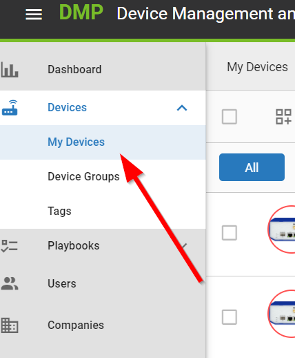
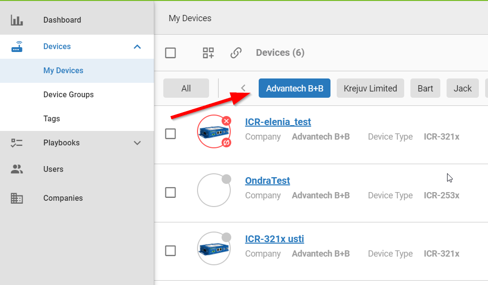
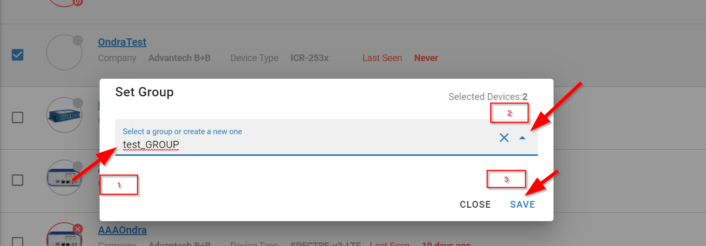
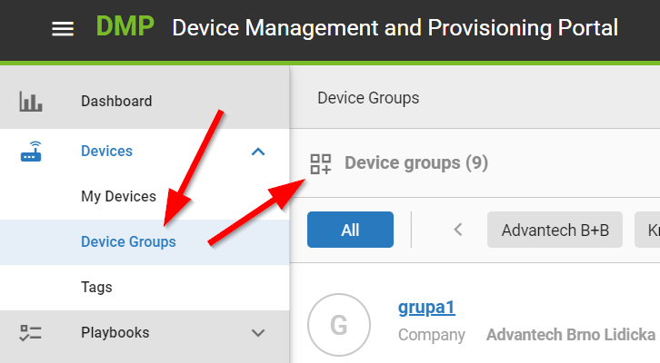

# Tagging and Grouping

## Grouping
We have 2 options, how we can group certain routers that we need and have an overview of it.

### Option 1

After logging in to the [system](https://dev.wadmp.com) , you will click "My Devices"

Then you select the company or companies you want to manage

Mark off the devices you want to group

and scroll to the end of the page and click "Set Group"

1. Name the group here
2. Or we add to an existing group
3. click on "Save"

After the already created group we see in "Device groups"

### Option 2

After logging in to the [system](https://wadmp.com) , we will click "My Devices" and "Devide Groups" and click on the dice and plus icon

1. Name the group here
2. Choose company
3. Click "Save"

After everything is saved a button "+Add devices to group" will appear click on.

1. Select Company or Companies
2. Mark off the devices you want to group

1. Here are the selected devices
3. Click on "Save"

In "Devices" is subfolder "Device Groups" and there should be your group

## Tagging

We need tagging to make it easier to find devices and give them specific properties according to which we can search for them

After logging in to the [system](https://wadmp.com) , we will click "Devices" and "Tags" and click on the dice and plus icon

1. Tag name
2. select company
3. Click "Save"

To assign the tag we created to the device we want, proceed as follows:

1. Click "My Devices"
2. Select company/companies
3. Select devices
4. Click "Set Tags"

Write the name of the tag we created and click "close"

If we want to find the device under a specific tag, feel free to click on the icon "Filter by Tags"

 
 Here we see the device under a specific tag

### Option 2

1. Go to "My Devices"
2. Select Company/Companies
3. Select Devices

Click on "Set Tags"

1. Existing tag
2. Type in any tag and press enter
3. Click "Close"

Here we see the assigned tags

