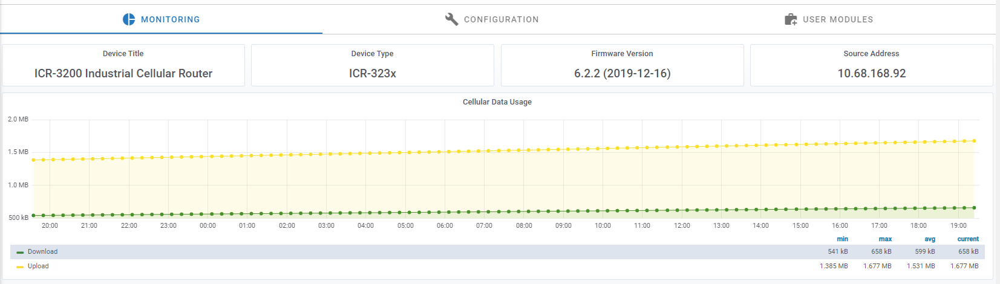
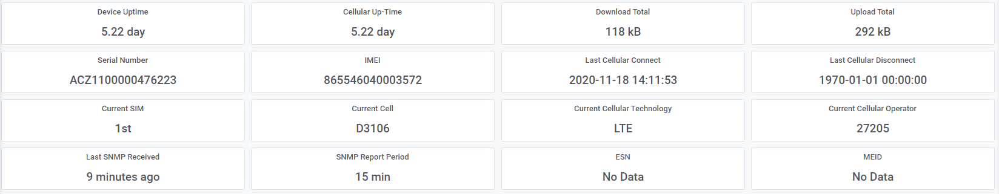
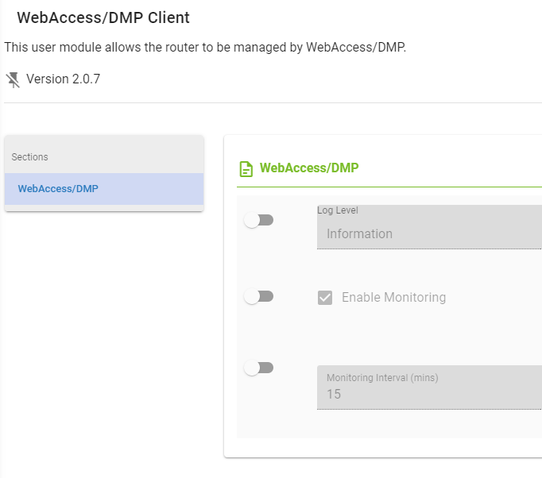

# Cellular Data Usage

## Introduction

WebAccess/DMP requires every device to have the [WebAccess/DMP Client](https://ep.advantech-bb.cz/products/software/user-modules#webaccessdmp-client) Router App installed.

The basic principle of operation is that the WebAccess/DMP client maintains a TCP connection with the WebAccess/DMP management server.
This means that the device is *always connected*, and therefore the user can reach the device immediately, as required.

However, there is a cost associated with maintaining this always-on TCP connection.
Packets of data must be sent periodically, in order to maintain the connection.
For the majority of our customers, the device connects to WebAccess/DMP via cellular.
Which means that the cellular network provider (or "carrier") charges for all data exchanged: even if it is only TCP "keepalive" data and not "application" data.

## Summary

In normal operation, each device connected to WebAccess/DMP consumes approximately **440kB** of data every day.

This can be reduced to approximately **240kB** per day if you chose to disable the default monitoring feature on the client.

| Data Usage per Device                | Up per Day | Down per Day | Daily Total   | Monthly Total   |
| ------------------------------------ | ---------- | ------------ | ------------- | --------------- |
| Monitoring Disabled                  | 120 kB     | 120 kB       | 240 kB        | 7.2 MB          |
| Monitoring Enabled, every 15 minutes | 320 kB     | 120 kB       | 440 kB        | 13.2 MB         |

## Monitoring Cellular Data Usage

* If monitoring is enabled in the WebAccess/DMP client on a device, you can observe the *actual* cellular data usage on the Monitoring tab of the WebAccess/DMP UI:

The first graph shows you how the device counters for data downloaded and uploaded are incrementing over time.
The default time interval in this view is 24 hours.

* Further down the same page, various statistics for the device are displayed, including the Download Total and Upload Total:

* In order to disable WebAccess/DMP monitoring on a device, you can re-configure the WebAccess/DMP Router App via the device's local web server, or via WebAccess/DMP itself. From the WebAccess/DMP UI, simply activate the "toggle" beside the "Enable Monitoring" checkbox, then unclick the checkbox, and Submit:

* Similarly, you may also decide to leave monitoring enabled, but adjust the monitoring interval.
Please be aware of the impact this will have on your cellular data bill.

## Further details

* The most significant factor that leads to the data usage figures above is the transport keepalive interval we use in the WebAccess/DMP Client Router App.
This is hard-coded to be 60 seconds (1 minute). This may seem aggressive, but we have encountered cellular operators with VERY short timeouts on their networks. Of the order of 2 minutes!

* The Configuration manual for your device has a section on the use of the "Check Connection" feature, which is part of the Mobile WAN configuration.
It states unequivocally:

> Enabling the Check Connection function for mobile networks is necessary for uninterrupted and continuous operation of the router.

* This advice still applies to any device using WebAccess/DMP, *but the "Enable Traffic Monitoring" item should also be enabled.*
This means that the device will monitor all traffic on the cellular interface, and only send ping requests if the selected Ping Interval is less than the WebAccess/DMP keepalive interval (60 seconds).
If you do not "Enable Traffic Monitoring", the device will send periodic ping requests in order to check the cellular connection. This will add to your cellular data usage.

* The data usage figures given above are correct for steady-state operation. i.e. The device has already connected to the WebAccess/DMP Management Server.
If your device's cellular connection is unstable (for example, due to poor signal strength), you may experience occasional re-connects.
Each re-connection involves several data transfers:
  * TLS handshake = approximately 5kB, due to the exchange of X.509 certificates;
  * configuration re-synchronisation = approximately 150kB, depending on the number of Router Apps installed, and the content of the configuration data. 

* When a device is actively managed by a user via WebAccess/DMP, the overall data usage figures will obviously depend on the exact actions performed.
For example:
  * Firmware upgrade = approximately 14MB, depending on the exact device type, and firmware version;
  * Router App installation or upgrade = anything from 30kB for a small app such as Pinger, to 6MB for a large app such as Python;
  * Re-configuration = varies, depending on the section or sections being re-configured, and the content of the configuration data.

* In this article we are using the traditional base-10 (aka "decimal" or "SI") prefixes for digital data. i.e. 1000B = 1kB, 1000kB = 1MB, etc.
Other sources may use the alternative base-2 (aka "binary" or "IEC") prefixes. In this alternative notation: 1024B = 1KiB, 1024KiB = 1MiB, etc.
i.e. The difference is 2.4%.
