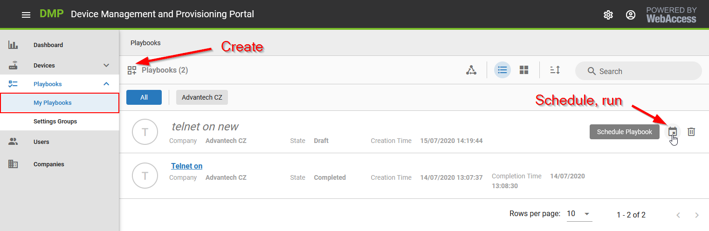
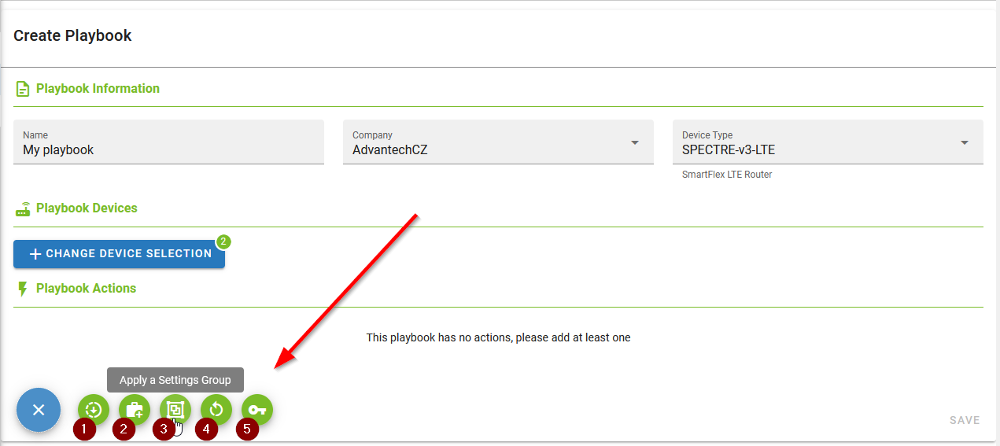
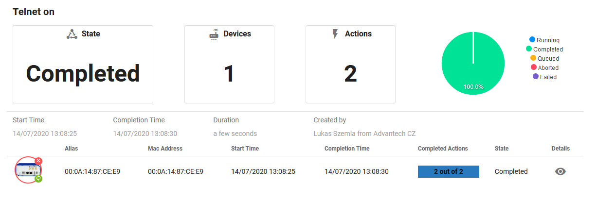
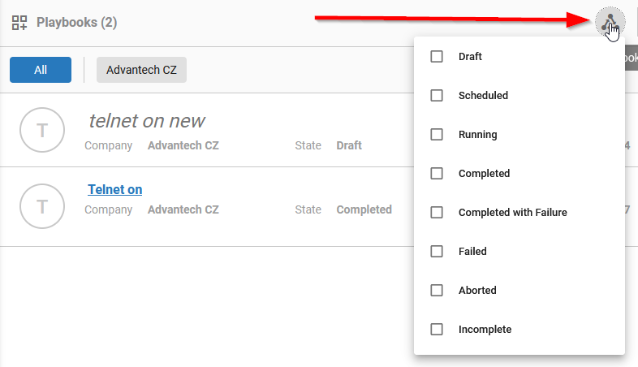
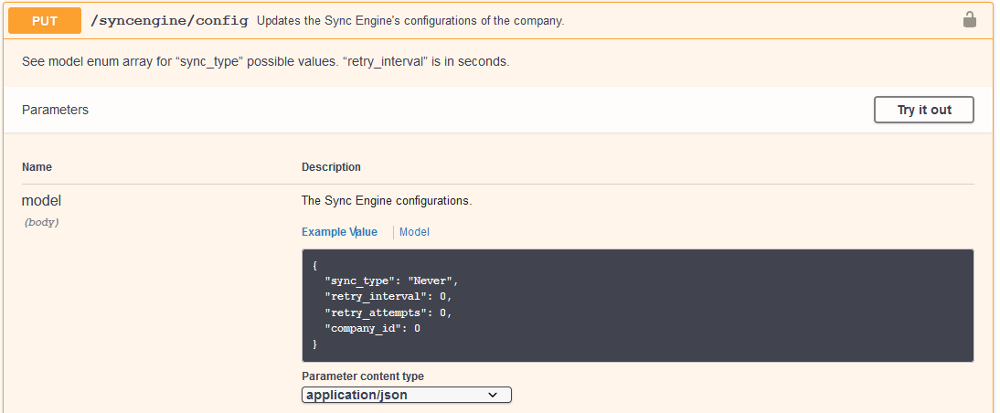

# Playbooks Explained 

Playbook is a set of defined actions that can be run on devices. 

To create a playbook, go to Playbooks -> My Playbooks in the left menu and use the grid plus icon to create a new one.



The playbook can be scheduled or run immediately by clicking on the calendar icon on the right.

## Available Playbook Actions

When creating playbook, fill in the name, company and the device type. A playbook can be run only for single device type because of settings differences between the device types. Select the devices you want to run playbook for.

You can add these types of actions to the playbook:

1. Set Firmware
2. Install Router App
3. Apply a Settings Group
4. Reboot Devices
5. Change Local Password



## Playbook States

The state of the playbook can be found in the list of the playbooks or after clicking on the playbook name:



Once created the playbook is in the state
* Draft 

and can be edited or deleted. 

Once the playbook is

* Scheduled (Queued) 

it can be unscheduled and then goes back to Draft state. 

Once run, the playbook can be in one of these states:

* Running
* Completed
* Completed with Failure (some actions completed, some were started but failed)
* Failed (all actions failed)
* Aborted (aborted when runnig)
* Incomplete (some actions completed, but some actions could not be started, e.g. one device is offline during all attempts to run a playbook).

See the device actions details by clicking the eye icon on the right.

If the playbook is run on the offline device, the status may be "Incomplete", but it is remembered to run the actions after the device appears online again. When the device is back online, the playbook is finished and reaches the "Completed" status.

When the playbook is run, it tries to do all the actions planned (does not stop after first failure, goes to another device).

The playbook run is affected by sync engine and by default, the actions are attempted to run 3 times (see details on sync configuration below).

You can filter the playbooks by state using this icon:




## Sync Configuration via API

Playbooks running behaviour is affected by the sync engine. The sync engine uses the default configuration (sync type, retry interval, retry attempts) and it currently cannot be changed in the UI.

It can be changed via [API](https://api.wadmp.com/#!/apis/cc753663-54c3-447a-b536-6354c3047ae6/detail) call PUT /syncengine/config:



The default values are as follows (adjust the company_id):

```
{
  "sync_type": "Custom",
  "retry_interval": 0,
  "retry_attempts": 3,
  "company_id": 0
}
```

Explanation / other available values:

* "sync_type": 
  * "Never" - means do not try ever again after once being sent.
  * "Forever" - means try to sync forever until it succeeds.
  * "Custom" - means follow the retry_interval and retry_attempts values.
* "retry_interval" - if sync_type is Custom, use this interval in seconds to wait between attempts.
* "retry_attempts" - if sync_type is Custom, try this many additional attempts to sync.


