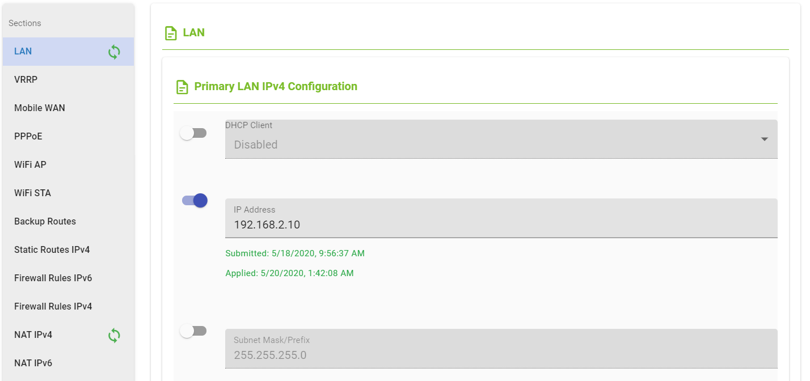

## Bulk Change Settings

This directory contains a Python script that allows you to configure one section of the firmware on all devices.
The desired configuration is defined by a separate INI file.

* bulk_change_settings.py

## Creating a virtual environment

We recommend that you create a new virtual environment for this script.

Example using virtualenv:

| Linux                                | Windows                               |
| ------------------------------------ | ------------------------------------- |
| `$ virtualenv --python=python3 env3` | `> virtualenv --python=python3 env3`  |
| `$ source env3/bin/activate`         | `> .\env3\Scripts\activate`           |
| `$ pip install -r requirements3.txt` | `> pip install -r requirements3.txt`  |

## Usage

Make sure you *activate* the virtualenv before every script execution.

For detailed usage information, run the script with `-h` as an argument:
```
> .\bulk_change_settings.py -h
usage: bulk_change_settings.py [-h] [-url URL] [-username USERNAME]
                               [-password PASSWORD]
                               [-console_loglevel {debug,info,warning,error,critical}]
                               [-file_loglevel {debug,info,warning,error,critical}]
                               section INIfile

Change settings for one section for all devices

positional arguments:
  section               Section name
  INIfile               Path to INI file

optional arguments:
  -h, --help            show this help message and exit
  -url URL              URL of the API gateway. Default =
                        'https://gateway.wadmp.com'
  -username USERNAME    Username. Check the code for the default!
  -password PASSWORD    Password. Check the code for the default!
  -console_loglevel {debug,info,warning,error,critical}
                        Log verbosity level. The higher the level, the fewer
                        messages that will be logged. Default = info
  -file_loglevel {debug,info,warning,error,critical}
                        Log verbosity level. The higher the level, the fewer
                        messages that will be logged. Default = info
```

You can change the default command-line arguments in the Python file, or specify new values on the command-line:

```.\bulk_change_settings.py snmp .\snmp.ini -username USERNAME -password PASSWORD```

(This example shows backslashes because it was run on Windows)

### section

The `section` argument is required. It must be the name of a configuration section in the firmware of a device.

In the main UI, the firmware sections are listed on the "Configuration" tab for an individual device:


However, the internal name of a section is not always obvious from the UI!

You should use the `GET /applications/{id}/versions/{versionId}` API endpoint to confirm the exact spelling of the section name.
The following example shows that the "Automatic Update" section is called "autoup":


### INIfile

Cellular routers use a configuration file format that is known as "INI-style".
Each desired configuration parameter is specified using the syntax "key=value".

For example:
```
SNMP_V1_ENABLED=0
SNMP_REPORT_ENABLED=0
```

Every section of the device firmware has its own configuration file.
You can obtain an INI file from a device by using the `get_settings.py` script.

The INI file that you supply to the `bulk_change_settings.py` script does not have to be complete.
i.e. It does NOT have to contain a key=value pair for every configuration parameter in that section.

It should only contain those parameters which you want to be part of the "desired" configuration.
This is the configuration that WebAccess/DMP will apply.

Any parameters which are NOT specified in the INI file will still be "reported" by the device.
The value of these parameters may literally be "don't care", or they may be important *but it is not the responsibility of WebAccess/DMP to set them*.

For example, in the following screenshot taken in the UI, only those configuration item that are "toggled" are part of the "desired" configuration:



Those configuration items that are NOT toggled are not part of the "desrired" configuration.
They may have factory default values, or they may have been set via the device's local webserver,
but they will not be changed by WebAccess/DMP.

### loglevel

There are 2 different `loglevel` arguments:
- `console_loglevel` determines what messages are printed to the console;
- `file_loglevel` determines what messages are printed to a file named `get_settings.log`.

Python's logging module has a set of default loglevels. The higher the level, the fewer messages that will be logged:
```
 CRITICAL
 ERROR
 WARNING
 INFO
 DEBUG
```

Both loglevel arguments default to `info`. If you want more detail, you may change one or both to `debug`.

> Note: If you have a lot of devices, this will create a lot of verbose output!

## Output

The script prints to the console, *and* to a file named `bulk_change_settings.log`.

* First, the script summarises what is contained in the specified INI file.
* Then, it confirms how many devices are owned by the user, and will be configured.
* For each device, the ID numbers of the firmware appliacation, application version, and application section are reported.
* At the end of the script, some summary statistics are shown.

For example:
```
> .\bulk_change_settings.py snmp snmp.ini -username ben.kinsella@advantech.com -password Oranm0re -console_loglevel info -file_loglevel debug
bulk_change_settings - INFO - Desired State:
SNMP_V1_ENABLED=0
SNMP_REPORT_ENABLED=0
bulk_change_settings - INFO - i.e. 2 individual parameters.

bulk_change_settings - INFO - Getting a list of your devices ...
bulk_change_settings - INFO - You have 5 devices in total.

bulk_change_settings - INFO - Device AA:AA:AA:AA:AA:AA
bulk_change_settings - INFO - Firmware application ID 1, application version ID 351
bulk_change_settings - INFO - Application section ID 9325

bulk_change_settings - INFO - Device BB:BB:BB:BB:BB:BB
bulk_change_settings - INFO - Firmware application ID 7, application version ID 356
bulk_change_settings - INFO - Application section ID 9471

bulk_change_settings - INFO - Device CC:CC:CC:CC:CC:CC
bulk_change_settings - INFO - Firmware application ID 10, application version ID 357
bulk_change_settings - INFO - Application section ID 9537

bulk_change_settings - INFO - Device DD:DD:DD:DD:DD:DD
bulk_change_settings - INFO - Firmware application ID 13, application version ID 314
bulk_change_settings - INFO - Application section ID 9084

bulk_change_settings - INFO - Device EE:EE:EE:EE:EE:EE
bulk_change_settings - INFO - Firmware application ID 15, application version ID 359
bulk_change_settings - INFO - Application section ID 9611

bulk_change_settings - INFO - 5 devices in total, of which 5 have the snmp section
bulk_change_settings - INFO - We changed the Desired State of these 5 devices.
```
