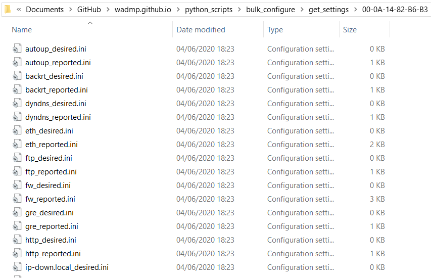
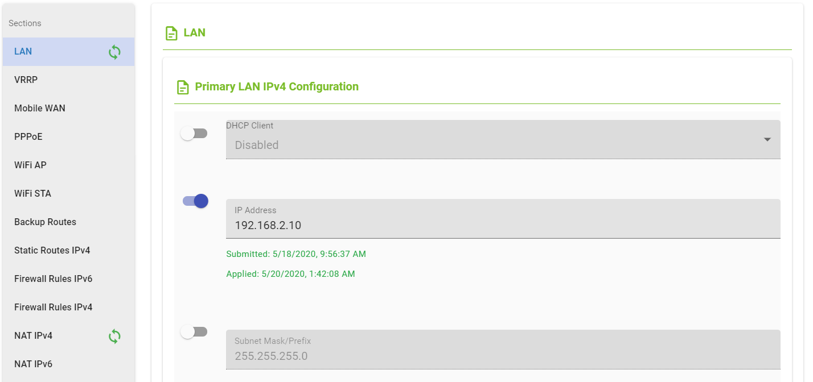
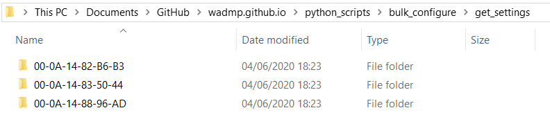
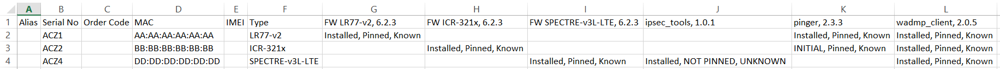
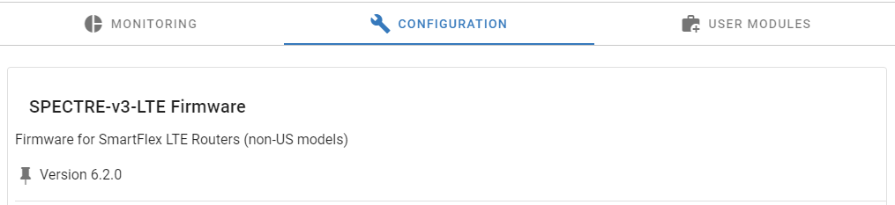
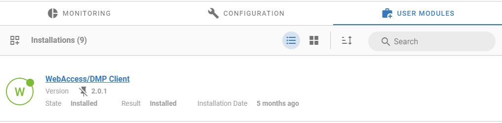
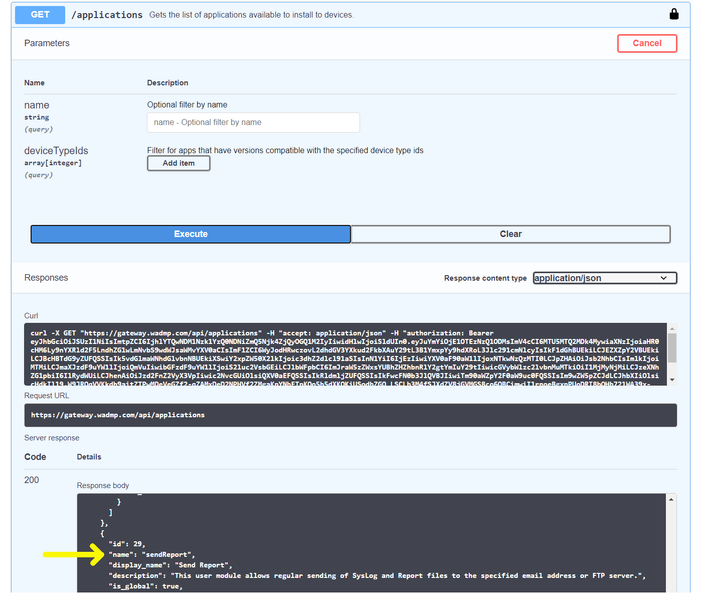

# Bulk Configuration scripts

This directory contains Python scripts that allow you to read and write configuration information
from multiple devices at once.

They should work on any Operating System (Windows, Linux, macOS) where you can install a Python 3 interpreter.

**get_devices.py**

> Create a CSV file with a list of your devices. Arguments to the script can be used to filter the list in various ways.  
> These CSV files can then be used as input to the other scripts below.

**get_settings.py**

> Read the latest settings (both Reported and Desired) for one or multiple sections, from multiple devices.  
> The INI files created can then be used as input to the `change_settings.py` script below.

**change_settings.py**

> Change the Desired settings for one section, on multiple devices.

**get_apps.py**

> Read the applications (both Firmware and User Modules) that are installed on multiple devices.  
> Create a new CSV file which summarises the information.

**install_app.py**

> Install or upgrade an application, on multiple devices.  
> An "application" may be Firmware or a User Module.

# General Info.

The following information is relevant to all scripts in this folder.

Later in this document, we provide specific information on each individual script.

## Creating a virtual environment

We recommend that you create a new virtual environment for these scripts.

Example using virtualenv:

| Linux                                | Windows                               |
| ------------------------------------ | ------------------------------------- |
| `$ virtualenv --python=python3 env3` | `> virtualenv --python=python3 env3`  |
| `$ source env3/bin/activate`         | `> .\env3\Scripts\activate`           |
| `$ pip install -r requirements3.txt` | `> pip install -r requirements3.txt`  |

> You only have to do this once on any particular machine.  
> For subsequent runs, just run the activate command.

## Usage

Make sure you *activate* the virtualenv before trying to execute any script.

For detailed usage information, run any script with `-h` as an argument.

The scripts take two types of command-line argument:
1. Positional arguments are not optional. If you do not specify them, you will get an error.
2. Optional arguments. These are prefixed with a hyphen "-". If you do not specify an optional argument, it assumes a default value.

You can change the default values for optional arguments by editing the Python file, or specify new values on the command-line.
For example:

```.\change_settings.py snmp .\snmp.ini -username USERNAME -password PASSWORD```

(This example shows backslashes because it was run on Windows)

## Changing log verbosity

There are 2 different `loglevel` arguments for each script:
- `console_loglevel` determines what messages are printed to the console;
- `file_loglevel` determines what messages are printed to a file named `<script name>.log`.

Python's logging module has a set of default loglevels. The higher the level, the fewer messages that will be logged:
```
 CRITICAL
 ERROR
 WARNING
 INFO
 DEBUG
```

Both loglevel arguments default to `info`. If you want more detail, you may change one or both to `debug`.

> NOTE: If you have a lot of devices, this will create a LOT of verbose output!

# get_devices.py

This script will create a CSV file with a list of your devices.
Arguments to the script can be used to filter the list in various ways.

The CSV files created can then be used as input to the other scripts below.

## Usage

```
> .\get_devices.py -h
usage: get_devices.py [-h] [-CSVfile CSVFILE] [-mac_or_serial MAC_OR_SERIAL]
                      [-alias ALIAS] [-companies [COMPANIES [COMPANIES ...]]]
                      [-groups [GROUPS [GROUPS ...]]]
                      [-tags [TAGS [TAGS ...]]] [-types [TYPES [TYPES ...]]]
                      [-isOnline {yes,no,both}] [-inSync {yes,no,both}]
                      [-host HOST] [-username USERNAME] [-password PASSWORD]
                      [-console_loglevel {debug,info,warning,error,critical}]
                      [-file_loglevel {debug,info,warning,error,critical}]

Get a list of devices, save in CSV file.

optional arguments:
  -h, --help            show this help message and exit
  -CSVfile CSVFILE      Name of saved file. Default = 'get_devices.csv'
  -mac_or_serial MAC_OR_SERIAL
                        MAC Address or Serial Number of an individual device
  -alias ALIAS          Alias (name) of an individual device
  -companies [COMPANIES [COMPANIES ...]]
                        Names of Companies to which devices belong
  -groups [GROUPS [GROUPS ...]]
                        Names of Groups to which devices belong
  -tags [TAGS [TAGS ...]]
                        Names of Tags which have been applied to devices
  -types [TYPES [TYPES ...]]
                        List of Device Types
  -isOnline {yes,no,both}
                        isOnline?
  -inSync {yes,no,both}
                        inSync?
  -host HOST            URL of the API gateway. Default =
                        'https://gateway.wadmp.com'
  -username USERNAME    Username. Check the code for the default!
  -password PASSWORD    Password. Check the code for the default!
  -console_loglevel {debug,info,warning,error,critical}
                        Log verbosity level. The higher the level, the fewer
                        messages that will be logged. Default = info
  -file_loglevel {debug,info,warning,error,critical}
                        Log verbosity level. The higher the level, the fewer
                        messages that will be logged. Default = info
```

## Output

This script writes to the console and to the file `get_devices.log`.

This script will ALSO create a CSV file called "get_devices.csv", or some other name if you specify `-CSVfile` on the command line.
An example file is provided in this repository: [get_devices.csv](./get_devices.csv)

# get_settings.py

This script will read the latest settings (both Reported and Desired) for one or multiple sections, from multiple devices.

The INI files created can then be used as input to the `change_settings.py` script below.

> NOTE: At the moment, the script assumes that the section(s) are part of the firmware application on the device.  
> In a future version we will add support for User Modules.

## Usage

```
> .\get_settings.py -h
usage: get_settings.py [-h] [-host HOST] [-username USERNAME]
                       [-password PASSWORD]
                       [-console_loglevel {debug,info,warning,error,critical}]
                       [-file_loglevel {debug,info,warning,error,critical}]
                       devices section

Read settings for one section from all devices

positional arguments:
  devices               CSV file of devices
  section               Section name

optional arguments:
  -h, --help            show this help message and exit
  -host HOST            URL of the API gateway. Default =
                        'https://gateway.wadmp.com'
  -username USERNAME    Username. Check the code for the default!
  -password PASSWORD    Password. Check the code for the default!
  -console_loglevel {debug,info,warning,error,critical}
                        Log verbosity level. The higher the level, the fewer
                        messages that will be logged. Default = info
  -file_loglevel {debug,info,warning,error,critical}
                        Log verbosity level. The higher the level, the fewer
                        messages that will be logged. Default = info
```

## Section names

For the `get_settings.py` and `change_settings.py` scripts, the `section` argument is required.
You can use "ALL" (uppercase) to automatically iterate over all sections per device.

But if you do not use "ALL", `section` must be the name of a configuration section in the firmware of a device.

In the main UI, the firmware sections are listed on the "Configuration" tab for an individual device:


However, the internal name of a section is not always obvious from the UI!

You could use the `get_settings.py` script with the `section` argument = "ALL" to find what the section names are on any particular device:



Alternatively, you can use the `GET /applications/{id}/versions/{versionId}` API endpoint to confirm the exact spelling of the section name.
The following example shows that the "Automatic Update" section is called "autoup":


## INI files

Cellular routers use a configuration file format that is known as "INI-style".
Each desired configuration parameter is specified using the syntax "key=value".

For example:
```
SNMP_V1_ENABLED=0
SNMP_REPORT_ENABLED=0
```

Every section of the device firmware has its own configuration file.
You can obtain an INI file from a device by using the `get_settings.py` script.

The INI file that you supply to the `change_settings.py` script does not have to be complete.
i.e. It does NOT have to contain a key=value pair for *every* configuration parameter in that section.

It should only contain those parameters which you want to be part of the "desired" configuration.
This is the configuration that WebAccess/DMP will apply.

Any parameters which are NOT specified in the INI file will still be "reported" by the device.
The value of these parameters may literally be "don't care", or they may be important *but it is not the responsibility of WebAccess/DMP to set them*.

For example, in the following screenshot taken in the UI, only those configuration item that are "toggled" are part of the "desired" configuration:



Those configuration items that are NOT toggled are not part of the "desired" configuration.
They may have factory default values, or they may have been set via the device's local webserver,
but they will not be changed by WebAccess/DMP.

## Output

This script writes to the console and to the file `get_settings.log`.

This script will ALSO create a directory called "get_settings".
Inside that directory, it will create a sub-directory for every device.



Inside each device sub-directory, it will create a pair of INI files for every section:
* One for the desired configuration;
* One for the reported configuration.


If *one* section was named on the command line, then at the end of the script some summary statistics are shown.

For example:
```
get_settings - INFO - 506 devices in total, of which 401 have the snmp section
get_settings - INFO - Of those 401:
    98 have a reported state,
    0 have a desired state,
    98 are in sync.
```

# change_settings.py

This script will change the Desired settings for one section, on multiple devices.

> NOTE: At the moment, the script assumes that the section is part of the firmware application on the device.  
> In a future version we will add support for User Modules.

## Usage

```
> .\change_settings.py -h
usage: change_settings.py [-h] [-host HOST] [-username USERNAME]
                          [-password PASSWORD]
                          [-console_loglevel {debug,info,warning,error,critical}]
                          [-file_loglevel {debug,info,warning,error,critical}]
                          devices section INIfile

Change settings for one section for all devices

positional arguments:
  devices               CSV file of devices
  section               Section name
  INIfile               Path to INI file

optional arguments:
  -h, --help            show this help message and exit
  -host HOST            URL of the API gateway. Default =
                        'https://gateway.wadmp.com'
  -username USERNAME    Username. Check the code for the default!
  -password PASSWORD    Password. Check the code for the default!
  -console_loglevel {debug,info,warning,error,critical}
                        Log verbosity level. The higher the level, the fewer
                        messages that will be logged. Default = info
  -file_loglevel {debug,info,warning,error,critical}
                        Log verbosity level. The higher the level, the fewer
                        messages that will be logged. Default = info
```

### Section names

See the documentation on section names for the `get_settings.py` script above.

### INI files

See the documentation on INI files for the `get_settings.py` script above.

## Output

This script writes to the console and to the file `change_settings.log`.

* First, the script summarises what is contained in the specified INI file.
* Then, it confirms how many devices will be configured.
* For each device, the ID numbers of the firmware application, application version, and application section are reported.
* At the end of the script, some summary statistics are shown.

For example:
```
> .\change_settings.py ALL snmp snmp.ini -username ben.kinsella@advantech.com -password Oranm0re -console_loglevel info -file_loglevel debug
change_settings - INFO - Desired State:
SNMP_V1_ENABLED=0
SNMP_REPORT_ENABLED=0
change_settings - INFO - i.e. 2 individual parameters.

change_settings - INFO - Getting a list of ALL your devices ...
change_settings - INFO - You have 5 devices in total.

change_settings - INFO - Device AA:AA:AA:AA:AA:AA
change_settings - INFO - Firmware application ID 1, application version ID 351
change_settings - INFO - Application section ID 9325

change_settings - INFO - Device BB:BB:BB:BB:BB:BB
change_settings - INFO - Firmware application ID 7, application version ID 356
change_settings - INFO - Application section ID 9471

change_settings - INFO - Device CC:CC:CC:CC:CC:CC
change_settings - INFO - Firmware application ID 10, application version ID 357
change_settings - INFO - Application section ID 9537

change_settings - INFO - Device DD:DD:DD:DD:DD:DD
change_settings - INFO - Firmware application ID 13, application version ID 314
change_settings - INFO - Application section ID 9084

change_settings - INFO - Device EE:EE:EE:EE:EE:EE
change_settings - INFO - Firmware application ID 15, application version ID 359
change_settings - INFO - Application section ID 9611

change_settings - INFO - 5 devices in total, of which 5 have the snmp section
change_settings - INFO - We changed the Desired State of these 5 devices.
```

# get_apps.py

This script will read the current applications (both Firmware and User Modules)
that are installed on multiple devices.

It will create a report, in the form of a CSV file, that summarises the version
and other information about each application.

This makes it easy for the user to visually check for any problems with a device,
or to confirm that the same apps and versions are used consistently across a group of devices.

## Usage

```
> .\get_apps.py -h
usage: get_apps.py [-h] [-CSVfile CSVFILE] [-host HOST] [-username USERNAME]
                   [-password PASSWORD]
                   [-console_loglevel {debug,info,warning,error,critical}]
                   [-file_loglevel {debug,info,warning,error,critical}]
                   devices

Read applications from all devices

positional arguments:
  devices               CSV file of devices

optional arguments:
  -h, --help            show this help message and exit
  -CSVfile CSVFILE      Name of saved file. Default = 'get_apps.csv'
  -host HOST            URL of the API gateway. Default =
                        'https://gateway.wadmp.com'
  -username USERNAME    Username. Check the code for the default!
  -password PASSWORD    Password. Check the code for the default!
  -console_loglevel {debug,info,warning,error,critical}
                        Log verbosity level. The higher the level, the fewer
                        messages that will be logged. Default = info
  -file_loglevel {debug,info,warning,error,critical}
                        Log verbosity level. The higher the level, the fewer
                        messages that will be logged. Default = info
```

## Output

This script writes to the console and to the file `get_apps.log`.

This script will ALSO create a CSV file called "get_apps.csv", or some other name if you specify `-CSVfile` on the command line.
In this output CSV file:
* there is one row per device;
* the first set of columns contain device meta-data;
* the second set of columns contain Firmware information;
* the third set of columns contain User Module information.

Every unique application *version* is given a unique column.

Example:



As shown, the script currently includes 3 pieces of information about each application version:

> NOTE: It is easy to customise the `get_apps.py` script to include other information in the CSV file.  
> Just modify the `summarise_app()` function.

### State

Several states are possible, but these are the two most common:

**"Installed"** means that this application version is fully installed on the device.

i.e. If the application version was installed via WA/DMP, then the device has reported that the installation is complete.
If the application version was installed *outside* of WA/DMP, then the device has connected to the server and reported it.

**"INITIAL"** means that a user has requested WA/DMP to install this application version on the device,
but the installation process has not started yet. Usually because the device has not connected to the server.

> NOTE: Currently, the `get_apps.py` script deliberately ignores any applications which failed to install on the device.  
> i.e. They are not shown in the output CSV file.  
> This is consistent with the main UI, which also does not display these failed applications.

### Pinned status

This is the same "pin" that is graphically displayed in the UI, as shown in the following screenshots:

| Example of "Pinned" Firmware app: | Example of "Not Pinned" User Module app: |
|:--------------------- | ------------------------:|
|  |                    |

**"Pinned"** means that this application version will be maintained on the device by the WA/DMP server.

i.e. If a local user were to *delete* the application, WA/DMP will automatically re-install it.
If a local user were to change the application *version*, WA/DMP will automatically upgrade/downgrade the application again to the pinned version.

If an application is installed via WA/DMP, the default status is "Pinned". This may be changed later via the API or UI.

**"NOT PINNED"** means that this application version will **NOT** be maintained on the device by the WA/DMP server.

This may be because the application was installed outside of WA/DMP, for example via the device's local webserver.
Or maybe the application was installed via WA/DMP, but a user subsequently removed the pin.

### Known status

**"Known"** means that this application version is known to the WA/DMP server. i.e. WA/DMP contains a configuration model for this application version.

Obviously, any application that was installed via WA/DMP will be "known" in advance.

But it is also possible that an application version was installed on a device *outside* of WA/DMP,
and when the device reported it to the server it was known to the server.
This means that the application may be configured by WA/DMP.

**"UNKNOWN"** means that the device reported an application version for which the server does not have a configuration model.

It may be that the entire *application* is unknown. For example, the device reported a User Module name which is not yet supported on WA/DMP.

Or it may be that the *application* is known, but the particular *version* that was reported by the device is unknown.

# install_app.py

This script will install an application, on multiple devices.
An "application" may be Firmware or a User Module.

If the *application* is already on the device, but with a different version, it will be upgraded or downgraded to the new version.

If the application *version* is already on the device, it will not be changed.

> Bear in mind that this script only changes the "desired" state of the device.  
> For example, if a device is temporarily offline, the application won't actually be installed until the device re-connects.  
> The "Sync Engine", which is an integral part of WebAccess/DMP, will work continuously to ensure that the changes are applied,
> and the "reported" and "desired" states will eventually be in-sync.

## Usage

```
> .\install_app.py -h
usage: install_app.py [-h] [-host HOST] [-username USERNAME]
                      [-password PASSWORD]
                      [-console_loglevel {debug,info,warning,error,critical}]
                      [-file_loglevel {debug,info,warning,error,critical}]
                      [--replace_pending_installs]
                      devices appName appVersion

Install an app. on multiple devices

positional arguments:
  devices               CSV file of devices
  appName               App. name
  appVersion            App. version number

optional arguments:
  -h, --help            show this help message and exit
  -host HOST            URL of the API gateway. Default =
                        'https://gateway.wadmp.com'
  -username USERNAME    Username. Check the code for the default!
  -password PASSWORD    Password. Check the code for the default!
  -console_loglevel {debug,info,warning,error,critical}
                        Log verbosity level. The higher the level, the fewer
                        messages that will be logged. Default = info
  -file_loglevel {debug,info,warning,error,critical}
                        Log verbosity level. The higher the level, the fewer
                        messages that will be logged. Default = info
  --replace_pending_installs
                        If a device already has an upgrade-downgrade pending
                        for this app, replace it
```

### Application names

As with the discussion on section names above, in order to avoid ambiguity you must use the *internal* app name.

You can use the `GET /applications` API endpoint to confirm the exact spelling of the app name.
The following example shows that the "Send Report" app is called "sendReport":



### Already pending installations

A device can have a maximum of 2 instances of any one application.
For example, if a device is currently offline, there may be one installed version and one other version which is waiting to be installed.

In this scenario, if you use the `install_app.py` script to install a third version, you will see an error message like the following:

```
install_app - ERROR - Failed to install app! 400
install_app - ERROR - There is already an upgrade/downgrade pending for 'app_name' on device 'device_name'.
```

If you specify the `--replace_pending_installs` option on the command line, the `install_app.py` script will:

- automatically detect these errors;
- un-install the pending installation;
- and attempt to install the new version again.

> WARNING: Use this option with caution!  
> You may be interfering with a device that is actually online, and the pending install may have just been queued by another user.

## Output

This script writes to the console and to the file `install_app.log`.