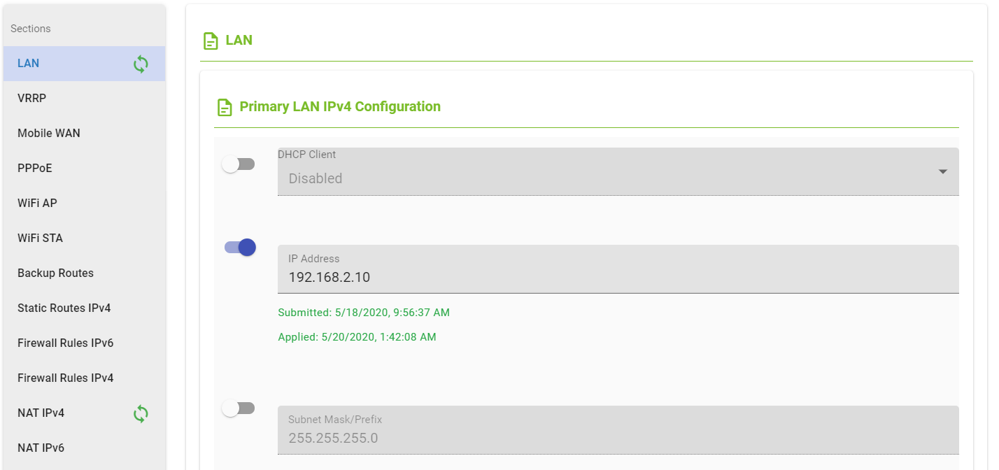

## Get Settings

This directory contains a Python script that allows you to read the latest settings (both Reported and Desired)
for one section of the firmware configuration, for all devices.

* get_settings.py

## Creating a virtual environment

We recommend that you create a new virtual environment for this script.

Example using virtualenv:

| Linux                                | Windows                               |
| ------------------------------------ | ------------------------------------- |
| `$ virtualenv --python=python3 env3` | `PS virtualenv --python=python3 env3` |
| `$ source env3/bin/activate`         | `PS .\env3\Scripts\activate`          |
| `$ pip install -r requirements3.txt` | `PS pip install -r requirements3.txt` |

## Usage

Make sure you *activate* the virtualenv before every script execution.

You can change the default command-line arguments in the Python files, or specify new values on the command-line:

```.\get_settings.py snmp -host https://gateway.wadmp.com -username USERNAME -password PASSWORD```

(This example shows backslashes because it was run on Windows)

### section

The `section` argument is required. It must be the name of a configuration section in the firmware of a device.

In the main UI, the firmware sections are listed on the "Configuration" tab for an individual device:


However, the internal name of a section is not always obvious from the UI!

You should use the `GET /applications/{id}/versions/{versionId}` API endpoint to confirm the exact spelling of the section name.
The following example shows that the "Automatic Update" section is called "autoup":


### loglevel

There are 2 different `loglevel` arguments:
- `console_loglevel` determines what messages are printed to the console;
- `file_loglevel` determines what messages are printed to a file called `get_settings.log`.

Python's logging module has a set of default loglevels. The higher the level, the fewer messages that will be logged:
```
 CRITICAL
 ERROR
 WARNING
 INFO
 DEBUG
```

Both loglevel arguments default to `info`. If you want more detail, you may change one or both to `debug`.

> Note: If you have a lot of devices, this will create a lot of verbose output!

## Output

The script prints to the console, *and* to a file called `get_settings.log`.

Assuming you have set the loglevel to "debug" or "info", the configuration settings of the requested section will be shown for every device.

For example:
```
script - INFO - Device 00:0A:04:00:07:65
script - INFO - Firmware application ID 13, application version ID 85
script - INFO - root:{
    "desired_configuration": null,
    "in_sync": true,
    "last_desired_update": null,
    "last_reported_update": "2020-04-28T19:21:58.513489",
    "reported_configuration": "SNMP_ENABLED=1\nSNMP_NAME=\nSNMP_LOCATION=\nSNMP_CONTACT=\nSNMP_V1_ENABLED=1\nSNMP_COMMUNITY_RO=public\nSNMP_COMMUNITY=private\nSNMP_V3_ENABLED=0\nSNMP_USERNAME_RO=\nSNMP_AUTH_RO=MD5\nSNMP_AUTH_PASSWORD_RO=\nSNMP_PRIV_RO=DES\nSNMP_PRIV_PASSWORD_RO=\nSNMP_USERNAME=\nSNMP_AUTH=MD5\nSNMP_AUTH_PASSWORD=\nSNMP_PRIV=DES\nSNMP_PRIV_PASSWORD=\nSNMP_IO_ENABLED=0\nSNMP_MBUS_ENABLED=0\nSNMP_MBUS_BAUDRATE=300\nSNMP_MBUS_PARITY=E\nSNMP_MBUS_STOPBITS=1\nSNMP_REPORT_ENABLED=0\nSNMP_REPORT_IPADDR=\nSNMP_REPORT_PERIOD=\n",
    "section_id": 3907
}
```

Note that the JSON object contains both the "desired" and the "reported" configuration.
One or both of these may be null.

For example, in the following screenshot taken in the UI, only those configuration item that are "toggled" will be part of the "desired" configuration:



At the end of the script, some summary statistics are shown.

For example:
```
script - INFO - 506 devices in total, of which 401 have the snmp section
script - INFO - Of those 401:
    98 have a reported state,
    0 have a desired state,
    98 are in sync.
```