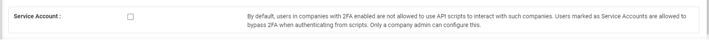
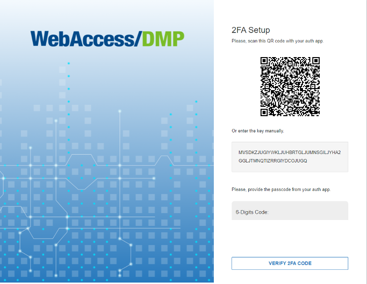

# 2Fa  

**2Fa** (*Two-Factor authentication*) is an extra layer of security to protect your account.

If its enabled and already setup after a successful login you will be asked for one time password to enter from your Auth App (Microsoft Authenticator, Google Authenticator, Authy, etc. …) 

## Auth apps
To setup 2Fa first you need to download the authenticator app to your phone.
We do support a wide range of auth applications.

- [Google Authenticator](https://play.google.com/store/apps/details?id=com.google.android.apps.authenticator2&hl=en&gl=US)

- [Microsoft Authenticator](https://play.google.com/store/apps/details?id=com.azure.authenticator&hl=en&gl=US)

- [Google Authenticator (IOS)](https://apps.apple.com/us/app/google-authenticator/id388497605)

- [Microsoft Authenticator (IOS)](https://apps.apple.com/us/app/microsoft-authenticator/id983156458)

## Enable 2Fa

You can enable 2Fa in the **Company edit form**.

After its enabled you can setup a 2Fa using your auth app.

**Important Notice:** Enabling 2Fa will add an extra option “Service Account” so company admins are able to enable this feature for users in a company have 2Fa enabled (this will allow users to use the scripts even they have 2Fa enabled otherwise they will not be able to do.)

When you enable 2Fa for a company all user will be forced to setup the 2Fa after they login, they will not be able to use the system until they will do the setup . 

## 2Fa login

After downloading the application, you should scan the QR code or enter the given code manually.

Enter the one-time password you see in your auth app to login 

**Important Notice:** Disabling 2Fa for company will disable it for all users in that company.

