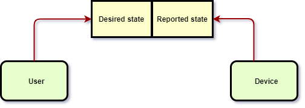
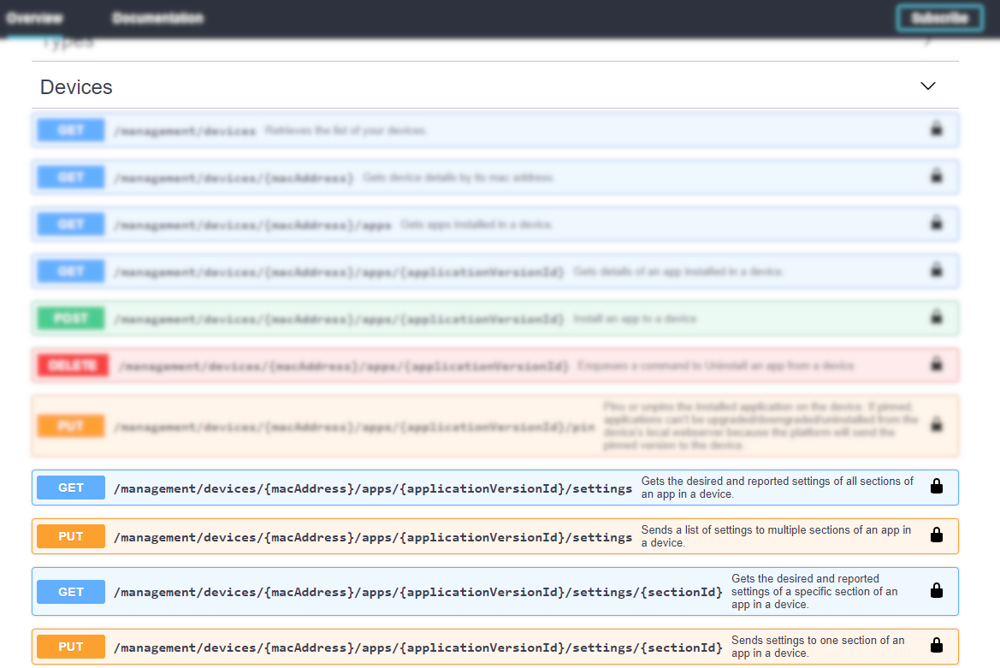
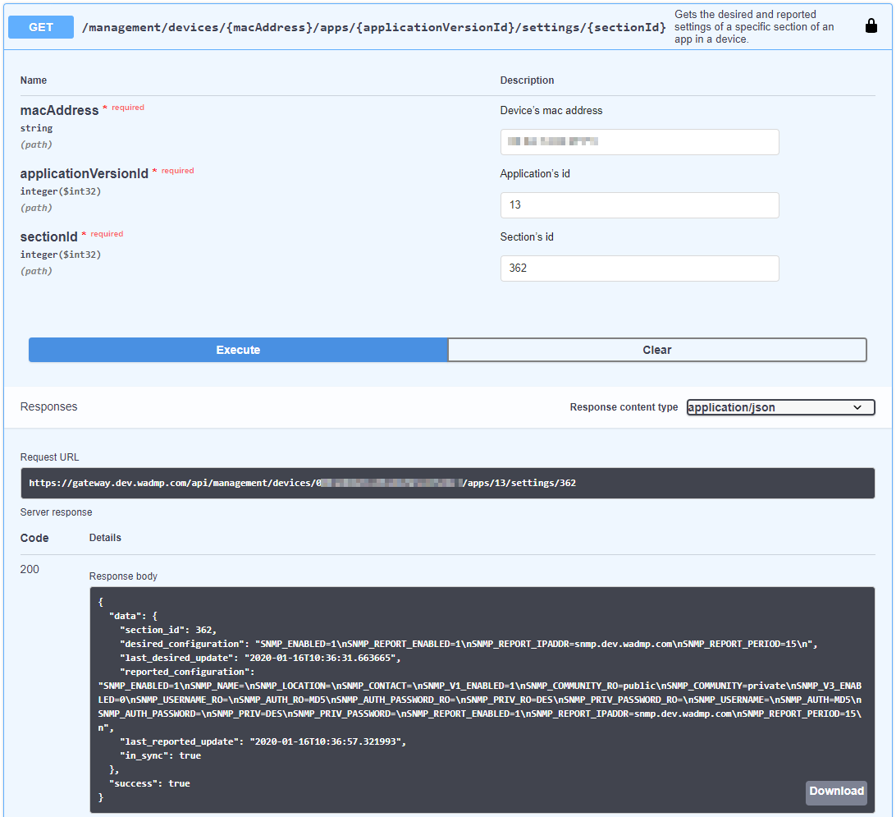
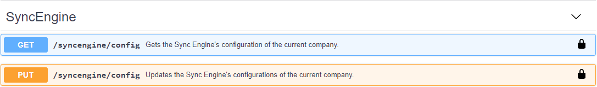
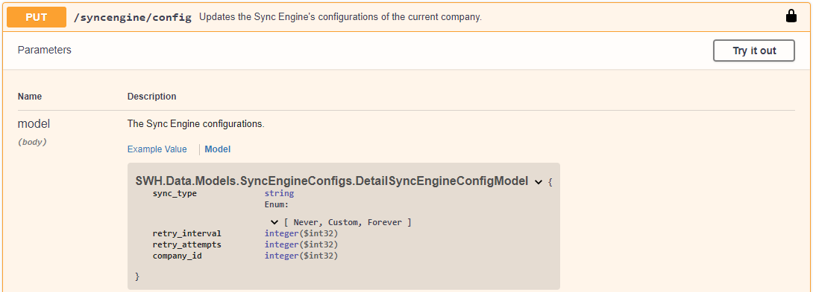

# Device Desired and Reported states

To configure a device, you need access to it, either to its web server or through SSH. When connected to a device, all changes made are immediately applied, and, if needed, services are restarted.

Remote device configuration, on the other hand, is a different business. It adds a second actor that can receive configuration changes and send them to the device. This raises new issues: Will this actor save a copy of all the properties or request them to the device every time? What if the device is temporarily not available? These and other questions are addressed by the solution DMP implemented. Desired and Reported states are not a new idea, especially now that cloud management of IoT devices is increasingly popular. We took pictures from other solutions but aimed to make ours lightweight and straightforward.

If you are curious about the ideas behind them, please visit the documentation for the following projects:
- [AWS IoT](https://aws.amazon.com/iot-platform/how-it-works/) and its implementation of [Device Shadows](http://docs.aws.amazon.com/iot/latest/developerguide/iot-thing-shadows.html)
- [Azure IoT](https://docs.microsoft.com/en-us/azure/iot-hub/iot-hub-what-is-iot-hub) and the similar [Device Twins](https://docs.microsoft.com/en-us/azure/iot-hub/iot-hub-devguide-device-twins)
[Eclipse Ditto](https://www.eclipse.org/ditto/intro-overview.html) also provides a similar solution.

## How it works

DMP defines two sets of configuration:
- The Desired state or changes a user wants to make on a device and
- The Reported state, the configuration the device reports to DMP

In this model, the user can only modify the Desired state, while the Reported is only by the device. DMP is in charge of sending the difference between the two to the device, so eventually, both Desired and Reported are the same. Devices are the source of truth, so the Desired state has to be updated at any change so DMP can make correct decisions.

Two things are implied in this explanation:
The device needs a process capable of monitoring changes to report them and also be able to apply modifications received from DMP.
DMP also needs to be able to send changes to the device, possibly waiting for the device to connect.
If the device doesn't apply the changes, DMP should be able to re-apply them.

### DMP client
Routers allow extensibility through [Router Apps](/references/routers-overview.md). We created the "WebAccess/DMP client" Router App to be the service that updates DMP when the router changes and applies all changes sent by DMP, among other tasks. It maintains a connection with DMP using the [MQTT protocol](/explanations-discussions/what-is-webaccess-dmp.md) so changes on both sides can be reported to the other end.

Because the router is the source of truth when this client connects, it reports all its configurations. This allows DMP to have a detailed report of all the changes when the device was disconnected.

Configuration on routers is naturally separated into sections, so we take advantage of it by sending to DMP all the properties of that section only. This allows for less information exchanged and is a practical difference from the other similar solutions.

The client knows where the changes need to be applied and what extra steps need to be taken. When finished, it reports back the changed configuration.

### Applying configuration changes
Every time the Desired state is changed, DMP will determine the difference with the reported state and send it to the device. If the device is online, it will receive the change immediately, but if it is offline, all subsequent changes will be merged into the Desired state. When the device connects again, it will receive only one change request per section modified.
This behavior has a downside. For example, if a user wants to apply a set of changes, wait or request a reboot, and then use other modifications to the same section while the device is offline, all changes will be merged into one request only. In this exceptional scenario, the user should wait for the device to reboot before applying the second set of changes.

### Everything is an Application
DMP treats both Firmware and Router Apps as applications. An application is a versioned set of properties grouped in sections. It can be replaced by a different version that may have a different set of properties. The Firmware is still a unique application because it is related to the device type and cannot be uninstalled.
This simplification allows to use of Desired and Reported states in all applications.

## How to use Desired and Reported states
DMP groups all properties into sections. The DMP UI reflects this on the left column of the configuration screen:

The desired value always takes priority in the UI. The reported is shown only if it is different from the reported (like the "Name" property above, that was changed but not saved) or if there is no desired value. This simplified view allows focusing on what the user wants to change, showing details about the reported data only when relevant.

On the other hand, the API exposes all values to the user, processing and presenting them more appropriately. Moreover, the API allows a user more control over the presentation as the way to do it is not imposed by DMP.

The following endpoints are the ones that allow us to interact with Desired and Reported states:

For example, the image of the UI above called the following endpoint to get the Desired and Reported states for the SNMP section :

### Re-applying configuration with SyncEngine
When a user applies a configuration change, DMP will send it to the device immediately or as soon as the device connects. However, if the device does not use the difference, DMP needs to re-apply the changes configured previously by the user. This is the job of SyncEngine.

SyncEngine is an active agent in DMP in charge of detecting not applied differences in all devices and re-applying them following the policy set for the company to which the device belongs.

This is how the SyncEngine can be configured:

Sync Type "Never" disables the SyncEngine for the company. "Forever" will keep re-applying every "retry_interval" seconds until the device reports changes were applied. The custom mode will retry "retry_attempts" times.

When installing or removing applications, SyncEngine also supervises the change following the company's policy. In addition, SyncEngine will ensure an application is changed, retrying if needed.