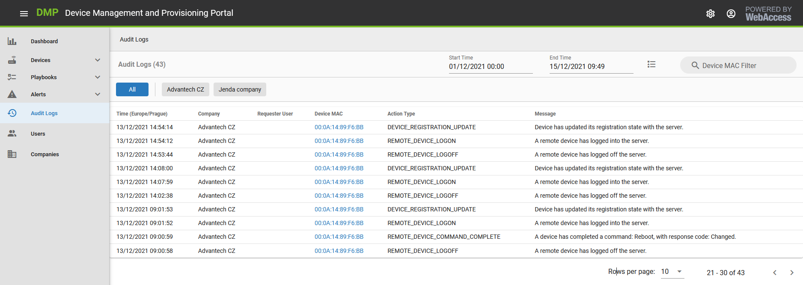
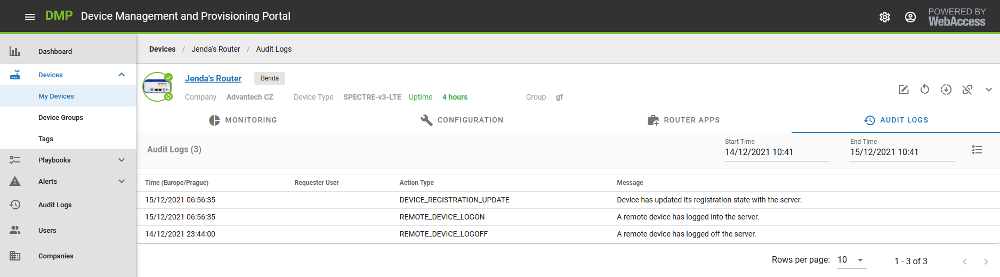
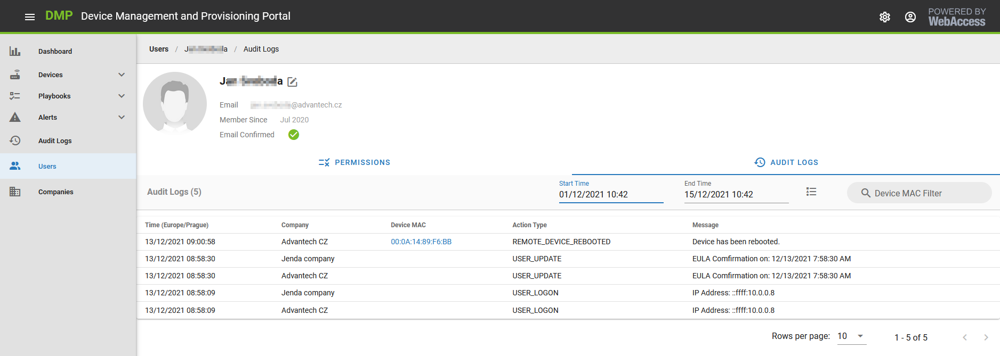
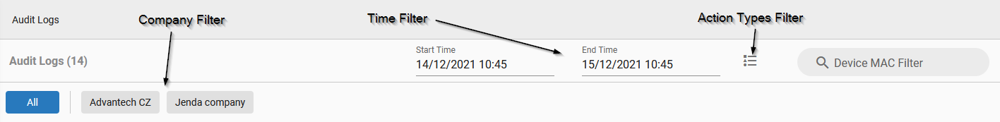

# Auditing Explained 

By default, just the last 24 hours of Audit Logs are shown. Audit Logs are stored on DMP for two months back in time (you can filter by time selection at the top). Audit Logs older than two months are forgotten.
There are more places where you can find Audit Logs on DMP:

## Overall Audit Logs

"Audit Logs" menu item contains overall Audit Logs. You can view all of them (for Devices, Users, the server) based on your permissions. 

## Device Audit Logs

There are new tabs on the Device detail page, “Audit Logs” (the last one). You can find here all the Audit Logs related to this device.

## User Audit Logs

Similar on the User detail page. There are new tab, “Audit Logs” where all the Audit Logs related to this user can be found.

## Filtering of Audit Logs

You can filter Audit Logs at the top part of the table. These filtering options are available (where applicable):

* Company - One or more companies can be chosen in the filter above the Audit Logs table.
* Time - The pickers can set the start and End times above the table. The last 24 hours are set by default. Two months back is allowed as older data are forgotten.
* Action Types - Specific types of tracked actions can be selected here.
* Device MAC - When looking for a particular device in Audit Logs, the device's MAC address can be put here.

