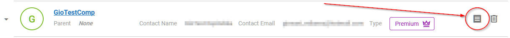
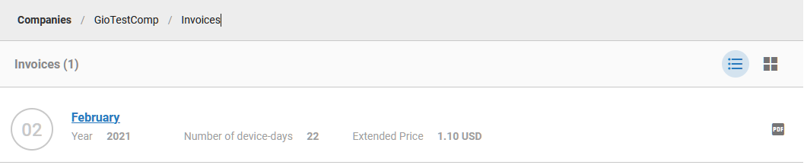
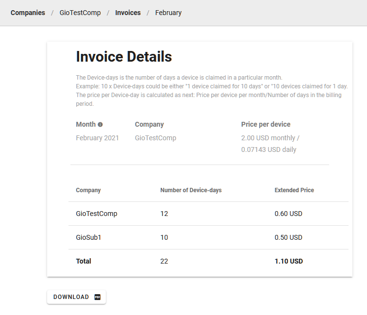

# Billing Explained 

## Types of Companies

After a new company is created, the company type is automatically set to "Free". 
Company type can be:

| Company type |   | Features     |
|------|----------------------------------------------------------|-------------------------------------------|
| Free |  | Can claim and manage up to 5 devices.     |
| Premium |         | Can claim and manage an unlimited number of devices and use the API. Billed monthly.    |

Company type can be changed only for the parent company. Child companies inherit the type from their parent.

If you are a member of the parent company, you can also see your company type right under the profile button in the top right corner:

&nbsp;    
&nbsp; 
## Request Upgrade to Premium

To request the change to Premium, go to the Companies list (in the menu on the left) and click the crown button at the company you want to request. 

Fill in the request form and submit it.

Email is sent to the sales manager for your region, and a confirmation email is sent to you as the requester. The sales manager will contact you and negotiate the details.

&nbsp;    
&nbsp; 
## Premium Features

With Premium, you are not limited with the number of devices to 5.

Additionally, you can access these user permissions:

&nbsp;    
&nbsp;    
## Invoices (Premium type companies)

If your company type is Premium, you are billed monthly. The invoices are coming automatically on the Primary Contact Email at the company.

Email example:

You can always find all your invoices in the Companies list by clicking on this paper button on the right:

There is a list of invoices by month. Click on the invoice to see the details or download it as a PDF by clicking the button on the right. 

Invoice example:

