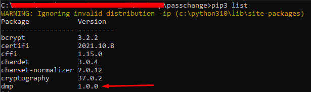

# Bunch Claiming Devices

This topic is a tutorial for bunch claiming devices using API, Python scripts, and CSV files.

## Claim from CSV file

This script claims devices in the WADMP platform using a *CSV* file as input. It takes the following arguments:

* **username**: the username for the WADMP account
* **password**: the password for the WADMP account
* **csv**: the name of the CSV file (located in the "resources" folder) containing the device information
* **company_id**: the ID of the company to which the devices will be claimed
* **out file** (for errors): the name of the file to which error messages will be written

It imports the following modules:

* **sys**: used to access command line arguments
* **os.path**: used to check if a file exists
* **requests**: used to make API calls
* **time**: used to get the current time
* **os**: used to check if a file exists
* **dmp.ApiConsumer**: a custom module used to interact with the WADMP API
* **dmp.Methods**: a custom module used to handle errors
* **csv**: used to read the CSV file

CSV input file parameters:

* **SERIAL** - REQUIRED
* **MAC** - REQUIRED
* **IMEI** - OPTIONAL
* **ALIAS** - OPTIONAL (if not filled, it will be used MAC as ALIAS)

---

Description of the process:

The script first checks that the correct number of arguments were passed and exits with an error message if not. It then logs into the WADMP platform using the provided username and password.

The script then defines a function "*append_file*" to write error messages to the specified out file. First, it checks if the file exists and, if not, creates it. It then reads the existing lines of the file and removes any newline characters from the end. It then appends the error message to the file, including the *MAC address* and the error message from the API response.

The script reads the *CSV* file using the "csv" module and iterates through each row, extracting the *MAC*, *serial*, *IMEI*, and *alias* information. It then creates a dictionary containing this information and the *company_id*. It then calls the WADMP API to claim the device, and if the API returns an error, it prints the error message and calls the "*append_file*" function to write the error to the out file. On the other hand, if the API call is successful, it simply prints a message indicating success.

---
:memo: **Note:** For this script is necessary DMP library that can be obtained by running the following command:


```
pip3 install https://bitbucket.org/bbsmartworx/dmp-public/raw/
8e86aa752b921caa095d8791cc8f6af62e2d7087/python_scripts/lib/dist/dmp-1.0.0.tar.gz
```

After this step you should be able to see the library installed by the command pip3 list:



---