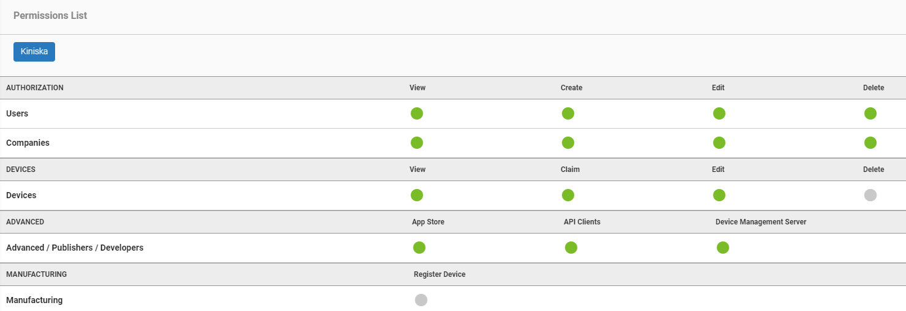
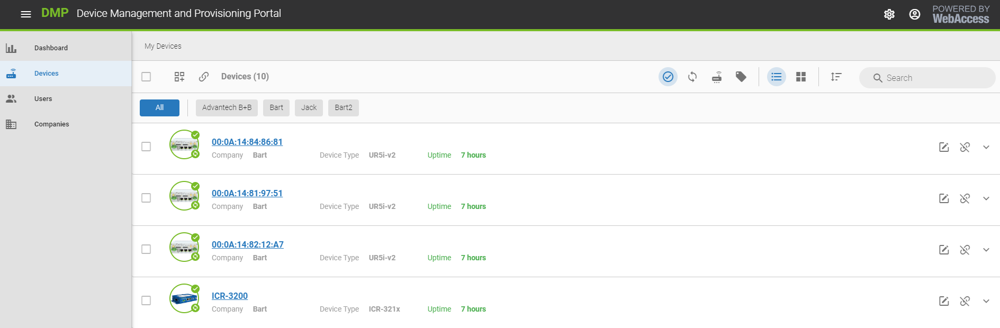
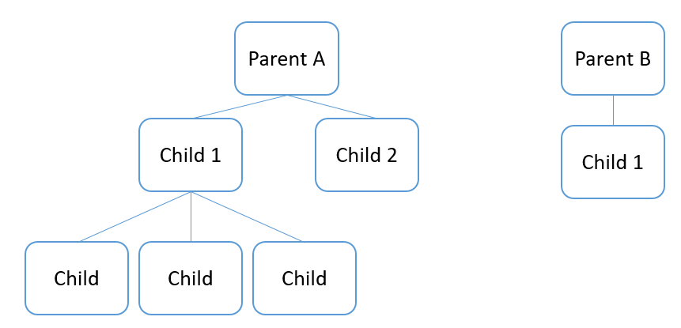

# Companies and Users

This article explains the concepts of company and user on the WebAccess/DMP (WADMP) platform. We will explain the differences between signing up to WADMP and having an account created for you by an administrator. We will also explain the concept of parent and child companies.

## Users

There are two ways to become a user on WADMP:

1. Signup at [WADMP](https://wadmp.com/) by creating an account.
2. Company administrator creates an account for you.

In both cases, the user will receive an email from the platform to confirm their email address. Then, using the 1st option, the user is the administrator for their company with the following permissions.

As you can see, you have permission to view, add, edit and delete most entities on the system. The only permissions that are not present are the permissions to delete and register devices.

Using the 2nd option, the permissions are set by the company administrator.

A user may be a member of one or more companies. Therefore, the user permissions may be different for each company. For example, a user may have to create and view user permissions on "Company A" but only view user permission on "Company B". 

**Note**: You cannot assign permission that you do not have yourself.

When you log in to WADMP, you can manage devices and users for all companies you belong to.

Click on a company to filter devices belonging to that company.

## Company

Every user on WADMP must belong to at least one company. When registering on WADMP for the first time, you will be asked to enter your company details. This is now your parent company. You are automatically the administrator for this company. You may also be added to an existing company by that company's administrator. 

Once you have signed up to WADMP, you can now create users and add them to companies with a set of permissions. You may also create other companies and assign users to those companies.

A parent company is a root-level company. You can create as many parent companies as you wish. Parent companies may have many children or sub-companies. Child companies may also have sub-companies. There are no restrictions on the number of levels of child companies you can create.

Having created your companies, you can now begin to manage and monitor devices. To control a device, you must first claim it to your company. See [Claim my device](https://docs.wadmp.com/tutorials/ui-claim-my-device.html) 

Having claimed your device, you will now be able to configure and monitor it.

## System Administrator

The System Administrator is the administrator of the platform. In addition to the standard permissions, the Sysadmin can also Register and Delete devices and claim devices to any company.

Contact your Sysadmin if you have any issues that your company administrator cannot resolve.