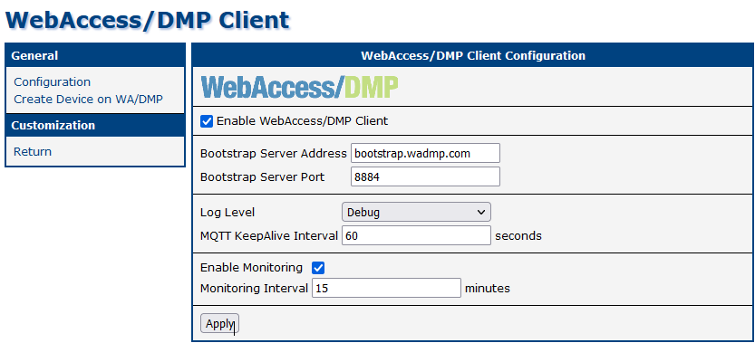

# Grafana - Company Dashboard, Device Dashboard

## WebAccess/DMP Client - Enable Monitoring

When a router has the “WebAccess/DMP Client” User Module installed, the client may optionally be configured to send monitoring data to the server. The data is displayed with Grafana. Grafana is used in WADMP: Home Dashboard → Company Dashboard and individual Device Dashboard.

On the WADMP client, the “Enable Monitoring” checkbox must be checked (the default is yes), and note the “Monitoring Interval”.

&nbsp;    
&nbsp; 
## Company Dashboard

When there are some online devices for the selected company, you should see aggregated company data like this:

When there is not any online device, the dashboard looks like this:

&nbsp;    
&nbsp; 
### Description of individual graphs

|        Name of graph/table         |    Description       |
| :--------------------------  | :------------------- |
|Cellular Download | The total number of octets (bytes) received on the first Mobile WAN interface. This counter is reset when the device is rebooted or restarted by the network interface. Units used are B, KiB, MiB, GiB, ... where 1 KiB means 1024 B. |
| Connectivity History | Shows history of online devices |
| Devices Table (no title) |   |
|  | Alias - Internal DMP name of the device |
|  | Mac Address - physical address of the device. It can be used as a direct link to the device detail page. |
|  | Firmware ver. - last reported firmware version. |
|  | Online - shows the last status of the device. |
|  | Device Type - last reported device type. |
|  | Down - The total number of octets (bytes) received on the first Mobile WAN interface. Units used are B, KB, MB, GB, ... where 1 KB means 1024 B. |
|  | Up - The total number of octets (bytes) transmitted on the first Mobile WAN interface. Units used are B, KB, MB, GB, ... where 1 KB means 1024 B. |
|  | Temp - Internal temperature within the device, in degrees Celcius. Note that this will always be higher than the external (ambient) temperature by around 20 degrees. |
|  | Voltage - Voltage of the input power supply to the device. |
|  | PLMN - A numeric identifier for the mobile operator, or "Public Land Mobile Network". Composed of the 3-digit Mobile Country Code (MCC) followed by the 2- or 3-digit Mobile Network Code (MNC). E.g. “27201” is Ireland (272), Vodafone (01). |
|  | Tech - A string identifying the type of cellular connection used. |
|  | Cell - The cell ID of the cell tower to which the device is connected. The string value is the hexadecimal representation of an integer. |
|  | Strength - Received Signal Strength Indication (RSSI) in dBm. It should correlate with mobile CSQ. |
|  | Quality - Varies by cellular module type but typically represents the “Energy per chip per power density” value (Ec/Io), in dBm. |
|  | CSQ - Signal strength number (0 to 31). 0 to 7: Bad 8 to 15: Marginal 16 to 23: Good 24 to 31: Excellent 99: No signal! |
|  | UpTime - The time in seconds since a connection was established to the mobile network. |
|  | Connect  - Timestamp of latest connection to the cellular network. The device uses “Unix Epoch Time”, the number of seconds that have elapsed since the Unix epoch, which is 00:00:00 UTC on 1 January 1970. |
|  | Disconnect - Timestamp of latest disconnection from the cellular network. 0 (“1970-01-01 00:00:00”) means that the device has not disconnected from the cellular network (since the last reboot or network restart). |
|  | Card - Which SIM card is in use: 0: “1st” 1: “2nd” 2: “3rd” 3: “4th” |
|  | CellsToday - Number of changes in mobile cell today. |

&nbsp;    
&nbsp; 
## Device Dashboard

To see the device dashboard go to Device → My Devices → And select a specific device.

When the device is online, there should be data displayed similar to this example:

When the device has never been online, there are no monitoring data to be displayed:

&nbsp;    
&nbsp; 
### Description of individual graphs

|        Name of stat/graph         |  Description       |
| :--------------------------  | :----------------- |
| Time Since Last Reboot | Time from the last reboot of the router |
| Cellular Up-Time | The time since a connection was established to the mobile network. |
| Download Total | The total number of octets (bytes) received on the first Mobile WAN interface since the last interface restart. Units used are B, KB, MB, GB, ... where 1 KB means 1024 B. |
| Upload Total | The total number of octets (bytes) transmitted on the first Mobile WAN interface since the last interface restart. Units used are B, KB, MB, GB, ... where 1 KB means 1024 B. |
| Last Cellular Connect | Timestamp of the latest connection to the cellular network since the last reboot or network restart. The device uses “Unix Epoch Time”, the number of seconds that have elapsed since the Unix epoch, which is 00:00:00 UTC on 1 January 1970. E.g. 1576587282 = Tuesday 17 December 2019 12:54:42 UTC. |
| Last Cellular Disconnect | Timestamp of latest disconnection from the cellular network since the last reboot or network restart in Unix Epoch Time. |
| Current SIM | Last reported SIM card in use |
| Current Cell | The cell ID of the cell tower to which the device is connected. The string value is the hexadecimal representation of an integer. |
| Current Channel | Cellular channel number |
| Current Cellular Technology | A string identifying the type of cellular connection used. Supported values: "N/A" "GPRS" "EDGE" "UMTS" "HSDPA" "HSUPA" "HSPA+" "LTE" "CDMA" "EV-DO" "EV-DO Rel. 0" "EV-DO Rev. A" "EV-DO Rev. B" |
| Current Cellular Operator | A numeric identifier for the mobile operator, or "Public Land Mobile Network". Composed of the 3-digit Mobile Country Code (MCC) followed by the 2- or 3-digit Mobile Network Code (MNC). E.g. “27201” is Ireland (272), Vodafone (01). |
| Last SNMP Received  | Age of the last download | 
| Cellular Data Usage | The total number of octets (bytes) received or sent on the Mobile WAN interface since the last interface restart. Units used are B, KiB, MiB, GiB, ... where 1 KiB means 1024 B.|
| Instantaneous Mobile Speed | Speed of the mobile connection computed as: Download: Non negative derivation of  ifInOctets * 8 Upload: Non negative derivation of ifOutOctets * 8 |
| Per Carrier | Transferred mobile data computed as  Down: Non negative difference of ifInOctets Up: Non-negative difference of ifOutOctets |
| Signal Quality | Signal Strength - Received Signal Strength Indication (RSSI) in dBm. |
| | Mobile CSQ - Signal strength number (0 to 31). |
| | Signal Quality - Represents the “Energy per chip per power density” value (Ec/Io), in dBm. |
| Internal Conditions | Temperature - Internal temperature within the device, in degrees Celcius. Note that this will always be higher than the external (ambient) temperature by around 20 degrees. |
|  | Voltage - Voltage of the input power supply to the device |
| Today Cells | Mean the number of changes in a mobile cell that represents the cell ID of the cell tower to which the device is connected. |
| Neighbours Channel (only valid when on GPRS/EDGE) | Cellular channel number for neighboring channels #1 to #5 |
| Neighbours Signal Strength (only valid when on GPRS/EDGE) | Signal Strength for neighboring channels #1 to #5. |

&nbsp;    
&nbsp; 
## Grafana tips & tricks

&nbsp;    
&nbsp; 
### View

Suppose you press an arrow near the name of the graph. A small menu pops up:

If you then press “View” you will get focused on the one graph only:

To get the focus back, press the “Esc” key.

&nbsp;    
&nbsp; 
If you press “Esc” once more, a sidebar will appear:

To close it, press the “Cycle view mode” button twice. The button is in the upper part of Grafana:

Also, you can zoom in on some graphs if you select a part of a graph.

&nbsp;    
&nbsp; 
### Share

Grafana allows you to share a graph or snapshot of a chart or even embed that graph on your page.

To do that, open the menu with an arrow near the graph title:

If you press the “Share” option, a Share panel will appear:

If you copy the link, you can send it to anyone so he can access the graph:

You can find more information [here](https://grafana.com/docs/grafana/latest/sharing/share-panel/).

&nbsp;    
&nbsp; 
### Data download

Grafana allows you to inspect a graph and download a CSV of the data presented.

To do that, open the menu with an arrow near the graph title and choose “Inspect”:

If you choose “Data”, you get to this panel, where you can download the data in CSV format:

You can find more information [here](https://grafana.com/docs/grafana/latest/panels/inspect-panel/).

