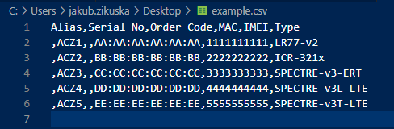

# Adding / Claiming Devices in Bulk

## Introduction

Head to our public repository where you can find python scripts: [Scripts Repository](https://bitbucket.org/bbsmartworx/dmp-public/src/master/python_scripts_old/csv_utilities)

This directory contains a set of Pythons scripts designed to read a CSV file.

1. create_from_csv.py
2. claim_from_csv.py
3. release_from_csv.py
4. delete_from_csv.py

Download the "claim_from_csv.py" file.

We recommend that you create a new virtual environment for these scripts.

Example using virtual environment:

| Linux                              | Windows                                 |
| ---------------------------------- | --------------------------------------- |
| $ virtualenv --python=python3 env3 | > virtualenv --python=python3 env3      |
| $ source env3/bin/activate         | > .\env3\Scripts\activate               |
| $ pip install -r requirements3.txt | > pip install -r requirements3.txt      |

## Usage

Make sure you activate the virtual environment before every script execution.

Run the script with -h as an argument for detailed usage information.

```
> .\claim_from_csv.py -h
usage: claim_from_csv.py [-h] [-host HOST] [-username USERNAME]
                         [-password PASSWORD]
                         [-console_loglevel {debug,info,warning,error,critical}]
                         [-file_loglevel {debug,info,warning,error,critical}]
                         CSVfile Company

Claim devices to a company on WA/DMP

positional arguments:
  CSVfile               Path to CSV file.
  Company               Company name. Check the code for the default!

optional arguments:
  -h, --help            show this help message and exit
  -host HOST            URL of the API gateway. Default =
                        'https://gateway.wadmp.com'
  -username USERNAME    Username. Check the code for the default!
  -password PASSWORD    Password. Check the code for the default!
  -console_loglevel {debug,info,warning,error,critical}
                        Log verbosity level. The higher the level, the fewer
                        messages that will be logged. Default = info
  -file_loglevel {debug,info,warning,error,critical}
                        Log verbosity level. The higher the level, the fewer
                        messages that will be logged. Default = info
```

## CSV File

The **example.csv** file is provided to illustrate the expected schema. -- The first row is ignored. -- Edit the rest of the file with your device information.

### **Alias**

Alias is an optional string displayed in the WA/DMP User Interface.

It allows the user to identify a device using a more human-friendly name.

You should only specify an alias when claiming a device, not when creating it! An alias only has meaning within the Company's context that claims it.

### **Serial No.**

This is printed on the physical label of the device.

Serial No. is mandatory when creating, claiming, or releasing a device.

### **Order Code**

Order Code is an optional string.

### **MAC Address**
This is the MAC address of the primary ethernet interface on the device. It is also printed on the physical label of the device.

MAC is mandatory when creating, claiming, releasing, or deleting a device.

### **IMEI**

IMEI stands for "International Mobile Equipment Identity". It is the unique number of the cellular module in the device and is available on the physical label of the device.

When creating a device, IMEI is optional. However. We highly recommend including the IMEI number when creating cellular devices.

If the IMEI number was included when creating a device, then the IMEI number must be included when claiming or releasing that device later.

### **Type**
To avoid ambiguity with various names used in sales and marketing (e.g., product type, product name, order code, etc.), the string in the Type column should be the name of the firmware used by the device.



## Company

The **claim_from_csv.py** file takes an argument which is your **Company** name. If the name contains a space, you should enclose it in single quotes. For example:

```
python3 claimscript.py -username "Your Username" -password "Your Password" -host https://gateway.dev.wadmp.com example.csv "Your Company"
```