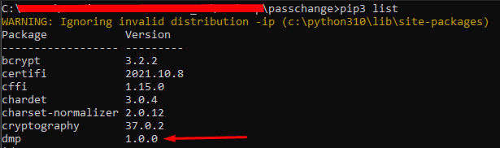
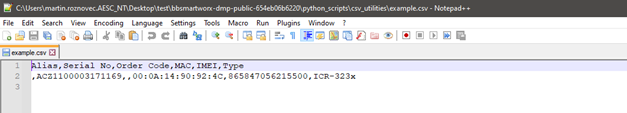
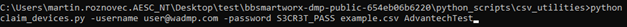
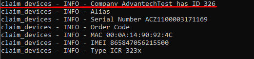
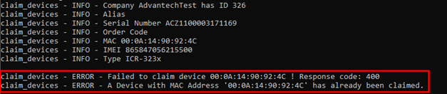

# Bunch Claiming Devices using Script

This topic is a tutorial for bunch claiming devices using API, Python scripts, and CSV files.

## Requirements

1. Python

2. DMP library

:memo: **Note:** For this script, it is necessary DMP library that can be obtained by running the following command:


```
pip3 install https://bitbucket.org/bbsmartworx/dmp-public/raw/
8e86aa752b921caa095d8791cc8f6af62e2d7087/python_scripts/lib/dist/dmp-1.0.0.tar.gz
```

After this step, you should be able to see the library installed by the command pip3 list:



3. Clone of the DMP repository: [Scripts Repository](https://bitbucket.org/bbsmartworx/dmp-public/src/master/python_scripts/csv_utilities/)

Once you will have downloaded the DMP library and the DMP repository, head to the folder

```
\bbsmartworx-dmp-public-654eb06b6220\python_scripts\csv_utilities
```

and edit the example.csv file where you will insert all the devices you want to claim. 



Once you have the example.csv prepared, you can start the claiming script by opening the command line and navigating to the Repository folder

```
\python_scripts\csv_utilities\ 
```
and executing the command:
``` 
python claim_devices.py -username "WADMP_EMAIL" -password "PASSWORD" example.csv "COMPANY_NAME"
```

::: warning Caution:
Please note that the Company name parameter is CASE SENSITIVE!
:::


Example (from the \python_scripts\csv_utilities\ folder): 
python claim_devices.py -username user@wadmp.com -password S3CR3T_PASS example.csv AdvantechTest



If everything is successfully prepared, you should see that the device has been claimed to your company.



If there is any issue with claiming of the device, you will see it in the error message like this:

