# Tagging and Grouping

You can filter and overview the devices using groups and tags. The difference between groups and tags is that the device can be only in one group at a time. So changing the group will move the device to another group. But using tags, you can create overlapping bunches of devices. This is because the device can have only one group but multiple tags.

## Grouping
There are two options, how to group certain routers to be overviewed as a group.

### Option 1

After logging in to the [system](https://wadmp.com), click on "My Devices".

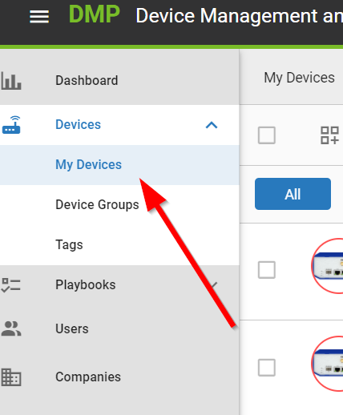

If you are in more companies, select exactly one company you want to manage.

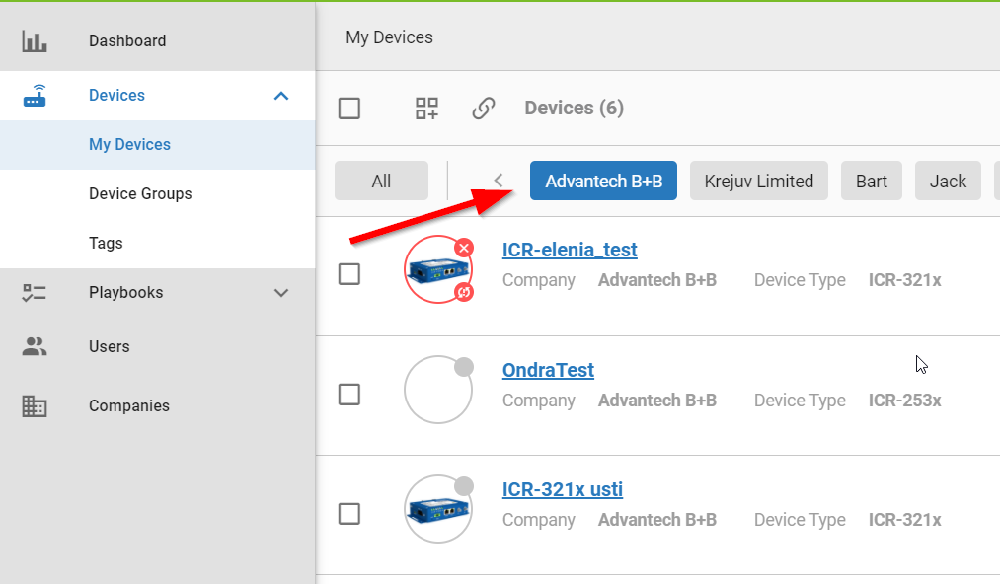

Select the devices you want to group

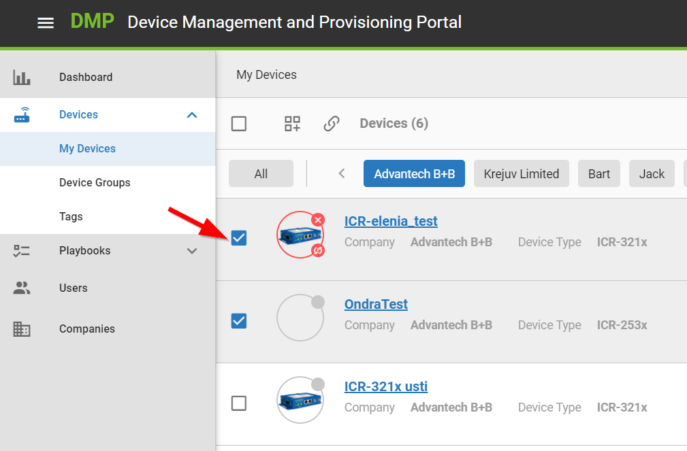

and scroll to the end of the page and click "Set Group".

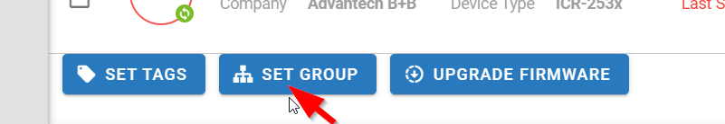

1. Name the group here,
2. or add to an existing group,
3. click on "Save".

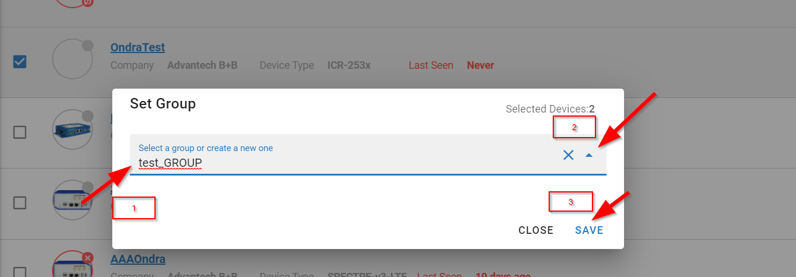

After the group is created, you can find it in "Device groups".

### Option 2

After logging in to the [system](https://wadmp.com), click on "My Devices" and "Divide Groups" and then click on the grid plus icon.

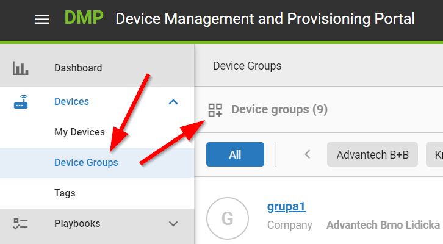

1. Name the group here,
2. choose the company,
3. click "Save".

After everything is saved, a button "+ Add devices to group" will appear. Click on the button.

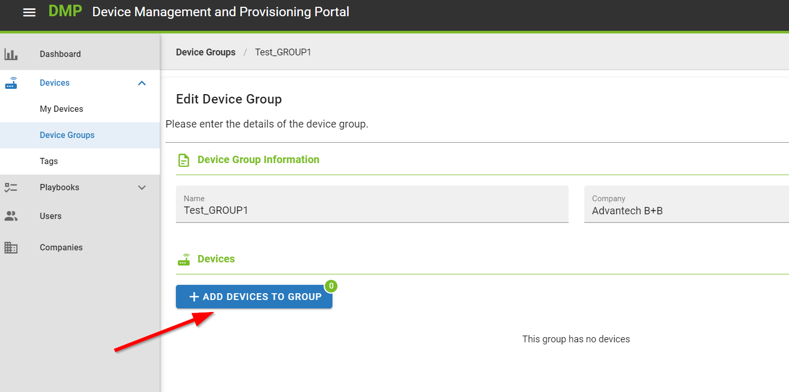

1. You can use filters to find the devices.
2. Select the devices you want to group.

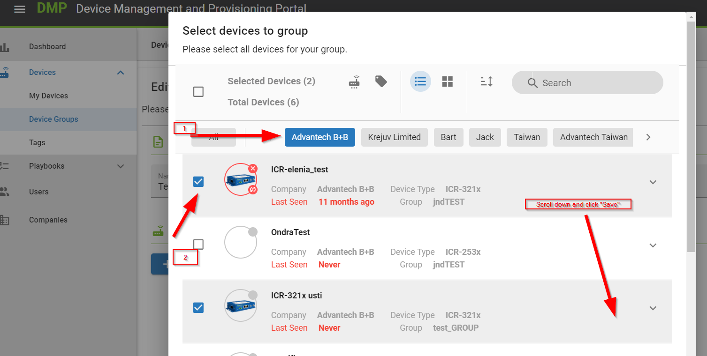

1. There is an overview of the selected devices.
3. Click on "Save".

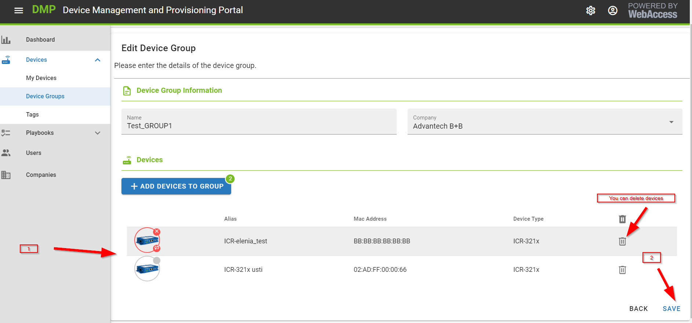

In "Devices" there is "Device Groups" subitem. Your group can be found there.

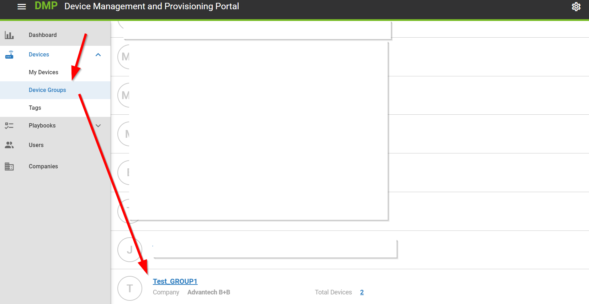

## Tagging

Tagging can make it easier to find the devices by giving them specific properties with tags and then filtering or searching for them.

After logging in to the [system](https://wadmp.com), click on "Devices" and "Tags" and click on the grid plus icon.

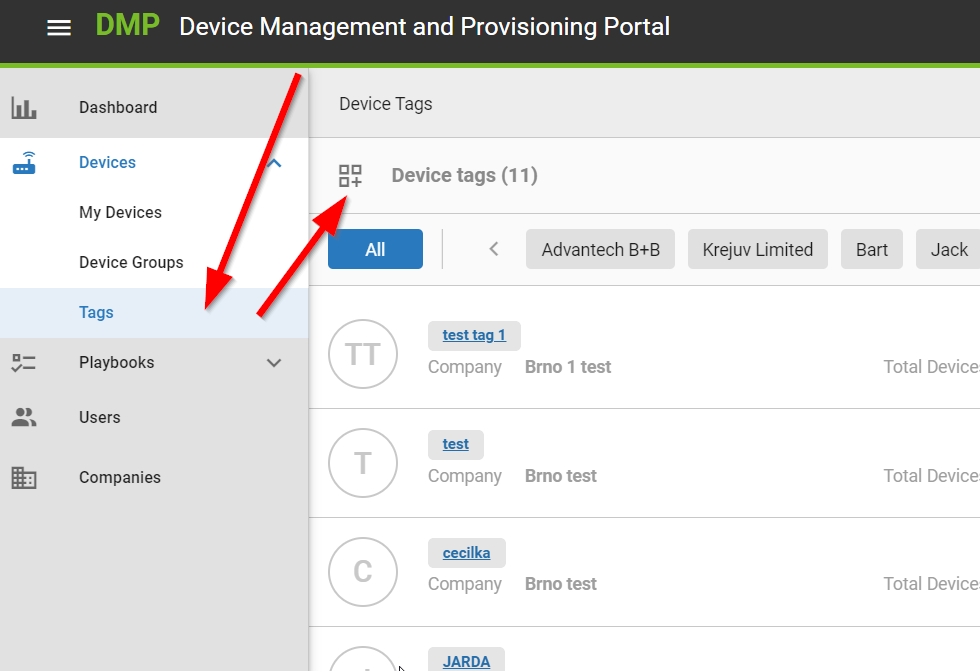

1. Name the Tag,
2. select the company,
3. Click on "Save".

To assign the tag we created to the device we want, proceed as follows:

1. Click "My Devices".
2. If you are in more companies, select precisely one company.
3. Select devices.
4. Click "Set Tags".

Start writing the name of the tag you just created and select it. Then click "close". (The tag is added just by selecting it).

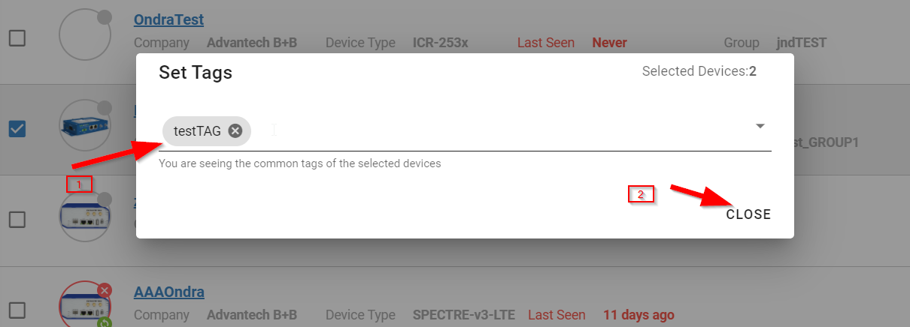

To find the device under a specific tag, click on the icon "Filter by Tags".

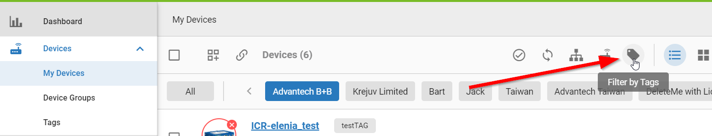

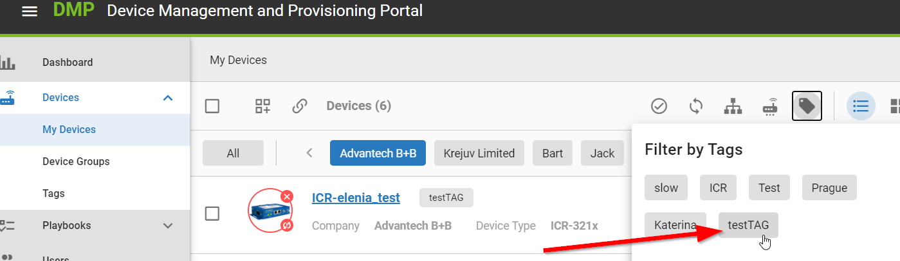
 
 Here you can see the devices under a specific tag.

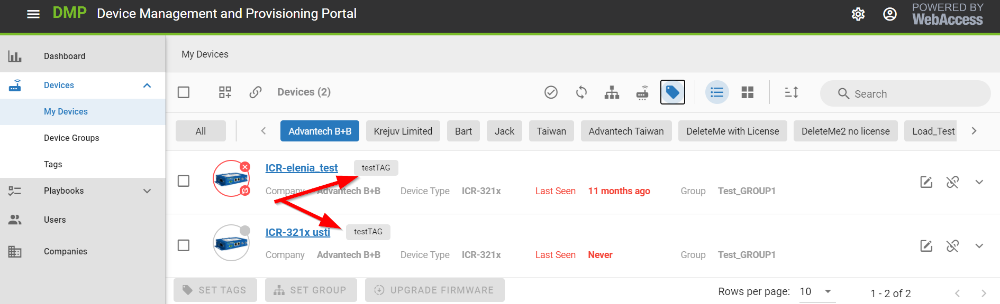

### Option 2

You can create new tags directly when marking the devices with tags:

1. Go to "My Devices".
2. If you are in more companies, select precisely one company.
3. Select Devices.

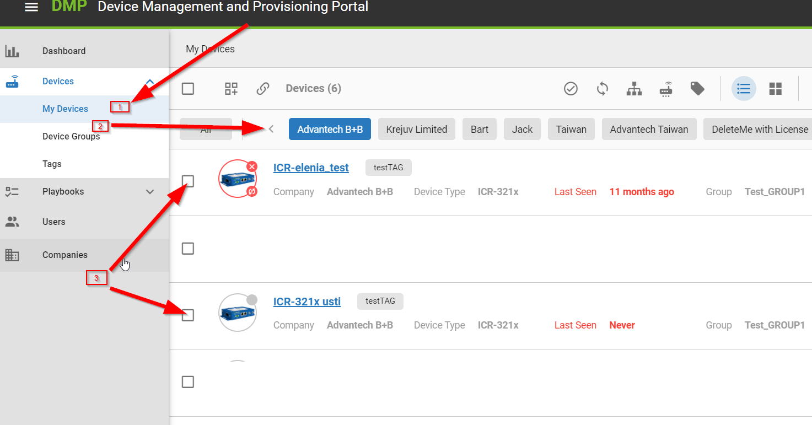

Click on "Set Tags".

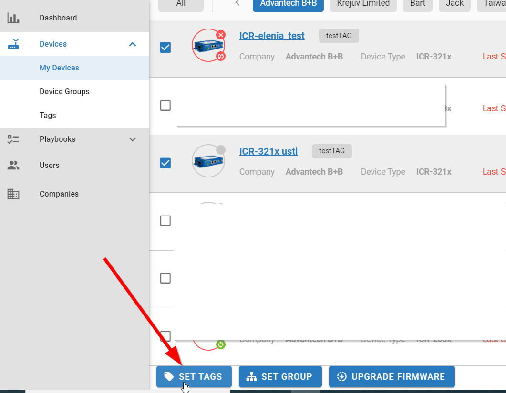

1. There can be an existing tag.
2. Type in the new name of another tag you want to create and press enter.
3. Click "Close".

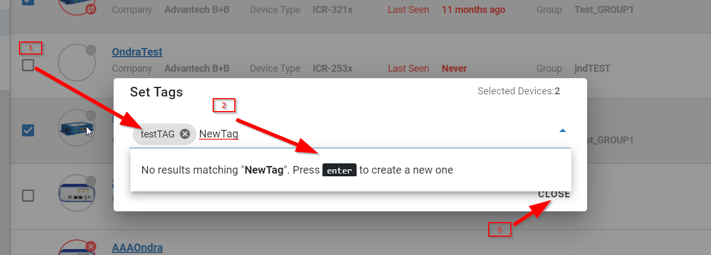

Here you can see the tag is assigned.

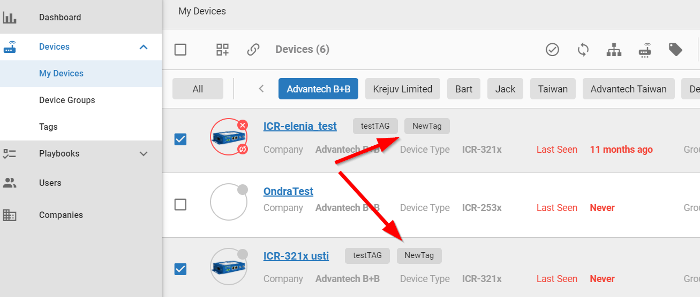