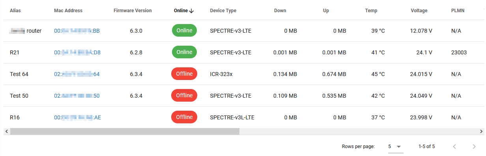
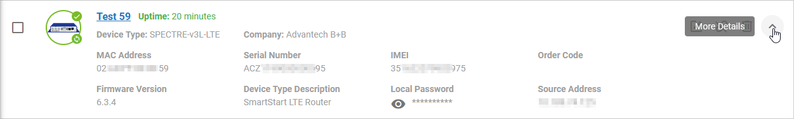
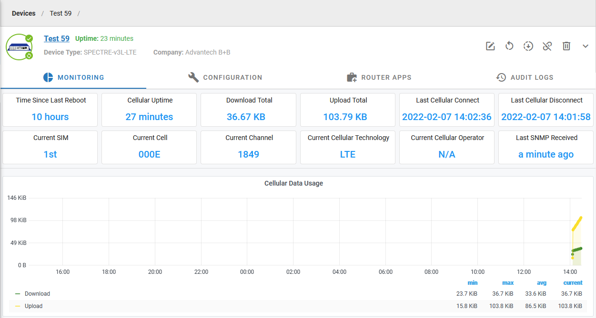

# 2.4.2: February 11, 2022

This immediate bugfix release has addressed several issues present for some time now. 

### Improvements:

* **UI: Reworked the device table at the Company Dashboard page** (it now contains links to the pages of the respective devices and is sortable by column).

* **Added several significant optimization measures that improve the performance of our database.**

* UI: Removed pie graphs from the Company Dashboard page (Connection Status, Device Type, Cellular Connection Type) due to being redundant. This information is available on the Aggregated Dashboard page.

* UI: Improved formatting of the extendable device detail information available on the "My Devices" page and device pages.

* UI: Rearranged information at the device detail Monitoring page.

### Bugfixes:

* **Fixed routers sometimes become stuck out of sync due to a lost message and the server not resending it.**

* Fixed Auditing pages by default, not including the records created in the past 1 minute.

* Fixed records in the Alert History page not being sorted by time.

* Fixed some auditing records missing Requester User and Company Name information.

* Fixed e-mails about Alerts showing slightly wrong time (delayed by the Cooldown length). We also added information about the timezone (UTC) into the messages.
