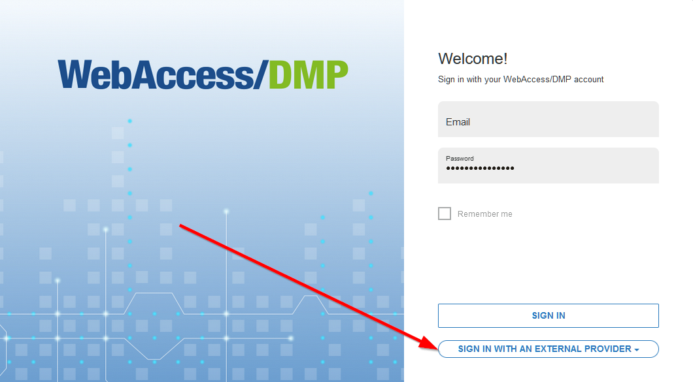

# Sign Up and create your company

To start using WebAccess DMP, you need a user account first. 

Use Sign Up only if you are the first from your company to access the platform. If someone else has already Signed Up, ask them to create a user to add you to the company. Signing Up will also ask you to create a company. This will allow you later to claim your devices.

Sign in straight away if your company is listed as an external provider under the Sign-in button (see details below the video).

## Sign up Process

These are the steps if you prefer instructions instead of a video:
- Go to [wadmp.com](https://wadmp.com). You will be redirected to the login page
- Click on the Sign-Up link and fill in your details and the ones of your company
- After clicking on the Sign-Up button, go to your email inbox and confirm your new user.

<iframe width="560" height="315" src="https://www.youtube.com/embed/fDfFuPSz90w" frameborder="0" allow="accelerometer; autoplay; encrypted-media; gyroscope; picture-in-picture" allowfullscreen></iframe>
  
&nbsp;    
&nbsp;   
## Sign in with External Provider 

If your company is listed as an external provider, you can sign in immediately.

OAuth/OpenIP type of authentication is supported for external providers. Don't hesitate to contact us if you want your company to be listed as an external provider.

