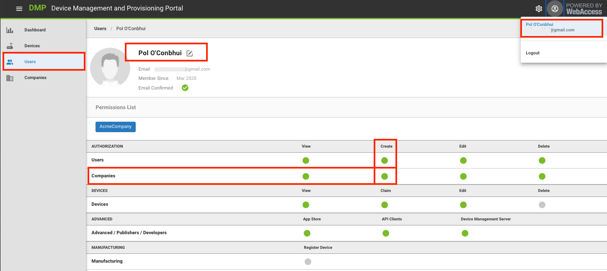
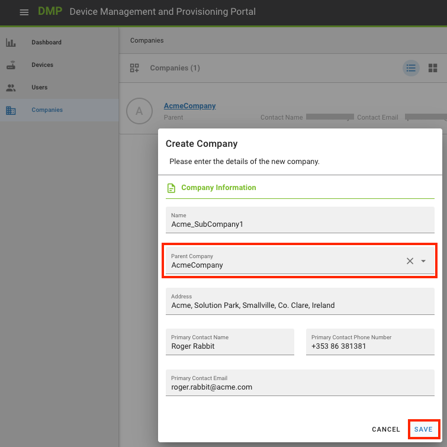

# Create new Companies

You can create more companies to represent a logical subdivision for practical purposes. For example, you may want to make a new company under your organization with different devices because:

You want your devices to be managed by different users
You want one aggregated dashboard per device group
It makes sense for the structure to resemble the hierarchy of your organization. e.g., Buildings or Areas where devices are installed
Go to Companies on the left menu and click on the icon for a new company on the left of the page menu. Select a parent company to represent the hierarchy between them.

<iframe width="560" height="315" src="https://www.youtube.com/embed/oHyHGEjnUY4" frameborder="0" allow="accelerometer; autoplay; encrypted-media; gyroscope; picture-in-picture" allowfullscreen></iframe>

Remember, the creation of a company depends on two conditions:
- That you can log in to the platform and
- That you have permissions to create companies

If you can't see the new company icon, contact your company's admin to get the appropriate permissions.
You can check your permissions if you edit your user. Your assigned permissions are shown as green dots.

In summary, these are the fields you have to fill when creating a new company: 

1. Name of the Company that you are creating. 

2. Parent Company for this Company (this is required)

   Note: if you are an authorized user in more than one Company, you can select which of those Companies should be the Parent for this new Company.

3. Business address for this new Company.

4. Name, phone number, and email address of the person who will be the Primary Contact person in this new Company. 

   **Note**: this information is "metadata": this step does _not_ create a User in the system, nor does it assign a User any permissions for this new Company. 

