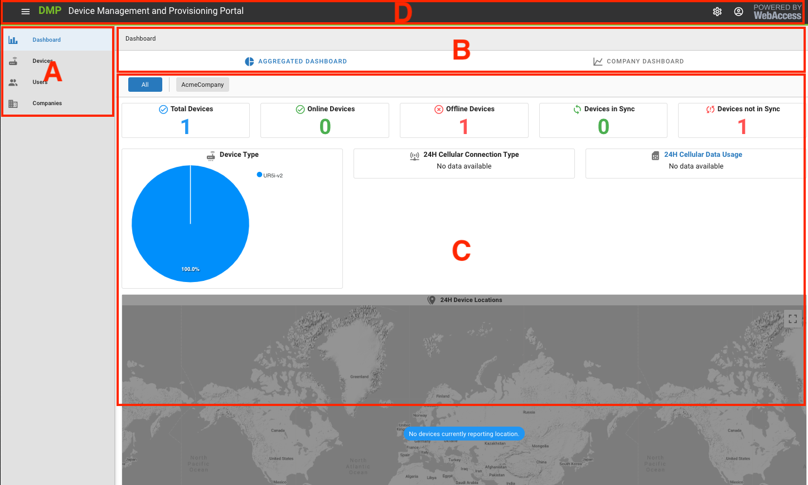

# General Structure of the User Interface

The UI is structured into four main areas. 

<u>A: The Context Panel</u>

The Context Panel is where the current context for panels B and C is selected.

<u>B: The Actions Panel</u>

This is where the available Actions will appear. 

What you see here depends on the selected context.

<u>C: The Details Panel</u>

This is the central panel of information. The details presented here depend on the context and actions selected. 

<u>D: The Title Panel</u>

The Title Panel contains some information about the currently running software version; it has links to user documentation and has logged-in user information.