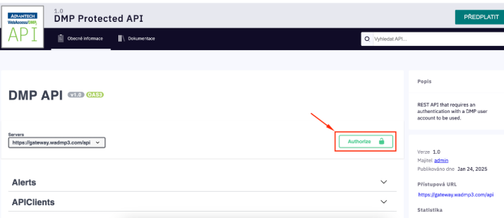
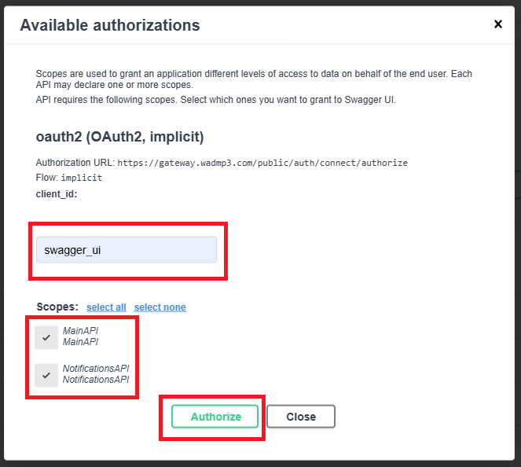
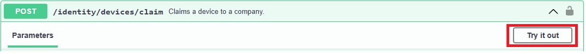
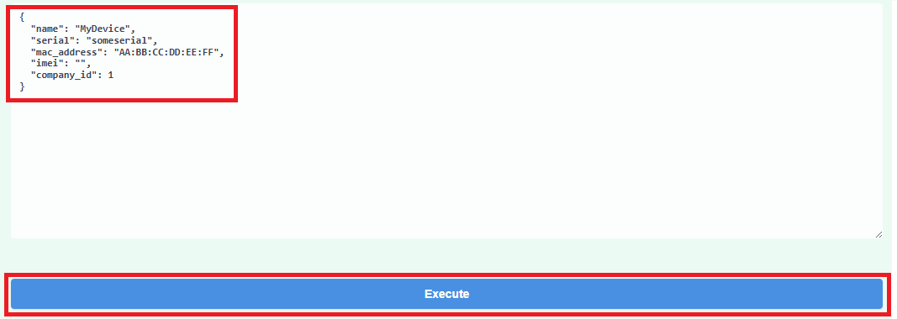

# Getting Started

This guide will help you setup your own scripts that communicate with WebAccess/DMP via **REST API**. Please look up the appropriate section based on your prefered language.

### Python

We actively maintain a python library for interacting with DMP servers. The library and many useful scripts are available in a public repository at [bbsmartworx/dmp-public](https://bitbucket.org/bbsmartworx/dmp-public/src/master/). Please see the README.md inside the repository for instructions how to install and use it.

### Bash (and cURL)

We understand that using curl is sometimes the simplest solution. To explore all supported endpoints and their parameters, visit: [api.wadmp3.com](https://api.wadmp3.com/). The API documentation is presented as interactive Swagger pages.

#### Using Swagger UI

Before you can call any endpoint, you must authorize yourself:

- Click the Authorize button.

- In the dialog window, enter swagger_ui as the client ID, enable the **MainAPI** scope, and click **Authorize**:

- Once authenticated, locate the desired endpoint, click **Try it out**, fill in the required parameters, and click **Execute**:

### Further Examples

Some endpoints can be complex or require additional context. We’ve prepared a set of **examples and guides** to aid you in making the most of our API. Please see [Useful Examples](../useful-examples/README.md) for more code samples and in-depth explanation of important endpoints.