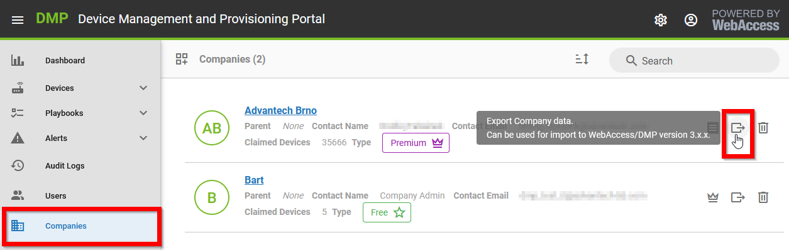
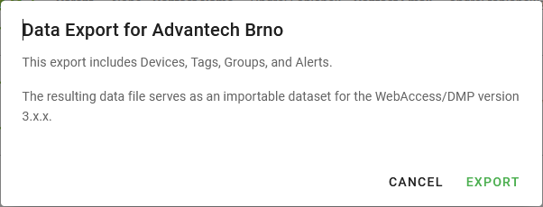
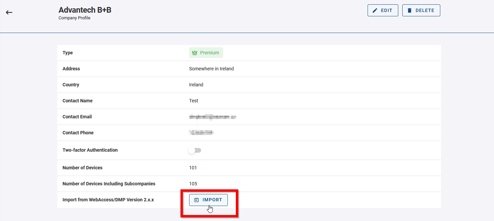
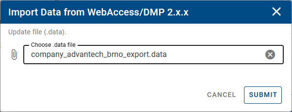
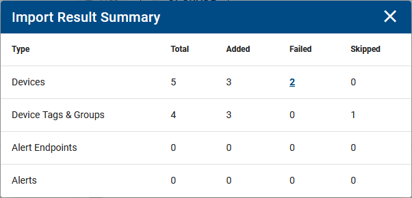
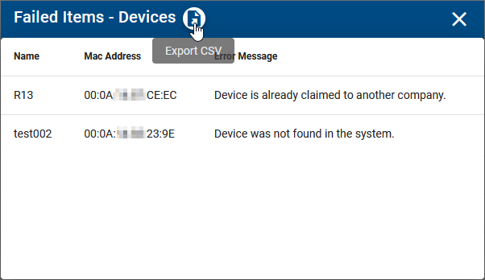
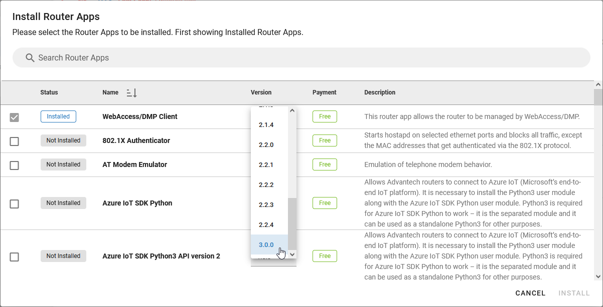

# Migration from 2.x.x to 3.x.x Instance

This page explains the process of migrating data from a 2.x.x instance at [www.wadmp.com](http://www.wadmp.com) to a 3.x.x instance at [www.wadmp3.com](http://www.wadmp3.com). 

1. The migration involves transferring data from one company in GEN2 to another in GEN3, without altering the company structure. 

2. Both companies must already exist in their respective instances for the migration to proceed.

**What is migrated:**

- Device Memberships (the same devices from 2.x.x will be added to your 3.x.x company)
- Tags and Groups (added through automatically created _Fields_ of type _Tag - True/False_)
- Alerts and Alert Endpoints

## Step 1: Export Data from 2.x.x Instance

Navigate to _Companies_. Locate the company from which you wish to export data and click the _Export_ icon on the right.

A dialog box will appear providing details about the export. Save the file as `company_name_export.data` to your computer.

## Step 2: Import Data into 3.x.x Instance

Log in to your account at [www.wadmp3.com](http://www.wadmp3.com). Select or create the company where data will be imported. Navigate to _Companies_ in the menu and click on the company details. On the _Company Profile_ page, click on the _Import_ button:

Choose the data file containing exported data from the 2.x.x instance and press **Submit**.

The results of the import will be displayed after the process completes, which depends on the volume of data. This will include an overview of successful imports, skipped items, and any failures.

You can examine the outcome of the import process. Skipped items indicate they were previously imported or manually added. For any failures, select the number of failed items to investigate the reasons. You can also generate a CSV failure report using the export icon at the top.

## Step 3: Migrate Devices

To manage your devices in the 3.x.x instance , upgrade the _wadmp_client_ Router App on your devices to version 3.0.0 using the 2.x.x instance.

Installing this updated Router App version enables your devices to connect to the 3.x.x instance. Note that after this upgrade, devices will no longer be able to connect to the 2.x.x instance. It is advisable to test this migration process on a small number of devices first.

