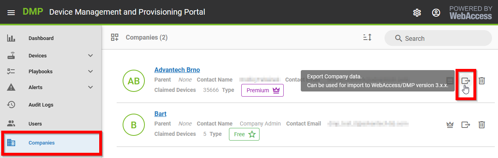
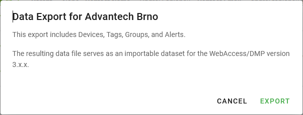

# Step 1: Export Data from 2.x.x Instance

## Migration from 2.x.x to 3.x.x Instance

This page explains the process of migrating data from a 2.x.x instance at [www.wadmp.com](http://www.wadmp.com) to a 3.x.x instance at [www.wadmp3.com](http://www.wadmp3.com). 

1. The migration involves transferring data from one company in GEN2 to another in GEN3, without altering the company structure. 

2. Both companies must already exist in their respective instances for the migration to proceed.

**What is migrated:**

- Device Memberships (the same devices from 2.x.x will be added to your 3.x.x company)
- Tags and Groups (added through automatically created _Fields_ of type _Tag - True/False_)
- Alerts and Alert Endpoints

## Step 1: Export Data from 2.x.x Instance

Navigate to _Companies_. Locate the company from which you wish to export data and click the _Export_ icon on the right.

A dialog box will appear providing details about the export. Save the file as `company_name_export.data` to your computer.

