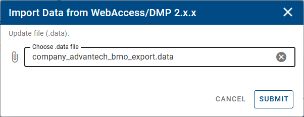
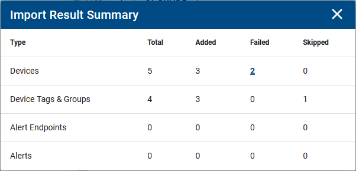

## Step 2: Import Data into 3.x.x Instance

Log in to your account at [www.wadmp3.com](http://www.wadmp3.com). Select or create the company where data will be imported. Navigate to _Companies_ in the menu and click on the company details. On the _Company Profile_ page, click on the _Import_ button:

Choose the data file containing exported data from the 2.x.x instance and press **Submit**.

The results of the import will be displayed after the process completes, which depends on the volume of data. This will include an overview of successful imports, skipped items, and any failures.

You can examine the outcome of the import process. Skipped items indicate they were previously imported or manually added. For any failures, select the number of failed items to investigate the reasons. You can also generate a CSV failure report using the export icon at the top.

