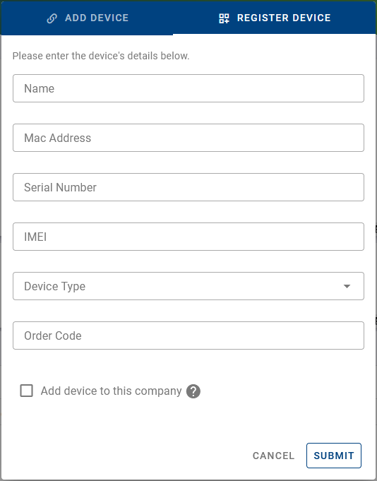

## 1. Register a Device (On-Premises Only)

In the on-premises version of our system, administrators must register devices before they can be added. This process is necessary because on-premises installations lack access to our manufacturing database, which is utilized for device registration in the public instance. Here's how administrators can register a device:

1. **Accessing Device Registration:**

   - Navigate to the dashboard interface.
   - Click on the "+" icon located above the dashboard table.

2. **Registration Process:**

   - Upon clicking the "+" icon, administrators will be directed to the device registration interface.
   - Administrators will notice an additional tab labeled "Register Device."

     

   - Fill in the required details about the device in this tab.

     

3. **API Endpoint:**
   - Additionally, administrators have the option to register devices programmatically using the API endpoint designated for device registration.

By following these steps, administrators can efficiently register devices in the on-premises version of our system, ensuring seamless integration and management within their environment.
