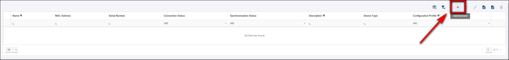

# Adding Devices

- On [wadmp3.com](https://wadmp3.com) you can add manufactured Advantech devices directly using plus icon on the dashboard. For more continue to [Add a device](./add-a-device/).

- If you are using On-Premises instance, you need to [register a device first](./register-a-device/).

:::warning Recommendation:
WebAccess/DMP Client App is neccessary for a device to be added. It should be pre-preinstalled in your device already when manufactured, but we recommend to check and always use the latest version of WebAccess/DMP Client App. See [Install/Upgrade a WebAccess/DMP Client App](./install-client-app/).
:::
