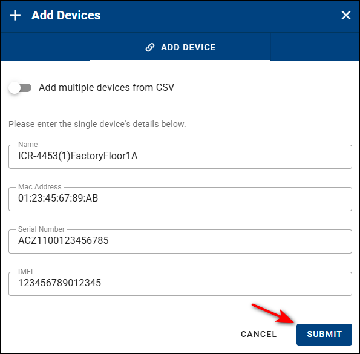
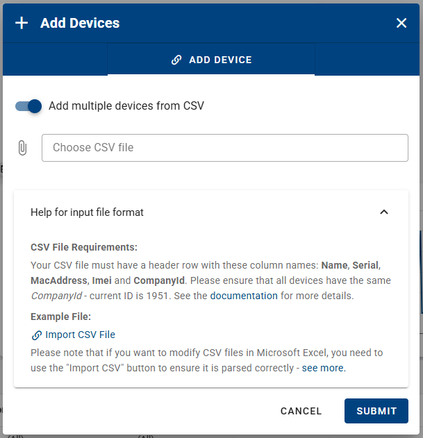

## Add a Device

⚠️ You must have the appropriate permissions to add a device to your company.

⚠️ Support for the WebAccess/DMP platform is limited for **S1 Router** version.

**Note:** The Device can be connected to the WebAccess/DMP instance only if WebAccess/DMP Client Router App is installed in the device. This Router App is installed automatically when manufacturing the device, so you do not have to do it manually. In most cases adding the device to WebAccess/DMP instance is enough to connect your device. Otherwise follow [Install/Upgrade a WebAccess/DMP client app](../install-client-app/). <!-- new link-->

- **User Criteria for adding a Device:**
  You need to have the right permissions, Check the [permissions](../../user-management/permissions/). <!--  need to check the link after I finish splitting all the sections to edit the internal links. -->

### Rules

- Both removed and new devices can be added.
- A device can only be added by one company at a time.
- A company can remove a device it has previously added.
- A device must be added by a company before it can be managed or monitored.
- A free company can add up to five unique devices.

⚠️ Once you add five devices, you cannot add more, even if you remove a device. The limit is based on the number of times the "Add" device function has been used successfully, not the current number of devices.

### Steps To Add a Device

#### How to obtain router information?

- You can obtain router information through the WebAccess/DMP Client application by following these steps:

1.  Login to the router's user interface.
2.  Navigate to Router Apps (in Customization section of the menu).
3.  Enter the WebAccess/DMP Client application.
4.  Click on Create Device on WA/DMP.
5.  You will find the information about this router there.

- You can also use the printed device label:

#### Steps to add a device for your company (Assuming you have the required permissions):

**1. Navigate to the "Dashboard" on the Side Menu.**

**2. Click the "Add Devices" action button above the table.**

**3. Fill out the "Add Device" form with the following information:**

- **Name:**
  Enter a human-friendly name to help identify the device later. _This field is optional._

- **MAC Address:**
  Enter the exact MAC Address for ETH0 of your device as it appears on the device label. The format should be `00:0A:14:aa:bb:cc`. _This is a required field._

- **Serial Number:**
  Enter the exact Serial Number as printed on the device label, including any alphanumeric characters. _This is a required field._

- **IMEI:**
  Enter the exact IMEI number as printed on the device label. Note that some devices may not have an IMEI number; _this field is only required if applicable._

**4. If you need to add more than one device at a time, enable the option "Add multiple devices from CSV":**

- Prepare the CSV file for your devices. Expandable help on the required format will be available after you enable "Add multiple devices from CSV".
- For large shipments of devices, you can optionally request a prepared list of devices from support. Please contact support for assistance with this.

- You can also download an example CSV file that you can edit for your needs: [CSV Example File](/assets/routers-example.csv)

**5. Click the _Submit_ button to finish adding the devices..**

- After successfully adding a device, it will appear in the Device List for your company, as shown here:

