## Creating New Alerts

### To Be Notified - Create Endpoint(s)

In the **Alerts -> Endpoints** section, use the plus icon to add an Endpoint. This is the contact that will receive notifications when an alert is triggered. You can create and configure multiple endpoints.

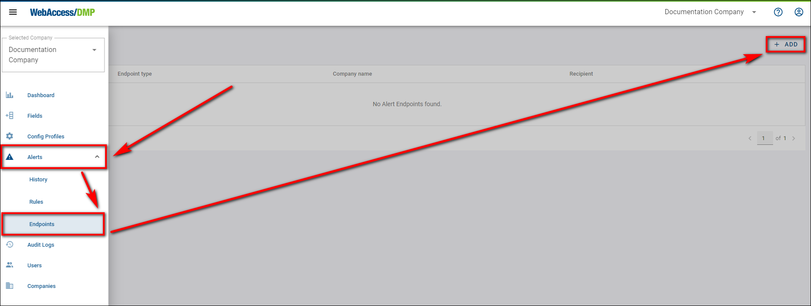 

- Provide the Name and Email for the endpoint.

  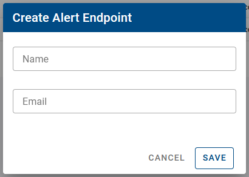

- To edit an existing endpoint, click on the pencil edit icon in the right column of the Endpoints table.

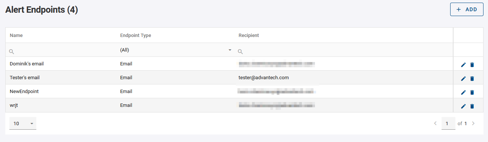

## Create Rule(s)

Create a new alert rule by using the plus icon in the Alerts section.

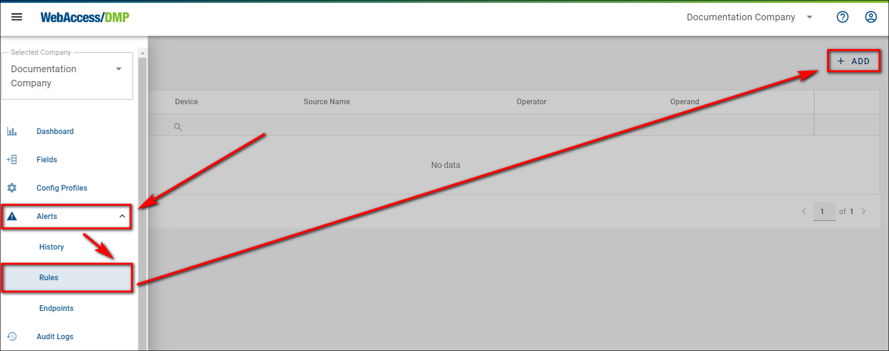

**1.** When setting up a new rule, you must choose one of three **Target Types**:  

- **Company** — applies the rule to all devices in your current company.  
- **Single Device** — applies the rule to one specific device.  
- **Devices** — applies the rule either to all devices or to devices with a specified tag, which you can choose from your list. 

**2.** Define the parameters for the rule, including the cooldown period which begins immediately after an alert is triggered. The rule check occurs instantly after the cooldown and continues according to the set period.

**2.1.** When defining rules for the **Company** target type, you can choose between the *Failed Login Attempts* and *Users Count* options. 

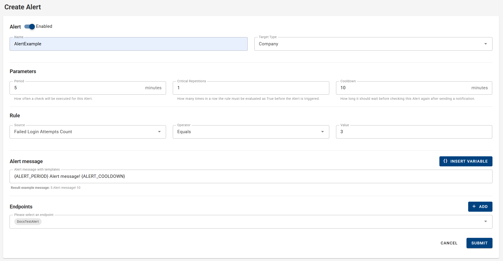

**2.2.** For the **Single Device** target type, select the specific device from your current company to which the rule will apply.

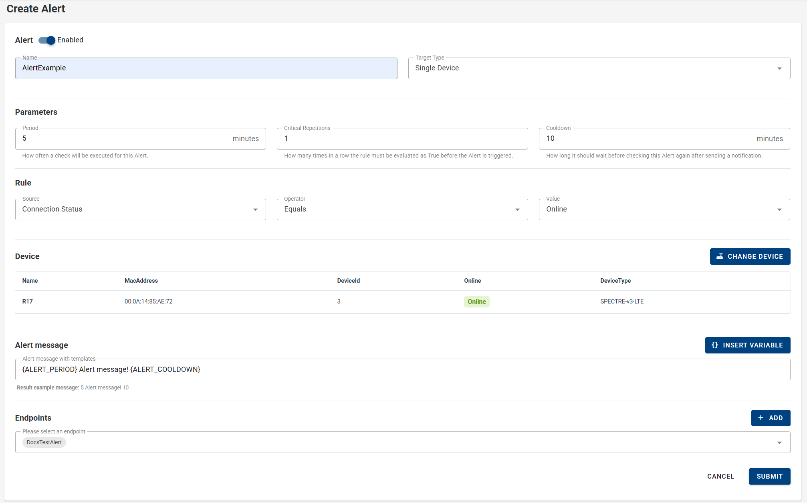

**2.3.** When selecting the **Devices** target type, you can choose either all devices or devices with a specified tag. Two types of tags are available:  
- *Tag - True/False* — with two possible values: True/False.  
- *Tag - Textual* — where you can define any custom tag. 

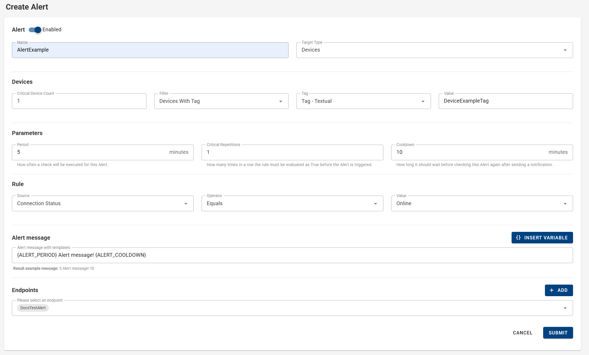

 **3.** Configure the rule criteria—choose the parameter to evaluate and the condition. For instance, with the **NotInRange** operator, specify two integer values.

<b style="color: red;">Important Notice:</b>
 DeviceState category fields like "Online/Offline" are evaluated based on the status at the time of the check, unlike Monitoring or Auditing fields which consider data over a specified period.

**4.** You can specify the message that the alert will send to your selected *Endpoint* when triggered. You also have the option to *insert variables* into the predefined alert message text field. The type of *variable* available depends on the selected *Rule* type. 

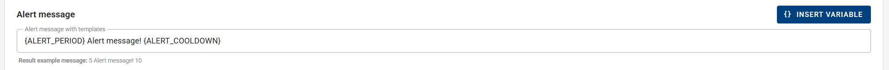

**5.** Select the endpoint(s) to notify when the alert is triggered. You can also disable the rule evaluation at any time.

**6.** Press the **Submit** button to save the changes in rule.

**7.** You can manage created rules in the Rules table by enabling/disabling them in the first column, edit them by clicking on the rule name or pencil icon, and duplicate them by clicking the copy icon in the right column, which opens the **Edit New Rule** form for adjustments.

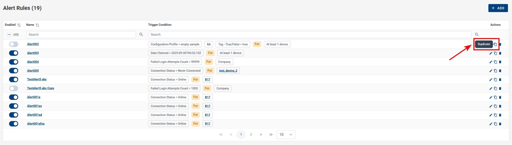

## Mail And History

For alerts sent to an Email endpoint, the notification **will appear in your mail inbox like this**:

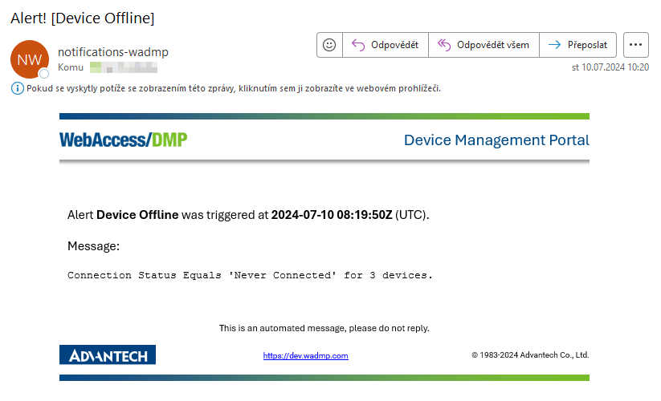

All alerts are also recorded in **Alerts -> History**, accessible even if no endpoint is selected for the rule.

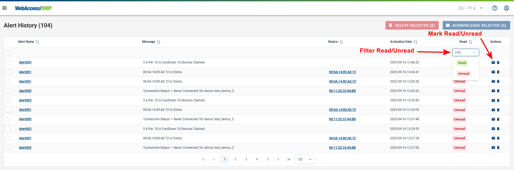

Alerts can be marked as read or unread using the envelope icon. Filters are available to view read/unread alerts.

You can select a specified number of alerts, or all alerts, and then mark them as read or delete them in bulk. The maximum number of alerts cannot exceed 5,000 at a time.

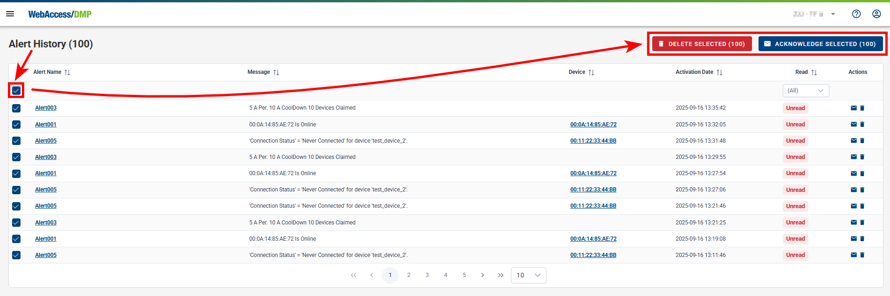