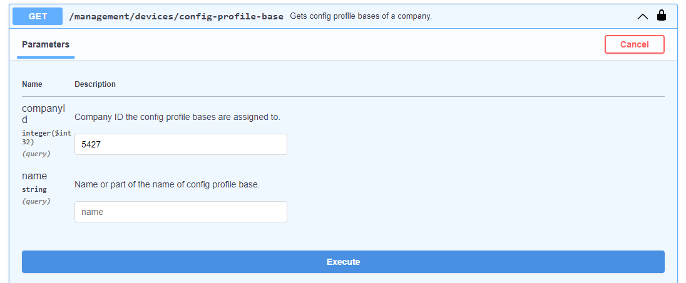

# API

## How to Use DMP API from a Swagger Page

You can use API endpoints directly from a Swagger page, available at [api.wadmp3.com](https://api.wadmp3.com).

How to Authorize for using the API via swagger:

- Select _DMP Protected API_ and press _Authorize_ button.

- Fill in _“swagger_ui”_ as _client_id_, tick _MainAPI_ and press _Authorize_.
  

## How to Create Configuration Profile, including Scripts, Using API

This tutorial describes how to create a configuration profile directly (rather than from an existing device).

1. Learn the ID of the company where you want to create the configuration profile.

   - Go to a company page in the main DMP UI. The ID of the currently viewed company can be found in the URL. Write this ID down, you will need it later.
     

2. Find the endpoint for creating configuration profiles.

   - Press the “Try it out” button that is shown after clicking at the POST endpoint in _ConfigProfiles_ section.
     

3. Specify the company ID and the name of the config profile.

   - Input the ID of your company and the name for your configuration profile.
     ```
     "company_id": 5427,
     "name": "testProfile",
     ```

4. You may add settings.

   - If you want this configuration profile to manage any settings, the “settings” section is used for that. You can add as many settings as you want. Each item consists of the name of the setting (equal to the one that can be found in setting files located within _/etc/_ folder of routers) and the structured object containing a value for that setting (see the example bellow). Any settings whose names do not match those on router will be ignored.
     ```
     "settings": {
       "ETH_IPADDR": { "v": "192.168.1.1" },
       "ETH_NETMASK": { "v": "255.255.255.0" },
       "WIFI_AP2_CHANNEL": { "v": "1" }
     },
     ```

5. You may add apps.

   - If you want this configuration profile to manage apps on your devices, you need to list those apps within the “apps” section. See the example bellow. Please beware that if you do not add “wadmp_client” here, the newest available version will automaticly be inserted into the configuration profile for you.
     ```
       "apps": {
         "wadmp_client": { "version": "3.0.1" },
         "pinger": { "version": "2.6.1" }
       },
     ```

6. You may add firmware version and behavior.

   - If you want to manage firmware, you can specify its version in the “firmware” subsection of a “system” section.

   * The “unlisted_behavior” property configures how the client should treat the apps that are installed in the router but not mentioned in the configuration profile. There are 2 possible values:

     - “Ignore” - The client will ignore applications that are not listed in apps section.

     - “Purge” - The client will uninstall any applications that are not specified in the apps section of the configuration profile.

     ```
     "system": {
       "firmware": { "version": "6.4.0" },
       "unlisted_behavior": "Ignore"
     }
     ```

7. You may add files.

   - If you want to deploy scripts or other files via the configuration profile, you can specify those within the “files” section. The names of the properties in “files” section must be unique. The parameters are:

     - “path” - specifies at what location will the file be created in the router (if file already exists there, it will be overwriten).

     - “data” - the contents of the file, encoded into a base64 string.

     ```
     "files": {
       "ip-down-script": {
         "path": "/etc/scripts/ip-down.local",
         "data": "IyEvYmluL2Jhc2gKCnVjaG8gIkhlbGxvIFdvcmxkISIKCmV4aXQgMA=="
       },
       "ip-up-script": {
         "path": "/etc/scripts/ip-up.local",
         "data": "IyEvYmluL2Jhc2gKCnVjaG8gIkhlbGxvIFdvcmxkISIKCmV4aXQgMA=="
       }
     },
     ```

8. You may add users.

   - If you want to manage users (and/or their passwords) through the configuration profile, you can add them within the “users” section. For each user you can only specify their name and password (hash). The value for the password must be obtained from the “/etc/shadows” file of a router.
     ```
     "users": {
       "root": {
         "password": "$5$O3T0K11ShCR0/59E$AZE6cxDijHEARuXDNQECqE7AgJgumf5Qfepi/piAWHD"
       },
     },
     ```

9. Press execute button.

   - Example of the whole profile create model:

     ```
     {
       "company_id": 5427,
       "name": "testProfile",
       "settings": {
         "ETH_IPADDR": { "v": "192.168.1.1" },
         "ETH_NETMASK": { "v": "255.255.255.0" },
         "WIFI_AP2_CHANNEL": { "v": "1" }
       },
       "files": {
         "ip-down-script": {
           "path": "/etc/scripts/ip-down.local",
           "data": "IyEvYmluL2Jhc2gKCnVjaG8gIkhlbGxvIFdvcmxkISIKCmV4aXQgMA=="
         },
         "ip-up-script": {
           "path": "/etc/scripts/ip-up.local",
           "data": "IyEvYmluL2Jhc2gKCnVjaG8gIkhlbGxvIFdvcmxkISIKCmV4aXQgMA=="
         }
       },
       "users": {
         "root": {
           "password": "$5$O3T0K11ShCR0/59E$AZE6cxDijHEARuXDNQECqE7AgJgumf5Qfepi/piAWHD"
         }
       },
       "apps": {
         "wadmp_client": { "version": "3.0.1" },
         "pinger": { "version": "2.6.1" }
       },
       "system": {
         "firmware": { "version": "6.4.0" },
         "unlisted_behavior": "Ignore"
       }
     }
     ```

   - Your configuration profile should now be complete. Press the Execute button.

   

### Using an Already Existing Configuration Profile as a Template.

Rather than creating a new configuration profile from scratch, you can use an existing configuration profile as a template:

- Firstly, list existing configuration profiles in your company to learn the ID of your configuration profile.

  

- Secondly, obtain the configuration profile by its ID.

  

- Lastly, copy the value of the “body” element of the configuration profile into a text editor and replace all occurences of `\"` with just `"`. After that, remove `"{` from the beginning (the first two characters) and `}"` from the end (the last two characters). Then edit the contents (delete settings/apps/scripts/files/users that you do not want to manage or add new ones) and paste the result into the endpoint for creating new configuration profiles (shown in the step #3 above). Add "company*id" and "name" and press the \_Execute* button.

  

  

  

  ## Bunch Claiming Devices Using Script

  This topic is a tutorial for bunch claiming devices using API, Python scripts, and CSV files.

  **Requirements**

  1. Python

  2. DMP library

  - Download latest repository from [https://bitbucket.org/bbsmartworx/dmp-public](https://bitbucket.org/bbsmartworx/dmp-public):

    - [Direct link to download as ZIP file](https://bitbucket.org/bbsmartworx/dmp-public/get/00b7e5bd78a6.zip)

  - Extract the ZIP file and go to folder:

  ```
  \bbsmartworx-dmp-public-00b7e5bd78a6\gen3\python_scripts\lib>
  ```

  - Install build dependency: **pip3 install build.**

  - Build the dmp library like this:

  ```
  python3 -m build
  \bbsmartworx-dmp-public-00b7e5bd78a6\gen3\python_scripts\lib>python3 -m build
  ```

  - You should see build status coming up:
    

  - If build is sucesfull you should see:
    

  - Then you can proceed with installing the dmp library by going into the dist folder:
    

  - And execute pip install **dmp-3.0.3.tar.gz** (in the dist folder)

  - If everything goes well you should be able to list the dmp library by pip3 list:
    

  3. Clone of the DMP repository that contains python_scripts (ZIP file from the previous step should contain this): [https://bitbucket.org/bbsmartworx/dmp-public](https://bitbucket.org/bbsmartworx/dmp-public)

  **Execution**

  - Once you will have downloaded the DMP library and the DMP repository, head to the folder:

  ```
  bbsmartworx-dmp-public-00b7e5bd78a6\gen3\python_scripts\csv_utilities
  ```

  - Edit the example.csv file to include all the devices you want to claim.

  

  - Once example.csv is ready, open the command line and navigate to the repository folder:

  ```
  \python_scripts\csv_utilities\
  ```

  - Execute the following command:

  ```
  python claim_devices.py -username "WADMP_EMAIL" -password "PASSWORD" example.csv "COMPANY_NAME"
  ```

  ::: warning Caution:
  Please note that the Company name parameter is CASE SENSITIVE!
  :::

  

  - Example Command (_from the_ \python*scripts\csv_utilities\ \_folder*):

  ```
  python claim_devices.py -username user@wadmp.com -password S3CR3T_PASS example.csv AdvantechTest
  ```

  

  - If the script executes successfully, the device will be claimed to your company.

  

  - If there is an issue with claiming the device, an error message will be displayed:

  
