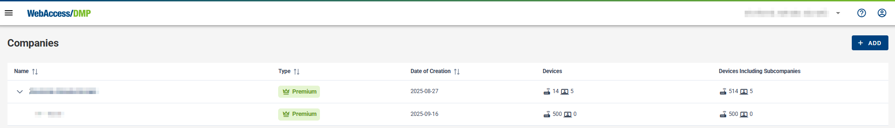

##	General

###	Introduction To Companies

* It's free to create a company. Just log in or sign up. You can create as many companies as you want.
* When you create a company, you become the "Company Admin". You can manage and control the devices added to the company. The permissions for users you invite are set by you or another user with the right permissions.

###	Limitations Of Non-Premium Companies

* After a new company is created, the company type is automatically set to "Free".

* Company type can be:

| Company type |   | Features     |
|------|----------------------------------------------------------|-------------------------------------------|
| Free |  | Can claim and manage up to 5 devices.     |
| Premium |         | Can claim and manage an unlimited number of devices, has access to the *Alerts* section.    |

* Company type configuration: Company type can only be changed for the parent company. Child companies inherit their type from their parent.

