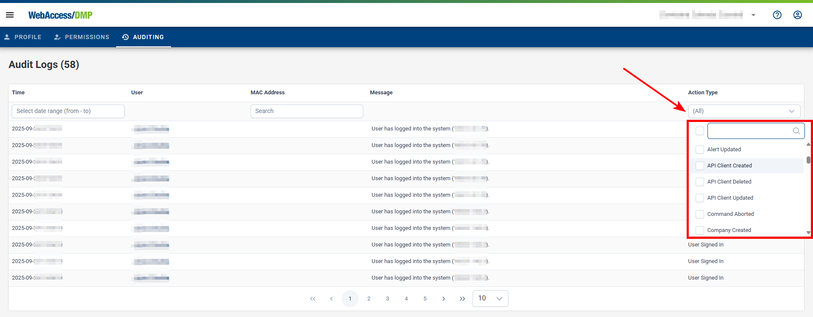

##	Audit Logs

Each user action that creates, updates, or deletes anything generates an auditing record. These records are kept for **6 months** after their creation.

### Searching Through Audit Logs

#### Accessing Overall Audit Logs
**Navigation:** Click on "Audit Logs" in the left side menu.

#### Accessing Device-Specific Logs
**Navigation:** From the Dashboard's table, navigate to a device page and select “Audit Logs.”

#### Accessing User-Specific Logs
**Navigation:** Click on "Users" in the left navigation menu, select the user you wish to audit, click on the "pen" icon to open their profile page, and then select the "Auditing" tab.

#### Filtering Audit Logs
**Date and Time Filters:** Specify the audit logs you need by selecting "Start Time" and "End Time".

**Action Type Filters:** You can also filter logs by the type of action recorded.

### Persistence Of Audit Logs

* **1. Default Display and Retention**

   * Initial Display: By default, only the last 24 hours of audit logs are shown immediately.

   *Retention Policy: Audit logs are retained on the DMP platform for two months. Logs older than two months are automatically purged.

* **2. Viewing Older Logs**

   * Custom Time Selection: To access logs older than the default 24-hour display but within the two-month retention period, use the time selection feature at the top of the audit logs page to adjust the displayed time range.
