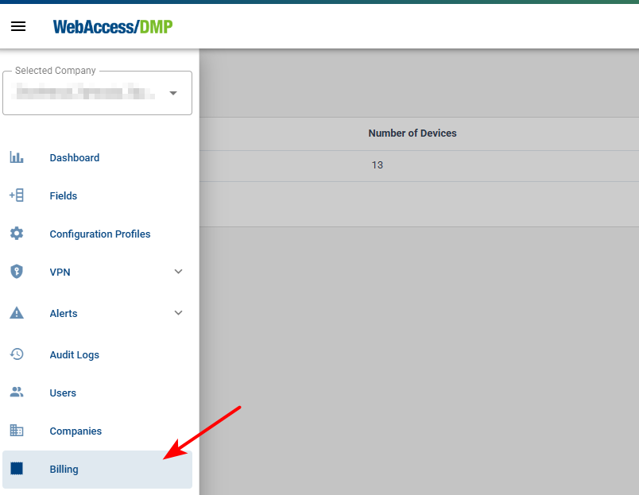

##	Billing 
* If your company type is Premium, you are billed monthly. The billing are coming automatically on the Primary Contact Email at the company

**Email example:**

### How to view billing history?

* To access the Billing item in the side menu, you must be in a root (top parent) company and have permissions to view Billing or be a Company Admin (A list of monthly billing will appear).

* **Billing Summaries list:**

  Click on an billing to view details or download it as a PDF by clicking the download button on the right (Arrow-Icon). 

  By clicking the Billing summary, you can go to the Billing Detail page, where you can also download a PDF.

