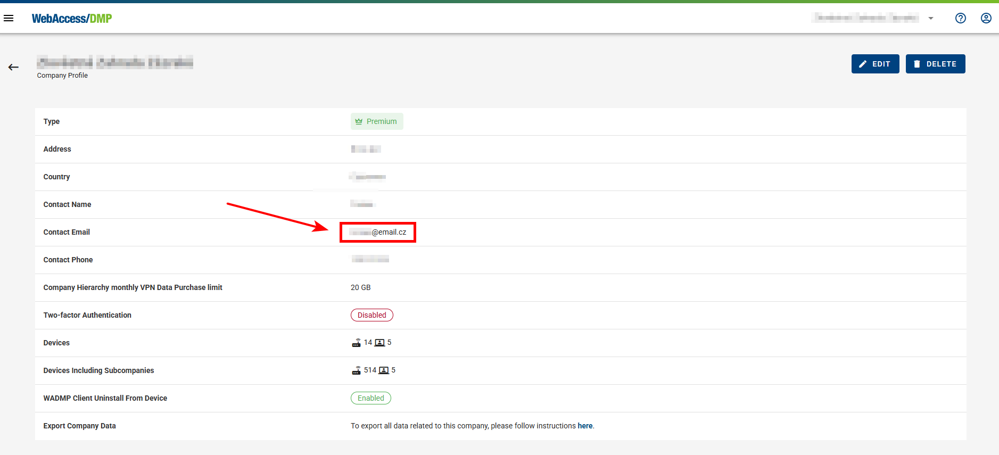

## Billing

- If your company type is Premium, you are billed monthly. The billing are coming automatically on the Primary Contact Email at the company

**Email example:**

### How to View Billing History?

- To access the Billing item in the side menu, you must be in a root (top parent) company and have permissions to view Billing or be a Company Admin (A list of monthly billing will appear).

- **Billing Summaries list:**

  Click on an billing to view details or download it as a PDF by clicking the download button on the right (Arrow-Icon).

By clicking the Billing summary, you can go to the Billing Detail page, where you can also download a PDF.

### VPN Billing Summary ###

- Premium companies are charged a fixed rate per GB of data, along with an additional charge per device. In the Parent Company settings under Companies → Edit, a data limit is defined for the entire company structure, including all subcompanies. Each subcompany, including the parent company, can independently purchase additional data (VPN Overview → Buy Data). These purchases count toward the overall data limit and are billed accordingly.

- Data is billed as a one-time charge in the month of purchase and remains available until fully consumed → it does not expire at the end of the billing cycle.

- Roadwarrior VPN users are billed in the same manner as devices, with a fixed charge per user.

