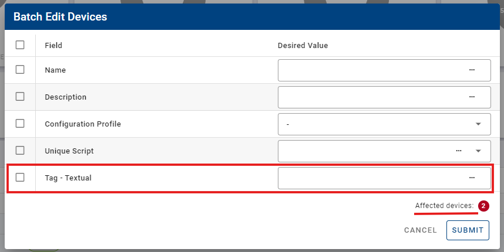
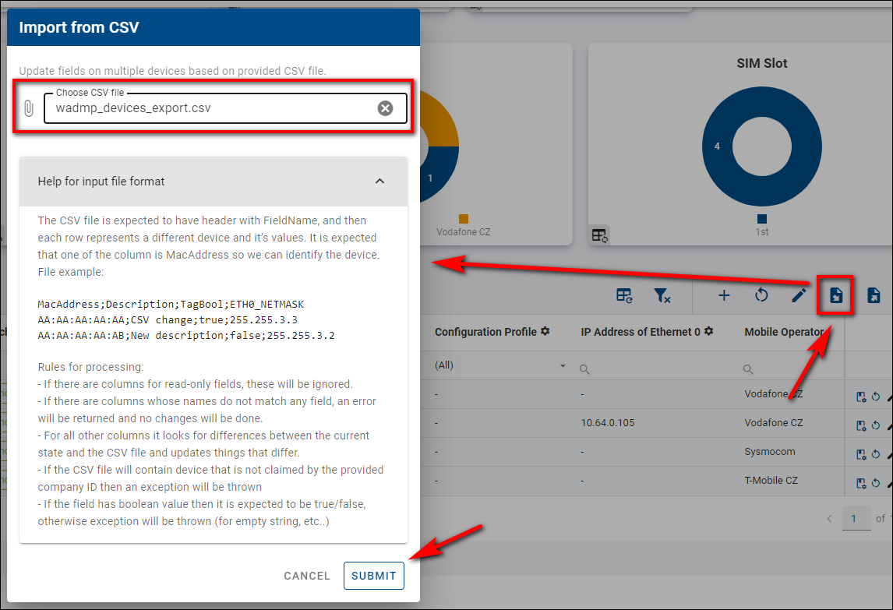

## Tips & Tricks

#### Sizing and Moving

This feature applies to both the company and device dashboards. To adjust the size and position of your graphs and widgets:

1. Select _Edit View_ mode.
2. Drag the desired field to adjust its size and position.

To exit _Edit View_ mode, click the _Floppy Disc_ icon to save your changes, or click the _Undo_ button next to it to discard any changes.

&nbsp;  
&nbsp;

#### Editing or Adding a Device Description

To edit or add a new description to a device:

1. Click the _Edit_ icon on the router you wish to modify.
2. Enter your desired description.
3. Save the changes by clicking on the _Floppy_ disc icon that replaced the _Edit_ icon.

&nbsp;  
&nbsp;

#### Devices Tagging

- You can filter and overview the devices using tags. Using tags, you can create overlapping bunches of devices.

Tagging can make it easier to find the devices by giving them specific properties with tags and then filtering or searching for them.
After logging in to the [system](https://wadmp3.com), you must ensure a _Tag - Textual_ field in the Filter Panel of the Devices. <!-- new link -->

If you don't have it, you can add this field by check [Adding/Removing fields](https://docs.wadmp.com/gen3/docs/device%20management/fields/#adding-removing-fields). <!-- new link -->

- After adding the _Tag - Textual_ field and making it visible, Select your desired devices to create a Tag for your device and click the _Batch Edit Filtered Devices_ icon.

- In the _Batch Edit Filtered Devices_ form, specify the name tag you want to use for the selected devices in the Tag - Textual Desired Value field and click submit. Above the submit button, there's a note showing how many devices are affected by this action.

- Your desired devices should now be Tagged.

- You can filter devices by simply typing in your specified tag; only the devices with this tag will appear.

#### Data Export

You can export CSV data files from your devices in Excel format:

1. **Export All Devices:** Without selecting any devices, you will download a CSV file containing data from all devices in bulk.
2. **Export Selected Devices:** You can select your preferred devices and export only their data. Additionally, you can choose your preferred devices on the graph and then download their data in bulk.

&nbsp;  
&nbsp;

- For more information, visit [Exporting data to CSV](https://docs.wadmp.com/gen3/explanations/device%20monitoring/#_2-exporting-data-to-csv).<!--  need to check the link after I finish splitting all the sections to edit the internal links. -->

&nbsp;  
&nbsp;

#### Data Import

You can import your devices from CSV data files by following these steps:

1. Click the _CSV Import_ button.
2. Select your specified data file.
3. For details about the input format, scroll down to the _Help for input format_ section.
4. Click the _Submit_ button to complete the import process.

&nbsp;  
&nbsp;

- For more information, visit [Device monitoring](https://docs.wadmp.com/gen3/explanations/device%20monitoring/#device-monitoring).<!--  need to check the link after I finish splitting all the sections to edit the internal links. -->

