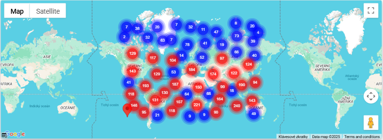
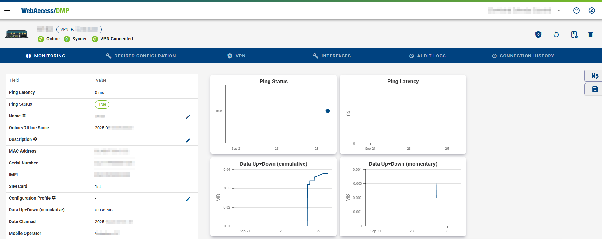

# Dashboards & Widgets

On Dashboard home page you can create "views" (seen as tabs on top) with different widgets (charts, stats, table). You can apply and save filters.

In the case of a large number of devices, the map will group them into a location cluster, as shown below.

On device detail page, there is similar dashboard on Monitoring home tab. You can add Fields to table, add charts as well. Editing of this device page view is common for all devices in a company (serves as template what information will be shown when you look at any device).

