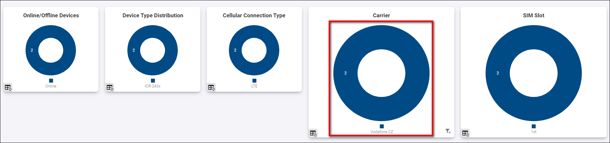
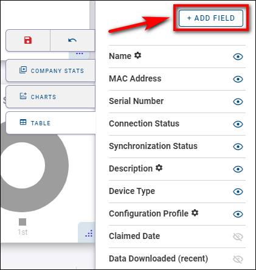
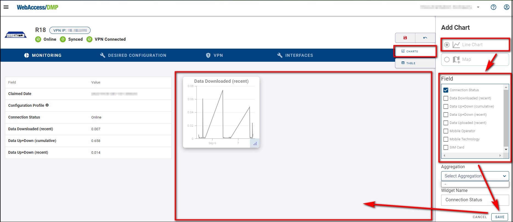

## Customization Of Views

The Company Dashboard (home page) allows you to create different views, and the Device Dashboard lets you similarly customize views for data per single device.

### Structure of Company Dashboard

The dasboard UI is structured into four main areas:

.png>)

&nbsp;  
&nbsp;

**A: The Title Panel**

- The Title Panel contains a link to the context panel, where you can specify your output on panel C.

- It also includes a link to the documentation, client router App, version and information about the currently logged-in user.

&nbsp;  
&nbsp;

**B: The Views Panel**

- This is where you can create empty views or select already defined settings for panels C and D.

.png>)

- To create a new view, click on the "+" add icon, enter the name of your view, and click "Create".

- You can edit, duplicate, or delete a view by clicking on the _three dots icon_ next to the name of the view you want to modify.

&nbsp;  
&nbsp;

**C: The Details Panel**
This is the central panel of information. The details presented here depend on the context and actions selected. You can access the Edit View menu by clicking the top icon.

- You can specify your desired widgets, including Company Stats Widgets, Chart Widgets, and columns in the Table. All of these can be moved at will. By clicking on the floppy disc icon, you save your current view.

&nbsp;  
&nbsp;

**D: The Filter Panel**
In this section, you can filter based on any available parameters. You can also export, import (from CSV file), add devices, delete devices, reboot devices, create configuration profiles, and configure your current filters at will.

- When there are online devices for the selected company, you should see aggregated company data like this:

- When there are no online devices, the dashboard looks like this:

&nbsp;  
&nbsp;

**Description of Individual Fields:**
For detailed information about the fields, visit [Fields](https://docs.wadmp.com/gen3/docs/device%20management/fields).<!-- new link -->

#### Searching And Filtering

You can search, filter, and sort your devices at will, but remember that this only applies to your active view.

#### Searching for a Specific Device

To search for a specific device:

1. Choose the appropriate column.
2. Enter your desired parameter.

- For example, to find devices with "Description 2" in the _Description_ column:

#### Sorting Devices

To sort devices by a specific column, such as _Description_:

1. Click the _Description_ column header.
2. Choose either descending or ascending mode.

#### Filtering

- You can interact with graphs by clicking on specific parts of them.

- For example, to display only devices of the "Vodafone CZ" operator, click on the section of the graph representing "Vodafone CZ" devices. This action will apply an active filter.

- To remove this filter, click the "Clear Filters" button.

#### Customizing Columns

You can edit, show/hide, or add more columns in the Edit View mode, as detailed in the **General Structure of the UI >> C: The Details Panel** section.

To customize your table fields, press the "Add field" button.

&nbsp;  
&nbsp;

### Device Dashboard

- To see the device dashboard, go to the Dashboard section → Filter Panel → And select a specific device (By clicking on the device name).

- When you're configuring your first device, the page will be blank with no monitoring data to be displayed:

- To add Tables to the device's dashboard, press _Edit View_.

- press _Table_ and make your already added Tables visible. You can add more by clicking the _+ Add Field_ button.

- To add Charts to the device's dashboard, press Edit View → Charts, select either Line Chart or Map (this is only functional when the device has GPS active), and choose your desired Field that will appear as graph widget on the device's dashboard. Click the "Save" button.

> **NOTE:** Remember that every action in the _Edit View_ must be saved by clicking the Floppy Disc icon.

&nbsp;  
&nbsp;
