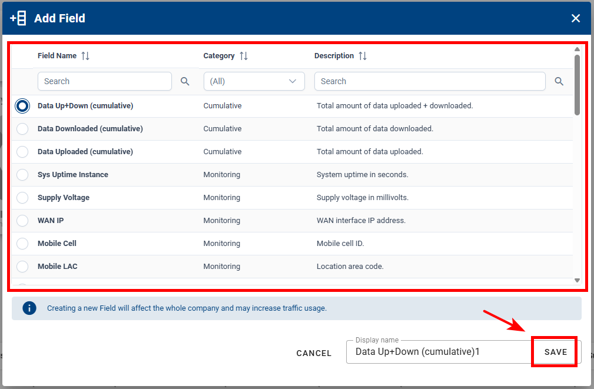
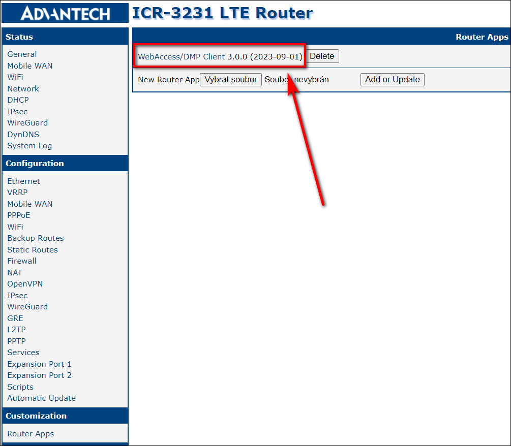
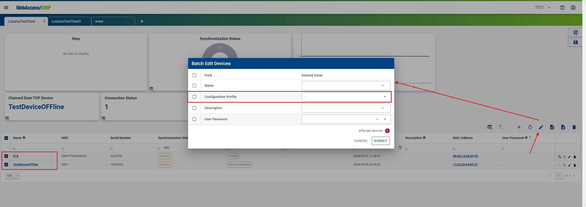

# Device Management

## 1. WebAccess/DMP Client App

### Configure Client Application

If you want to propagate your managed configuration to the device, it is recommended to have a device in Synced and Online state. In WebAccess/DMP Client router app, this checkbox has to be enabled for the sync to by working:

(Enable monitoring is not necessary for settings propagation, it is for reporting of metrics.)

### Handling Router-side Changes

If a configuration change is made directly on the router locally (via the router's web interface), it will be overridden by WebAccess/DMP only under certain conditions: The particular setting must be set as managed (desired) on WebAccess/DMP.

Managed (desired) value may be defined using a Configuration Profile or via an individual Field from the Configuration category (may be created and setup manually, or looked up and set on Desired Configuration tab of Device page).

## 2. Fields

### What Are Fields and How They Work?

#### Definition of Fields

Fields are data tracked in the database for your company. They have different categories, so they serve for both monitoring and configuration. Fields are further used for data presentation on dashboards, individual or batch configuration, alerts, etc.

#### How Fields Work

Fields are integral to the customization of views in both the Company Dashboard and the Device Dashboard. They allow users to tailor the information displayed to meet specific needs.

- When a field is added to a dashboard, it becomes a widget or part of a table, providing real-time data about the selected parameter.
- Users can interact with these fields to gain detailed insights and take necessary actions based on the information provided.

Here for example fields are shown as columns in the table on Company Dashboard, and editable field values may be edited directly by clicking edit pencil icon:

&nbsp;  
&nbsp;

### Field Categories

On Fields page you can filter Fields by category. In addition, you can search within fields by clicking on the search icon at the top left of the table.

Fields are categorized to streamline their management and usage. The primary categories include:

#### Static Fields

These fields hold constant information that typically doesn't change over time. Some of them are editable (like Name, Description), but once edited, they remain static. Examples include:

- Device ID
- MAC Address
- Name
- Description
- Serial Number
- IMEI

#### Monitoring Fields

These fields provide real-time or periodically updated information about the device's performance and status. Examples include:

- Connection Status
- Data Downloaded (momentary)
- Data Uploaded (momentary)
- Mobile Operator
- CPU Usage

#### Cumulative Fields

These fields aggregate monitoring data over time to give a comprehensive view of the device's performance. Periodical reset may be set up on this type of fields. Examples include:

- Data Downloaded (cumulative)
- Data Uploaded (cumulative)
- Data Up+Down (cumulative)
- Reconnects Count

#### Configuration Fields

These enable settings and configuration specific to the device. Examples include:

- Configuration Profile
- Unique Script
- User Password
- etc.

&nbsp;  
&nbsp;

There is a set of default Fields listed below, that you will find in the _Fields_ section in side menu. **Information about additional fields is shown in Add Field dialog** that can be acquired by clicking the _+ ADD_ button in the _Fields_ section and browsing through all available ones.

| Name of graph/widget      | Description                                                                                      |
| :------------------------ | :----------------------------------------------------------------------------------------------- |
| Claimed Date              | Date of claim.                                                                                   |
| Configuration Profile     | Assigned configuration profile.                                                                  |
| Connection Status         | Connection Status.                                                                               |
| Data Downloaded (recent)  | Amount of data downloaded within the last monitoring period.                                     |
| Data Up+Down (cumulative) | Total amount of data uploaded + downloaded.                                                      |
| Data Up+Down (recent)     | Amount of data uploaded + downloaded within the last monitoring period.                          |
| Data Uploaded (recent)    | Amount of data uploaded within the last monitoring period.                                       |
| Date Created              | Date when this device was created on the server (usually corresponding to its manufacture date). |
| Description               | Description of a device.                                                                         |
| Device ID                 | ID of the device.                                                                                |
| Device Type               | Type of device.                                                                                  |
| IMEI                      | IMEI of a device.                                                                                |
| MAC Address               | MAC address of the device's primary LAN interface.                                               |
| Mobile Operator           | The name of a mobile operator.                                                                   |
| Mobile Technology         | Mobile technology (e.g., GSM, UMTS, LTE) ("N/A" when no SIM is present).                         |
| Name                      | Name of the device.                                                                              |
| Online/Offline Since      | Date and time when this device has last connected or disconnected from DMP.                      |
| Reconnects Count          | Number of times the device went from offline to online state.                                    |
| Serial Number             | Serial number of a device.                                                                       |
| SIM Card                  | Active SIM card.                                                                                 |
| Synchronization Status    | Synchronization status of device.                                                                |

&nbsp;  
&nbsp;

### Adding/Removing fields

#### Adding Fields:

1. Either click +ADD on Fields page, or from "Edit View" mode in your dashboard:

2. Click the "+ Add Field" button to open the field selection panel.
3. Select the desired field from the list. You can browse through categories such as Cumulative, Monitoring, Static, or Configuration.
4. Enter the display name for the new field.
5. Click "Save" to add the field to your dashboard.

#### Removing Fields:

1. In the Side Menu select "Fields", locate the field you want to remove.
2. Click the "Delete" icon (A trash can) next to the field.

- Note: There are some fields that cannot be deleted such as “Static” type fields

3. Confirm the removal.

&nbsp;  
&nbsp;

## 3. Device Configuration

Device configuration may be done individually via specific managed settings (Fields from the Configuration category) that can be changed per device, and via Configuration Profiles (these are sets of settings values that serve as a template).

A combination of both is possible.

::: tip Example:
When you have hundreds of devices and need the same Firmware version on all of them, the same Router App version on all of them, but a different interface IP address for each device, you can:

- Prepare a Configuration Profile (that would include settings shared by all devices).
- Add a Unique Setting Value Field for the interface IP address.

**Assign a Configuration Profile**

- Set up a view on the dashboard that contains a devices table with columns for the Configuration Profile Field and the Unique Setting Value Field.

- Select all devices in the table, and using the Batch Edit dialog, apply the same Configuration Profile to all devices.

**Setup Unique Setting Value Field**

- For the individual IP address setting:

  - Export the dashboard table data to a CSV file.
  - Open the CSV file in Excel and copy increasing IP addresses to the Unique Setting Value column.
  - Import the updated CSV file back.

  For each individual device, both values from the Configuration Profile and the Unique Setting Value Field are tracked as managed (desired) by WebAccess/DMP. Unique Setting Value Field has priority over Configuration profile. You can check this (or setup for individual device) on the Desired Configuration tab on the Device page.

  :::

### Configuration Profiles

Configuration profiles are used for easy installation of any of our Router Apps, as well as router firmware and its overall settings as individual devices or bunch devices in bulk.

You may create Configuration Profile from scratch, clone from existing, or setup one model device and then create Configuration Profile as a snaphsot from this device.

#### Creating of Configuration Profile as a Snapshot from Device:

1. First, you must choose an example router that will be used to create a default configuration for your Configuration Profile.

2. Connect to your router via IP address to the user GUI.

3. Ensure you're running the latest WebAccess/DMP Client in the Router Apps section so the router is connected with WA/DMP. You can check the Client Release Notes section for the latest version of WA/DMP.

4. Now you can make all desired settings localy via Web interface in the selected device. This includes all your desired Router Apps, Firmware version, Configuration settings of the router, Scripts and Users.

5. At this point, head for the Dashboard in WebAccess/DMP and find your device in the table, where you can make a Configuration Profile out of this router (the icon button to create Configuration Profile is also accessible in the header of individual Device Page).

   Note: If you create Configuration Profile from the device that already has Configuration Profile setup, the created Configuration Profile will be the result of original Configuration Profile and ather individual configuration fields if applicable.

6. Now you can apply your newly created Configuration Profile to any router in your current Company, as showcased in the picture below.

::: tip Example Tip:
If you apply Configuration Profile, the router will apply all configurations from the router from which Config Profile was created.

For example:

- You have router_1 with an IP address on eth0=10.10.10.1 and router_2 with an IP address on eth0=10.10.10.2.
- If you create a Config Profile from router_1, it will contain setting ETH_IPADDR=10.10.10.1. and if you apply that Config Profile to router_2, setting ETH_IPADDR on router_2 will be overwritten to 10.10.10.1.
- Only if you create a Unique setting with Setting Name ETH_IPADDR (the exact name of the setting from the router) and display the name, for example, Unique_ETH_IPADDR, and edit that field to Unique_ETH_IPADDR=10.10.10.2, the setting will not be overwritten, because the individual Unique Settings fields have priority over Configuration Profile values.

:::

7. You can overview, compare, and delete your Configuration Profiles in the _Configuration Profiles_ section.

8. You can overview Configuration Profile values by clicking on it.

9. you can Clone or delete, or you can create new Config Profile from scratch, if you know your desired settings names and values.

10. Compare by choosing 2 Configuration Profiles of your desire.

### Overriding Specific Settings

You may override specific setting as desribed above in introduction and example tip (via field edited on devices table). You may also set or overide specific setting directly on device page:

On Device page on Desired Configuration tab, there is your individual device configuration overview and control:

- You can assign Configuration Profile here. When unassigned, you need to Read Router Configuration first (press the button) to see individual settings and their values on the device. Only online devices can be read.

- You can set the individual settings as Desired (managed). This action creates a new Field automatically, if needed.

- You can do this for:

  - Firmware and Apps,
  - Settings,
  - Scripts,
  - Users,

    as seen on the respective tabs.

- Changes are propagated to the device after clicking on the "Apply Desired Configuration" button.

### Performing Batch Edit of Field Values

#### In Devices Table on Dashboard

To edit multiple devices at once:

1. Select your desired devices (you can also choose all devices, which really selects all ignoring pagination).
2. Click on the _Batch Edit Filtered Devices_ icon.

3. Specify your changes in the _Batch Edit Devices_ table.
4. Confirm the changes by clicking the _Submit_ button. The changes will apply only to the selected devices.

#### Via CSV Export/Import

You can also set editable Fields (including configuration) vie CSV Import. It is advisable to setup your dashboard devices table to contain all columns (Fileds) you want to edit in CSV file (via Excel), and the Export them first (as described in Monitoring section - [Exporting data to CSV](/gen3/explanations/device%20monitoring/#_2-exporting-data-to-csv)), edit them vie Excel and Import back on the same Dashboard view:

