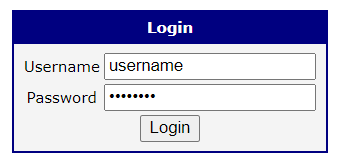
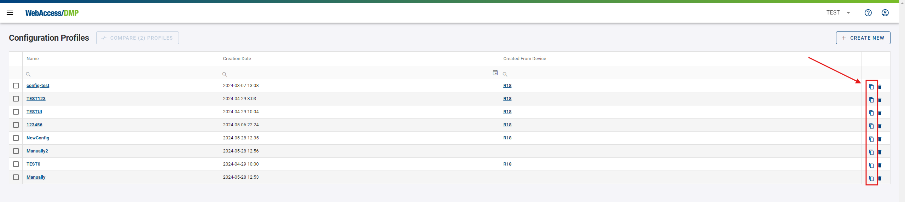
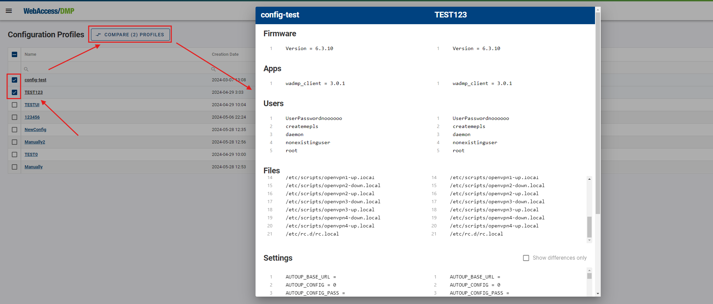
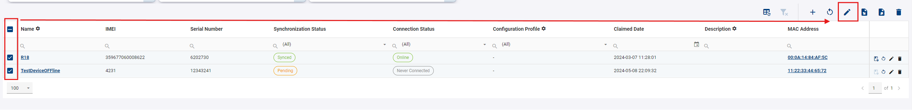
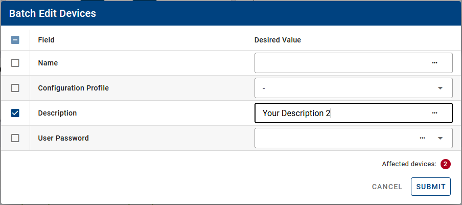

## Device Configuration

**1.** Device configuration may be done individually via specific managed settings (Fields from the Configuration category) that can be changed per device, and via Configuration Profiles (these are sets of settings values that serve as a template).

**2.** A combination of both is possible. For example, when you have hundreds of devices and need the same firmware version on all of them, the same Router App version on all of them, but a different interface IP address for each device, **you can**:

   * Prepare a Configuration Profile (that would include settings shared by all devices).
   * Add a Unique Setting Value Field for the interface IP address.

#### Setting Up the Dashboard

**1.** Set up a view on the dashboard that contains a devices table with columns from the Configuration Profile Field and the Unique Setting Value Field.

**2.** Select all devices in the table and, using the Batch Edit dialog, apply the same Configuration Profile to all devices.

**3.** For the individual IP address setting:
    - Export the table data to a CSV file.
    - Open the CSV file in Excel and copy increasing IP addresses to the Unique Setting Value column.
    - Import the updated CSV file back.

* For each individual device, both values from the Configuration Profile and the Unique Setting Value Field are tracked as managed by WebAccess/DMP. You can check this on the Desired Configuration tab on the Device page.

### Configuration Profiles

Configuration profiles are used for easy installation of any of our Router Apps, as well as router firmware and its overall settings as individual devices or bunch devices in bulk.

1. First, you must choose an example router that will be used as a default configuration for your Configuration Profile.

2. Connect to your router via IP address to the user GUI.

 

3. Ensure you're running the latest WebAccess/DMP Client in the Router Apps section so the router is connected with WA/DMP. You can check the Client Release Notes section for the latest version of WA/DMP.

4. Now you can make all desired settings localy via Web interface in the selected device. This includes all your desired Router Apps, Firmware version, and Configuration settings of the router.

5. At this point, head for the Dashboard in WebAccess/DMP and find your device in the table, where you can make a Configuration Profile out of this router (the icon button to create Configuration Profile is also accessible in the header of individual Device Page).

   Note: If you create Configuration Profile from the device that already has Configuration Profile setup, the created Configuration Profile will be the result of original Configuration Profile and ather individual configuration fields if applicable.

6. Now you can apply your newly created Configuration Profile to any router in your current Company, as showcased in the picture below.

::: tip Example Tip:
If you apply Configuration Profile, the router will apply all configurations from the router from which Config Profile was created.

For example:

- You have router_1 with an IP address on eth0=10.10.10.1 and router_2 with an IP address on eth0=10.10.10.2.
- If you create a Config Profile from router_1, it will contain setting ETH_IPADDR=10.10.10.1. and if you apply that Config Profile to router_2, setting ETH_IPADDR on router_2 will be overwritten to 10.10.10.1.
- Only if you create a Unique setting with Setting Name ETH_IPADDR (the exact name of the setting from the router) and display the name, for example, Unique_ETH_IPADDR, and edit that field to Unique_ETH_IPADDR=10.10.10.2, the setting will not be overwritten, because the individual Unique Settings fields have priority over Configuration Profile values.

:::

7. You can overview, compare, and delete your Configuration Profiles in the _Configuration Profiles_ section.

8. You can overview Configuration Profile values by clicking on it. 

9. you can Clone or delete, or you can create new Config Profile from scratch, if you know your desired settings names and values.

10.  Compare by choosing 2 Configuration Profiles of your desire.

### Overriding Specific Settings

You may override specific setting as desribed above in introduction and example tip (via field edited on devices table). You may also set or overide specific setting directly on device page:

On Device page on Desired Configuration tab, there is your individual device configuration overview and control:

* You can assign Configuration Profile here. When unassigned, you need to Read Router Configuration first (press the button) to see individual settings and their values on the device.

* You can set these settings as Desired (managed). This action creates a new Field if needed and overrides the Unique Setting Value. 

* You can do this for (These options are available on the respective tabs.):
    - Firmware and Apps
    - Settings
    - Scripts
    - Users

      
* Changes are propagated to the device after clicking on the Apply Desired Configuration button.

### Performing Batch Edit of Field Values

#### In Devices Table on Dashboard

To edit multiple devices at once:

1. Select your desired devices (you can also choose all devices, which really selects all ignoring pagination).
2. Click on the _Batch Edit Filtered Devices_ icon.

3. Specify your changes in the _Batch Edit Devices_ table.
4. Confirm the changes by clicking the _Submit_ button. The changes will apply only to the selected devices.

#### Via CSV Export/Import

You can also set editable Fields (including configuration) vie CSV Import. It is advisable to setup your dashboard devices table to contain all columns (Fileds) you want to edit in CSV file (via Excel), and the Export them first (as described in Monitoring section - [Exporting data to CSV](/gen3/explanations/device%20monitoring/#_2-exporting-data-to-csv)), edit them vie Excel and Import back on the same Dashboard view:
<!--  need to check the link after I finish splitting all the sections to edit the internal links. -->

