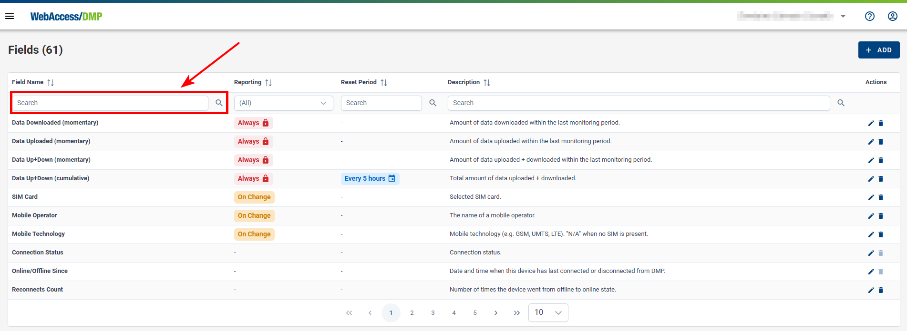
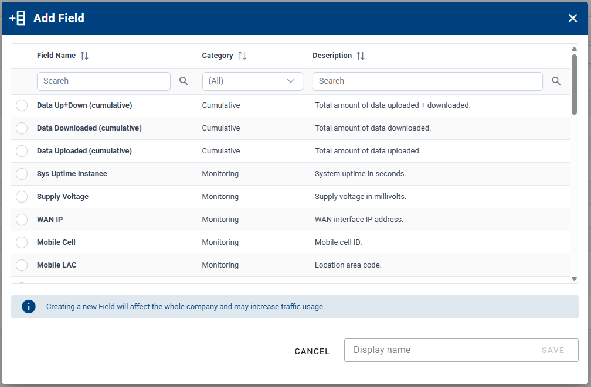

## 2. Fields

### What Are Fields and How They Work?

#### Definition of Fields

Fields are data points tracked in the database for your company. They fall into different categories and are related to both monitoring and configuration. 

- **Monitoring Fields**: Provide specific details about various aspects of each device, such as its status and performance.
- **Configuration Fields**: Used for setting up and managing device configurations.

Fields can be used for data presentation on dashboards, individual or batch configuration, alerts, and more.

#### How Fields Work
Fields are integral to the customization of views in both the Company Dashboard and the Device Dashboard. They allow users to tailor the information displayed to meet specific needs. 

- When a field is added to a dashboard, it becomes a widget or part of a table, providing real-time data about the selected parameter.
- Users can interact with these fields to gain detailed insights and take necessary actions based on the information provided.

Here for example fields are shown as columns in the table on Company Dashboard, and editable field values may be edited directly by clicking edit pencil icon:

&nbsp;  
&nbsp;

### Field Categories

On Fields page you can filter Fields by category. In addition, you can search within fields by clicking on the search icon at the top left of the table.

Fields are categorized to streamline their management and usage. The primary categories include:

#### Static Fields

These fields hold constant information that typically doesn't change over time. Examples include:

- Device ID
- MAC Address
- Name
- Description
- Serial Number
- IMEI

#### Monitoring Fields

These fields provide real-time or periodically updated information about the device's performance and status. Examples include:

- Connection Status
- Data Downloaded (momentary)
- Data Uploaded (momentary)
- Mobile Operator
- CPU Usage

#### Cumulative Fields

These fields aggregate data over time to give a comprehensive view of the device's performance. Periodical reset may be set up on this type of fields. Examples include:

- Data Downloaded (cumulative)
- Data Uploaded (cumulative)
- Data Up+Down (cumulative)
- Reconnects Count

#### Configuration Fields

These enable settings and configuration specific to the device. Examples include:

- Configuration Profile
- Unique Script
- User Password
- etc.

&nbsp;  
&nbsp;

There is a set of default Fields listed below, that you will find in the _Fields_ section in side menu. **Information about additional fields is shown in Add Field dialog** that can be acquired by clicking the _+ ADD_ button in the _Fields_ section and browsing through all available ones.

| Name of graph/widget      | Description                                                                                      |
| :------------------------ | :----------------------------------------------------------------------------------------------- |
| Claimed Date              | Date of claim.                                                                                   |
| Configuration Profile     | Assigned configuration profile.                                                                  |
| Connection Status         | Connection Status.                                                                               |
| Data Downloaded (recent)  | Amount of data downloaded within the last monitoring period.                                     |
| Data Up+Down (cumulative) | Total amount of data uploaded + downloaded.                                                      |
| Data Up+Down (recent)     | Amount of data uploaded + downloaded within the last monitoring period.                          |
| Data Uploaded (recent)    | Amount of data uploaded within the last monitoring period.                                       |
| Date Created              | Date when this device was created on the server (usually corresponding to its manufacture date). |
| Description               | Description of a device.                                                                         |
| Device ID                 | ID of the device.                                                                                |
| Device Type               | Type of device.                                                                                  |
| IMEI                      | IMEI of a device.                                                                                |
| MAC Address               | MAC address of the device's primary LAN interface.                                               |
| Mobile Operator           | The name of a mobile operator.                                                                   |
| Mobile Technology         | Mobile technology (e.g., GSM, UMTS, LTE) ("N/A" when no SIM is present).                         |
| Name                      | Name of the device.                                                                              |
| Online/Offline Since      | Date and time when this device has last connected or disconnected from DMP.                      |
| Reconnects Count          | Number of times the device went from offline to online state.                                    |
| Serial Number             | Serial number of a device.                                                                       |
| SIM Card                  | Active SIM card.                                                                                 |
| Synchronization Status    | Synchronization status of device.                                                                |

&nbsp;  
&nbsp;

### Adding/Removing fields

#### Adding Fields:

1. Either click +ADD on Fields page, or from "Edit View" mode in your dashboard:

2. Click the "+ Add Field" button to open the field selection panel.
3. Select the desired field from the list. You can browse through categories such as Cumulative, Monitoring, Static, or Configuration.
4. Enter the display name for the new field.
5. Click "Save" to add the field to your dashboard.

#### Removing Fields:

1. In the Side Menu select "Fields", locate the field you want to remove.
2. Click the "Delete" icon (A trash can) next to the field.

- Note: There are some fields that cannot be deleted such as “Static” type fields

3. Confirm the removal.

&nbsp;  
&nbsp;
