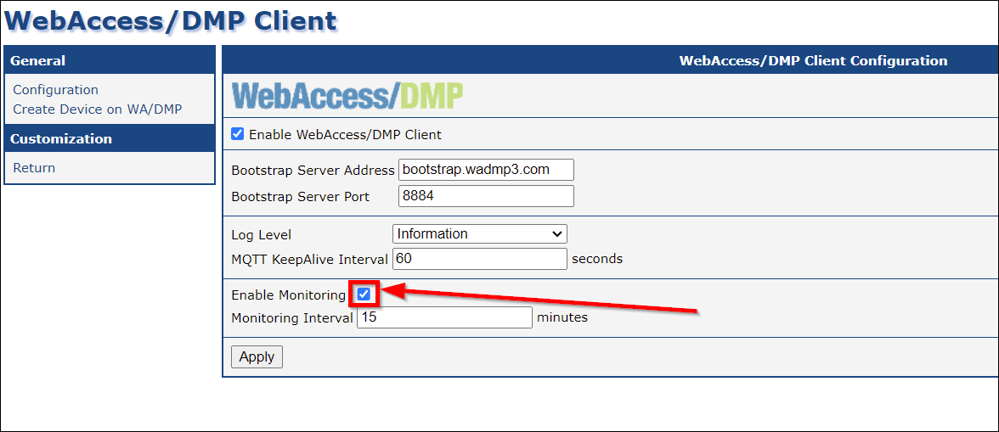
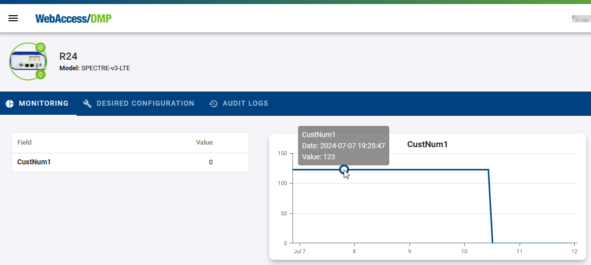

# Device Monitoring

Every device is connected to the WebAccess/DMP instance via the WebAccess/DMP Client Router App, which, by default, sends monitoring data to the instance every 15 minutes.

- **Data Sent**: The data sent is based on your [Fields](/gen3/explanations/device%20management/#_2-fields) settings.
- **Frequency**: The frequency of data sending is based on the Client Router App settings.

Monitoring data can be:

- Interpreted on the company Dashboard as Stats, Charts, or in the Table (for company/filtered in View), or individually per device on the Device Page Monitoring tab.
- Used as a trigger for [Alerts](/gen3/explanations/alerts/).
- Exported to a [CSV file](/gen3/explanations/device%20monitoring/#_2-exporting-data-to-csv).

## 1. Collecting Data from Routers

In the the WebAccess/DMP Client router app, the “Enable Monitoring” checkbox must be checked (default state is checked) in order to collect data from the device. Note the “Monitoring Interval” (default is 15 minutes).

You may disable WebAccess/DMP monitoring on a device, when disable the checkbox, and press apply. Similarly, you may leave monitoring enabled but adjust the monitoring interval.

Note that monitoring interval may affect your cellular data bill (more often - more data sent in long time interval).
Amount of data sent in every regular message is affected by Fields configured for your company. This may also affect your cellular data bill - see example below.

Fields have different categories you can filter, but monitoring (representation in Stats, Charts, Tables) can be generally done above all types of Fields, including Configuration.

Adding a Field means it is tracked in the database, and some fields may take more cellular data when reported.

### How Device Data Reporting Works

The basic principle of operation is that the WebAccess/DMP client maintains a TCP connection with the WebAccess/DMP management server. This means the device is always connected, so the user can reach the device immediately, as required.

However, there is a cost associated with maintaining this always-on TCP connection. Packets of data must be sent periodically to maintain the connection. In addition, for most of our customers, the device connects to WebAccess/DMP via cellular. This means that the cellular network provider (or "carrier") charges for all data exchanged, even if it is only TCP "keepalive" data and not "application" data.

The amount of data consumed is based on the type of the used Field. You can set Reporting behaviour for some Fields (Always, Never, On Change with Treshold). For examples on how much data are used by some actions, check the [FAQ](/gen3/explanations/faq/) section.

### Example: Monitoring Cellular Data Usage

For example you can observe the actual cellular data usage on the Monitoring tab of the device like this, after you make visible Data Up+Down Field in the Table (click on eye icon), and add charts for Data Up+Down Field. See [Dashboards & Widgets](/gen3/explanations/dashboards%20&%20Widgets/) for more information on how to work with widgets and table.

Similarly you can observe data for devices from the company on the main dashboard like this - here Company Stat for Max aggregation Data Up+Down Field and adding of Line Chart, where you can add more fields of same type with different aggreation to the same chart (e.g. show Max and Average in same chart).

### Ping Status & Ping Latency

These Fields can be used for monitoring of connection to specified IP address. Provide IP Address when creating the Field:

- **Ping Status** - True/False value indicating whether ping to some predefined address succeeded.
- **Ping Latency** - Latency (in miliseconds) when pinging a predefined address.

Reported monitoring data may be used in Widgets (Stats or Charts) or in the devices Table on dashboards.
Example of ping Fields made visible in Table and added as Line Charts on Device Monitoring tab:

Example of ping Fields made visible in Table on company dashboard, Ping Latency added as Company Stat and Ping Status added as Pie Chart:

### Custom Reportable String & Custom Reportable Number

These Fields can be programmaticaly connected to any customer desired string or number to be reported from device, e.g. via Script.

- **Custom Reportable String** is up to 40 characters long string stored in a local file on router (/var/data/wadmp_client/custom_metrics/custom_str) that is reported.
- **Custom Reportable Number** is a number stored in a local file on router (/var/data/wadmp_client/custom_metrics/custom_number) that is reported.

::: tip For example:

There is an industrial sensor connected to the router - a flow meter in a tube. A script exists in device, that writes the value from the sensor to a file. This script can be added via the Desired Configuration tab or a Configuration Profile. The value is then reported to WebAccess/DMP and may be presented as data in Stats, Charts, or Tables. It can also be used for Alerts or exported. A flow in the tube history chart can be observed in a View. An Alert may be sent based on the flow in tube value.

:::

## 2. Exporting data to CSV

You can export data to CSV file from devices table in any of your views: click on export icon above the table. Setup your table columns to contain desired monitored data before the export (Edit View button on right -> Table -> eye icon). All data (rows) are always exported - filters are taken into account. The result is not affected by neither pagination settings, nor rows individual selection.

Note, that exported data can be also used for bulk configuration - see [Performing Batch Edit of Field Values](/gen3/explanations/device%20management/#performing-batch-edit-of-field-values).
