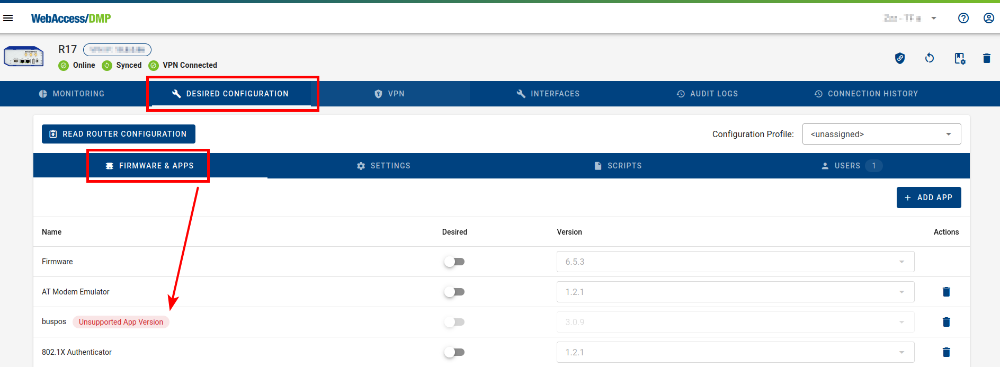

# Device Management

Multiple approaches can be used for device management and you can choose or combine what fits your needs the best.

Devices can be managed in a bulk on dashboard via [Fields](./fields/) (shown as columns in table), using Configuration Profiles, and via Export/Import to CSV.

An individual device can also be managed on the **Desired Configuration** tab (and via the fields on the **Monitoring** tab). This allows you to detect unsupported router applications as well. 

