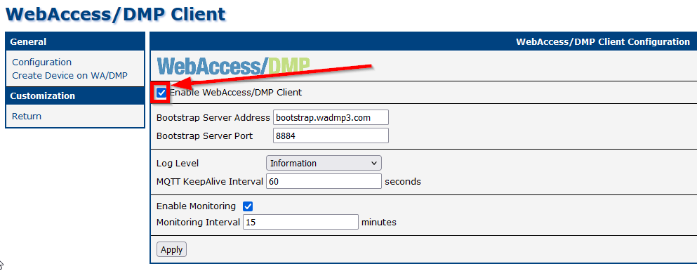

## WebAccess/DMP Client App

### Configure Client Application

If you want to propagate your managed configuration to the device, it is recommended to have a device in Synced and Online state. In WebAccess/DMP Client router app, this checkbox has to be enabled for the sync to by working (is enabled by default):

(Enable monitoring is not necessary for settings propagation, it is for reporting of metrics.)

### Handling Router-side Changes

If a configuration change is made directly on the router locally (via the router's web interface), it will be overridden by WebAccess/DMP only under certain conditions: The particular setting must be set as managed (desired) on WebAccess/DMP.

Managed (desired) value may be defined using a Configuration Profile or via an individual Field from the Configuration category (may be created and setup manually, or looked up and set on Desired Configuration tab of Device page).

### Deleting the WebAccess/DMP Client App

To delete the **WebAccess/DMP Client App** from your router, you must first allow this action in the company profile of your device.  

1. Go to your company's profile and click the **Edit** button.  
2. Enable the **Allow Client Uninstall** option by toggling the slide button, and proceed with **Confirm**.  

3. Navigate to your device's **Desired Configuration** page. You will see a blue trash bin icon next to the **WADMP Client App**.  

4. Click the **Confirm** button, then press **Apply Desired Configuration** to remove the app.  

