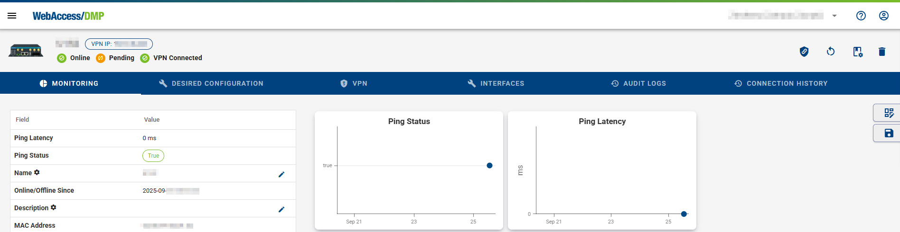
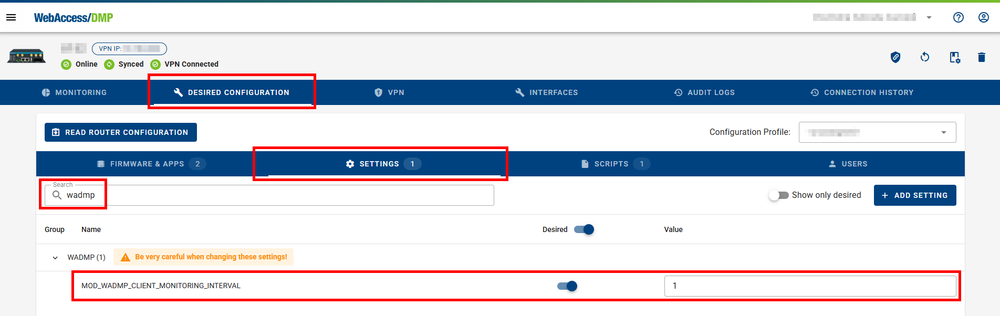
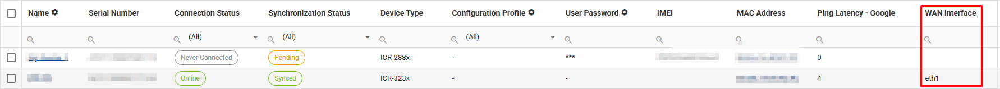

## Collecting Data from Routers

In the the WebAccess/DMP Client router app, the “Enable Monitoring” checkbox must be checked (default state is checked) in order to collect data from the device. Note the “Monitoring Interval” (default is 15 minutes).


You may disable WebAccess/DMP monitoring on a device, when disable the checkbox, and press apply. Similarly, you may leave monitoring enabled but adjust the monitoring interval.

Note that monitoring interval may affect your cellular data bill (more often - more data sent in long time interval).
Amount of data sent in every regular message is affected by Fields configured for your company. This may also affect your cellular data bill - see example below.

Fields have different categories you can filter, but monitoring (representation in Stats, Charts, Tables) can be generally done above all types of Fields, including Configuration.

Adding a Field means it is tracked in the database, and some fields may take more cellular data when reported.


### How Device Data Reporting Works

The basic principle of operation is that the WebAccess/DMP client maintains a TCP connection with the WebAccess/DMP management server. This means the device is always connected, so the user can reach the device immediately, as required.

However, there is a cost associated with maintaining this always-on TCP connection. Packets of data must be sent periodically to maintain the connection. In addition, for most of our customers, the device connects to WebAccess/DMP via cellular. This means that the cellular network provider (or "carrier") charges for all data exchanged, even if it is only TCP "keepalive" data and not "application" data.

The amount of data consumed is based on the type of the used Field. You can set Reporting behaviour for some Fields (Always, Never, On Change with Treshold). For examples on how much data are used by some actions, check the [FAQ](/gen3/docs/faq/) section.

### Example: Monitoring Cellular Data Usage

For example you can observe the actual cellular data usage on the Monitoring tab of the device like this, after you make visible Data Up+Down Field in the Table (click on eye icon), and add charts for Data Up+Down Field. See [Dashboards & Widgets](/gen3/docs/dashboards-widgets/) for more information on how to work with widgets and table.


Similarly you can observe data for devices from the company on the main dashboard like this - here for Max aggregation Data Up+Down Field and adding of Line Chart, where you can add more fields of same type with different aggreation to the same chart (e.g. show Max and Average in same chart).


### Ping Status & Ping Latency

These Fields can be used for monitoring of connection to specified IP address. Provide IP Address when creating the Field:


- **Ping Status** - True/False value indicating whether ping to some predefined address succeeded.
- **Ping Latency** - Latency (in miliseconds) when pinging a predefined address.

Reported monitoring data may be used in Widgets (Stats or Charts) or in the devices Table on dashboards.
Example of ping Fields made visible in Table and added as Line Charts on Device Monitoring tab:



Example of ping Fields made visible in Table on company dashboard, Ping Latency added as Company Stat and Ping Status added as Pie Chart:


### Custom Reportable String & Custom Reportable Number

These Fields can be programmaticaly connected to any customer desired string or number to be reported from device, e.g. via Script.

- **Custom Reportable String** is up to 40 characters long string stored in a local file on router that is reported. Files are located in /var/data/wadmp_client/custom_metrics/custom_str1 to custom_str5. Up to 5 custom strings can be added.

- **Custom Reportable Number** is a number stored in a local file on router that is reported. Files are located in /var/data/wadmp_client/custom_metrics/custom_number1 to custom_number5. Up to 5 custom numbers can be added.


**Note:** Only _Custom Reportable Number_ Field can be used for charts (string data type can not be shown in charts).

Custom Fields can be used also with a sensor connected to the router (via RS232/485, binary I/O or other industrial interface). E.g. If a flow meter in a tube would be connected, a script would exist in a device, that would write the value from the sensor to a file, the value could then be reported to WebAccess/DMP and could be presented as data in Stats, Charts, or Tables, exported or used for Alerts.

#### Download Speed Reporting - Example of the Script Using Custom Reportable Number

- Add this code as Startup Script (e. g. in Device Configuration):

```
#!/bin/sh
# -----------------------------------------------------------------------------
# Initialization Script
# -----------------------------------------------------------------------------
# This script will run *after* all other init scripts and is intended to set up
# a custom metric collection script that downloads a file and logs download speed.
# -----------------------------------------------------------------------------

# -----------------------------------------------------------------------------
# Create the metric collection script
# -----------------------------------------------------------------------------
cat << 'EOF' > /var/scripts/script.sh
#!/bin/bash

# URL of the file to be downloaded
url="http://ipv4.download.thinkbroadband.com/10MB.zip"

# Define the directory and file path for storing metrics
dir_path="/var/data/wadmp_client/custom_metrics"
file_path="$dir_path/custom_number1"

# -----------------------------------------------------------------------------
# Ensure the required directory and file exist
# -----------------------------------------------------------------------------
# Check if the directory exists; if not, create it
if [ ! -d "$dir_path" ]; then
    mkdir -p "$dir_path"
fi

# Check if the file exists; if not, create it
if [ ! -f "$file_path" ]; then
    touch "$file_path"
fi

# -----------------------------------------------------------------------------
# Download the file and measure download speed
# -----------------------------------------------------------------------------
echo "Downloading 10MB file..."

# Perform the download and capture the average download speed in bytes/sec
speed_bytes=$(curl -o /dev/null --silent --write-out "%{speed_download}" "$url")

# Verify if a valid speed value was captured
if [[ -z "$speed_bytes" ]]; then
  echo "Error: Speed not found in response"
  exit 1
fi

# Convert the speed from bytes/sec to megabytes/sec
mbps=$(awk "BEGIN {printf \"%.2f\", $speed_bytes / 1024 / 1024}")

# Output the download speed in MBps
echo "Average download speed: $mbps MBps"

# Write the download speed to the specified file
echo "$mbps" > "$file_path"
EOF

# -----------------------------------------------------------------------------
# Make the script executable
# -----------------------------------------------------------------------------
chmod +x /var/scripts/script.sh

# -----------------------------------------------------------------------------
# Schedule the script to run daily using cron
# -----------------------------------------------------------------------------
# Append the script to the root crontab to execute at midnight daily
echo "0 0 * * * root /var/scripts/script.sh" >> /etc/crontab

# -----------------------------------------------------------------------------
# Ensure the cron service is started
# -----------------------------------------------------------------------------
service cron start

```

- To show the number on Dashboard (column in table, Stat or Chart), ensure that the Field _Custom Reportable Number_ is added. If using more Custom Reportable fields, ensure that the path shown in the description is same as the file_path in the script (custom_number1).

- To add chart, in this case select Line Chart, and select _Custom Reportable Number_ Field:


- The chart then may look like this:


#### MWAN Interface Reporting - Example of the Script Using Custom Reportable String

Follow this tutorial on how to get the MWAN interface into the WADMP3 table:

- First create custom reportable string field like this:


- And then show it in table:


- After this step you would need to apply this Startup Script (below) to the Routers where you would like to read the WAN interface from:


```
#!/bin/sh
# -----------------------------------------------------------------------------
# Initialization Script
# -----------------------------------------------------------------------------
# This script will run *after* all other init scripts and is intended to set up
# a custom metric collection script that logs the primary network interface.
# -----------------------------------------------------------------------------

# -----------------------------------------------------------------------------
# Create the metric collection script
# -----------------------------------------------------------------------------
cat << 'EOF' > /var/scripts/script.sh
#!/bin/bash

# Define the directory and file path for storing metrics
dir_path="/var/data/wadmp_client/custom_metrics"
file_path="$dir_path/custom_str1"

# -----------------------------------------------------------------------------
# Ensure the required directory and file exist
# -----------------------------------------------------------------------------
# Check if the directory exists; if not, create it
if [ ! -d "$dir_path" ]; then
    mkdir -p "$dir_path"
fi

# Check if the file exists; if not, create it
if [ ! -f "$file_path" ]; then
    touch "$file_path"
fi

# -----------------------------------------------------------------------------
# Retrieve the primary network interface
# -----------------------------------------------------------------------------
interface=$(ip route show | awk '/default/ {print $NF}')

# Verify if a valid interface was found
if [[ -z "$interface" ]]; then
  echo "No interface" > "$file_path"
  exit 1
fi

# Output the network interface name
echo "Primary network interface: $interface"

# Write the interface name to the specified file
echo "$interface" > "$file_path"
EOF

# -----------------------------------------------------------------------------
# Make the script executable
# -----------------------------------------------------------------------------
chmod +x /var/scripts/script.sh

# -----------------------------------------------------------------------------
# Schedule the script to run daily using cron
# -----------------------------------------------------------------------------
# Append the script to the root crontab to execute at midnight daily
echo "* * * * * root /var/scripts/script.sh" >> /etc/crontab

# -----------------------------------------------------------------------------
# Ensure the cron service is started
# -----------------------------------------------------------------------------
service cron start

```

- And also set the WADMP3 Client monitoring interval to 1 minute to achieve the fastest reporting of the change of the WAN interface:
  

- After this step you would need to reboot the Router and after reboot you should be able to see the WAN interface in the WADMP3:
  

- If this solution is suitable for you, you can create the configuration profile from the Router and distribute it to the other routers if needed.
