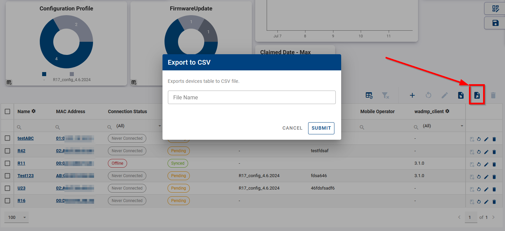

## Exporting Data to CSV

You can export data to CSV file from devices table in any of your views: click on export icon above the table. Setup your table columns to contain desired monitored data before the export (Edit View button on right -> Table -> eye icon). All data (rows) are always exported - filters are taken into account. The result is not affected by neither pagination settings, nor rows individual selection.

Note, that exported data can be also used for bulk configuration - see [Performing Batch Edit of Field Values](../../device-management/device-configuration/#performing-batch-edit-of-field-values).
