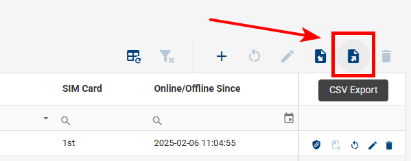
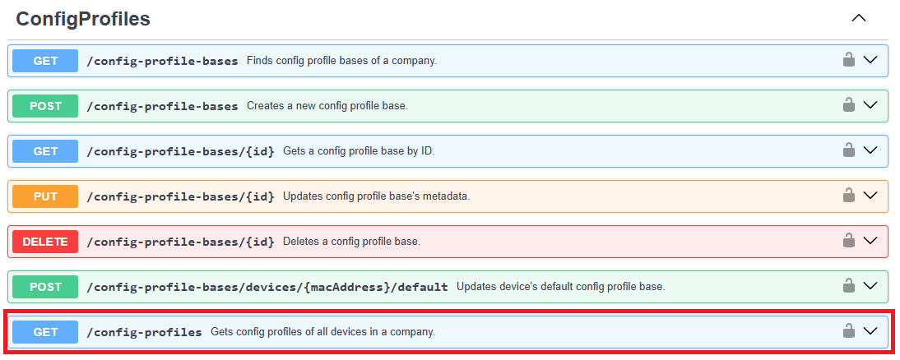
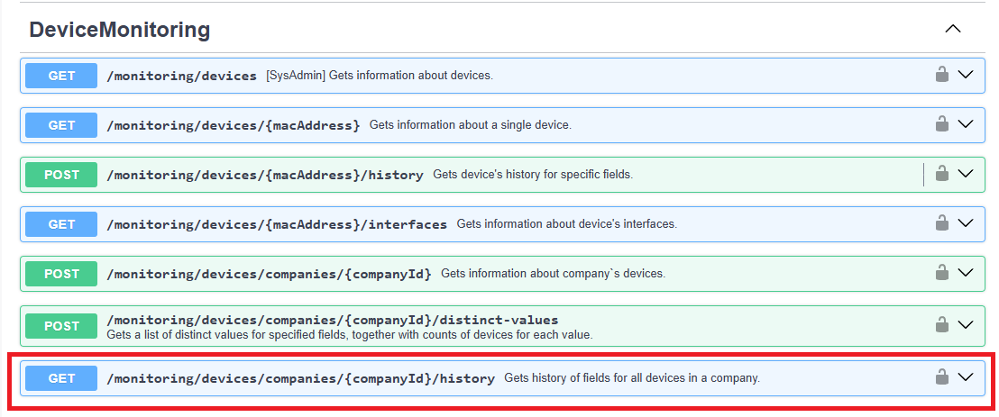

# FAQ

## WADMP Ports/Addresses - What should I put on firewall whitelist?

This section provides a list of addresses and ports that **customers need to whitelist** in their firewall.

:::warning Caution:
Please be aware that IP addresses may change with updates to our infrastructure.
Only the FQDN names will remain stable.
:::

| FQDN                  | IP                                                             | Port | Accessed from router? |
| --------------------- | -------------------------------------------------------------- | ---- | --------------------- |
| management.wadmp3.com | 
3.73.182.61 3.124.54.255 52.29.40.29
    | 8883 | 
Yes
  |
| bootstrap.wadmp3.com  | 
3.124.228.128 52.28.186.90 3.67.107.51
  | 8884 | 
Yes
  |
| content.wadmp3.com    | 
3.72.206.176 3.124.104.54 52.29.166.166
 | 443  | 
Yes
  |
| gateway.wadmp3.com    | 52.57.47.37                                                    | 443  | 
Yes
  |

## Cellular Data Usage - How much data will some operations take?

- Data usage examples for steady-state operation. i.e., The device has already connected to the WebAccess/DMP Management Server.
  If your device's cellular connection is unstable (for example, due to poor signal strength), you may experience occasional re-connects.
  Each re-connection involves several data transfers:

  - TLS handshake = approximately 5kB, due to the exchange of X.509 certificates;
  - configuration re-synchronization = approximately 150kB, depending on the number of Router Apps installed and the content of the configuration data.

- When a user actively manages a device via WebAccess/DMP, the overall data usage figures will depend on the exact actions performed.
  For example:

  - Firmware upgrade = approximately 14MB, depending on the exact device type and firmware version;
  - Router App installation or upgrade = anything from 30kB for a small app such as Pinger to 6MB for a large app such as Python;
  - Re-configuration = varies, depending on the section or sections being re-configured and the content of the configuration data.

- The Configuration manual for your device has a section on the "Check Connection" feature, part of the Mobile WAN configuration.
  It states unequivocally:

> Enabling the Check Connection function for mobile networks is necessary for the uninterrupted and continuous operation of the router.

This advice applies to any device using WebAccess/DMP, _but the "Enable Traffic Monitoring" item should also be enabled._
The device will monitor all traffic on the cellular interface and only send ping requests if the selected Ping Interval is less than the WebAccess/DMP keepalive interval (60 seconds).
If you do not "Enable Traffic Monitoring", the device will send periodic ping requests to check the cellular connection. This will add to your cellular data usage.

The most significant factor that leads to the data usage (cumulative) slightly increasing (normal state) is the transport keepalive interval we use in the WebAccess/DMP Client Router App.
This is hard-coded to be 60 seconds (1 minute). This may seem aggressive, but we have encountered cellular operators with VERY short timeouts on their networks. Of the order of 2 minutes!

- In this article, we are using the traditional base-10 (aka "decimal" or "SI") prefixes for digital data. i.e. 1000B = 1kB, 1000kB = 1MB, etc. The difference to base-2 (aka "binary" or "IEC") is 2.4%. However **on WebAccess/DMP we always use base-2 (1024) counted data units!** It is to maintain unification with our routers, using the customary practice of base-2 counts and B, KB, MB, and GB units. To sum up: On WebAccess/DMP may occur, both types of units B, KB, MB, ... and B, KiB, MiB, ... but they always use the base-2 (1024) count.

## How to export all company data?

You can export your company’s data from **wadmp3.com** in three different ways. Each export provides different information, and together they give you a complete backup of your device data, desired configurations, and time-series reports.

---

### 1. Export Device Data from Dashboard Tables

1. Navigate to the **Dashboard** in your wadmp3.com account.  
2. Locate the table that lists your company’s devices.  
3. Click the **Export** button located near the table.
4. Enter name of your **CSV** file, click **Export** button.

This will download a **CSV** file to your computer containing detailed device information. CSV files can be opened in spreadsheet applications like Microsoft Excel or Google Sheets for easier viewing and analysis.  

---

### 2. Export Desired Configurations via Swagger

1. Open the [Swagger API page](https://api.wadmp3.com/catalog/api/d5d37cf4-7be4-45eb-937c-f47be455ebf4) in your browser.  
2. Scroll down to the **ConfigProfiles** endpoint.  
3. Expand the endpoint description and click the **Try it out** button.  
4. Execute the request to download all desired configurations for your devices.  

This export contains the configuration settings that your company has applied to its devices. It is useful for record keeping and troubleshooting.  

---

### 3. Export Time-Series Data via Swagger

1. From the same [Swagger API page](https://api.wadmp3.com/catalog/api/d5d37cf4-7be4-45eb-937c-f47be455ebf4), scroll down to the **DeviceMonitoring** endpoint.  
2. Expand the endpoint description and click the **Try it out** button.  
3. Execute the request to export all time-series data reported by your devices.  

Time-series data contains historical reports such as performance metrics, usage statistics, and monitoring logs. This is especially helpful for analyzing device behavior over time.  

---

### Notes
- Large exports (especially time-series data) may take longer to generate depending on how many devices your company manages.  
- Make sure you have the appropriate permissions to access the Swagger API endpoints.  
- Always store your exported data securely, especially if it contains sensitive company information.  

