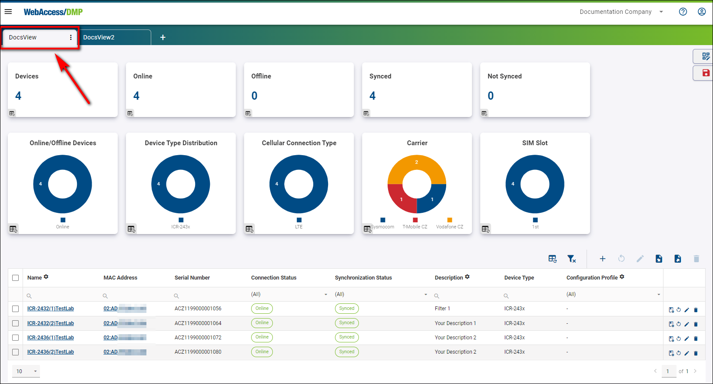
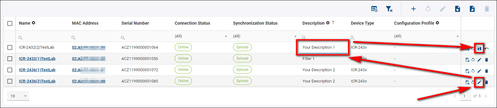
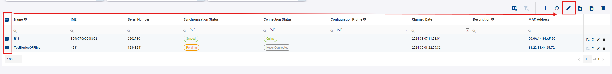
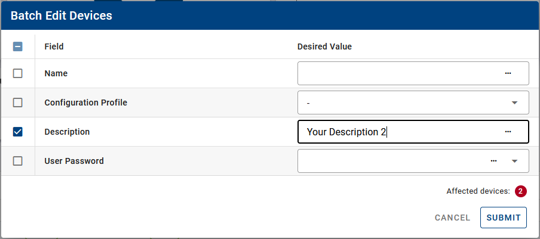
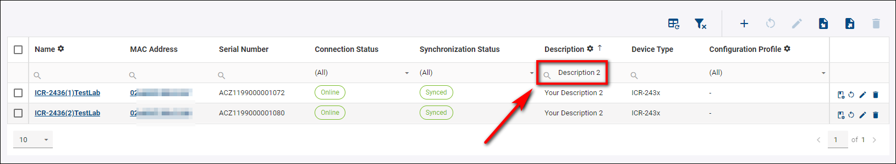
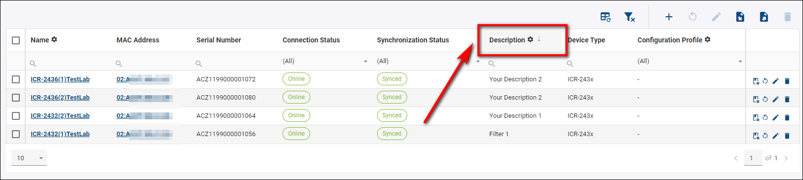
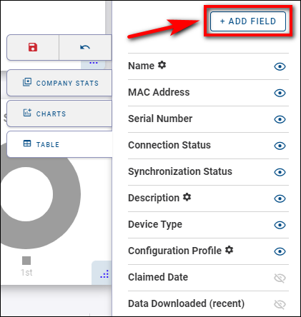
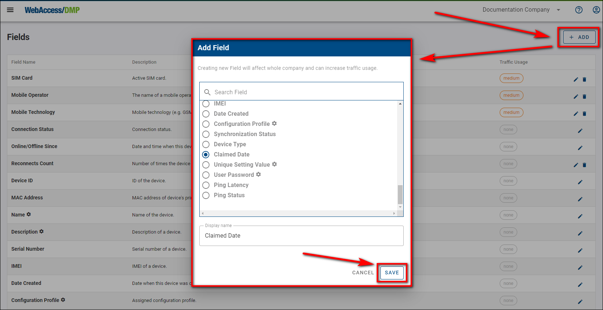

# Searching, Filtering, and Sorting Devices

You can search, filter, and sort your devices at will, but remember that this only applies to your active view.

For example, if you want to edit or add a new description to the device, you press the *Edit* icon on the router you wish to edit, write down your desired Description, and save it by clicking on the *Floppy* disc that changed from the *Edit* icon.

You can do the same to multiple devices with the *Batch Edit Filtered Devices* function. You select your desired devices (there is also an option to choose all of them) and click on the *Batch Edit Filtered Devices* icon.

You must specify your changes in the *Batch Edit Devices* table and confirm with the *Submit* button. The changes will apply only to devices that have been selected before.

If you want to search for a specific device, choose your particular column and write down your desired parameter. As a result of the example below, you should get only devices with "Description 2" in the *Description* column.

If you want to sort, for example, by the *Description* of the device, you press the *Description* button and choose either descending or ascending mode.

You can edit, show/hide, or add more columns in the Edit View mode, as mentioned in the **General Structure of the UI >> C: The Details Panel** section.

You can customize your custom table fields by pressing the "Add field" button.

