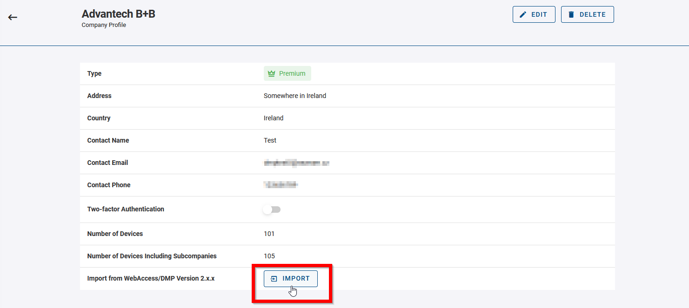
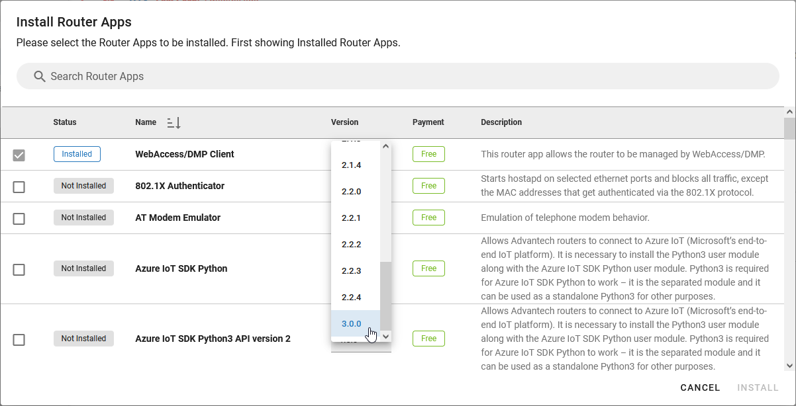

# Migration from 2.x.x to 3.x.x Instance

::: warning
**WebAccess/DMP GEN2 has been permanently discontinued.**

Please proceed to **WebAccess/DMP GEN3** at [wadmp3.com](https://wadmp3.com).

Devices previously claimed to GEN2 will be **migrated automatically (upgraded to GEN3 client)** when you claim them in WebAccess/DMP GEN3.

If you have any questions or need assistance, contact us at [wadmp@advantech.com](mailto:wadmp@advantech.com).
:::

This page explains the process of migrating data from a 2.x.x instance at [www.wadmp.com](http://www.wadmp.com) to a 3.x.x instance at [www.wadmp3.com](http://www.wadmp3.com).

1. The migration involves transferring data from one company in GEN2 to another in GEN3, without altering the company structure.

2. Both companies must already exist in their respective instances for the migration to proceed.

**What is migrated:**

- Device Memberships (the same devices from 2.x.x will be added to your 3.x.x company)
- Tags and Groups (added through automatically created _Fields_ of type _Tag - True/False_)
- Alerts and Alert Endpoints

## Step 1 – Export from WADMP 2.x.x *(No longer available)*

> ⚠️ **As of now, access to the WADMP 2.x.x (GEN2) system has been discontinued.**  
> It is no longer possible to export any data from the original instance.

Customers who exported their data (e.g. device lists, configuration backups, user structures) **can continue with the migration** using those files.

For everyone else, devices can still be reclaimed directly into WADMP 3.x.x using **serial number, MAC address, or via CSV import**, provided they were registered previously and are still known to our system.

---

### Why this is happening

The WADMP 2.x.x system is now running only as a minimal **microinstance**, which preserves router-level references for potential future claims — but **no longer provides UI access or export features**.

> Customers were notified about the migration in advance, and all necessary tools and timelines were provided during the migration window.

---

### What you can still do

You can continue with the migration from **Step 2** onward:

- Create companies and users in WADMP 3.x.x
- Reclaim devices using CSV or manually
- Recreate configuration profiles
- Apply settings per device or in bulk

See the full guide below for details.

## Step 2: Import Data into 3.x.x Instance

Log in to your account at [www.wadmp3.com](http://www.wadmp3.com). Select or create the company where data will be imported. Navigate to _Companies_ in the menu and click on the company details. On the _Company Profile_ page, click on the _Import_ button:

Choose the data file containing exported data from the 2.x.x instance and press **Submit**.

The results of the import will be displayed after the process completes, which depends on the volume of data. This will include an overview of successful imports, skipped items, and any failures.

You can examine the outcome of the import process. Skipped items indicate they were previously imported or manually added. For any failures, select the number of failed items to investigate the reasons. You can also generate a CSV failure report using the export icon at the top.

## Step 3: Migrate Devices

To manage your devices in the 3.x.x instance , upgrade the _wadmp_client_ Router App on your devices to version 3.0.0 using the 2.x.x instance.

Installing this updated Router App version enables your devices to connect to the 3.x.x instance. Note that after this upgrade, devices will no longer be able to connect to the 2.x.x instance. It is advisable to test this migration process on a small number of devices first.
