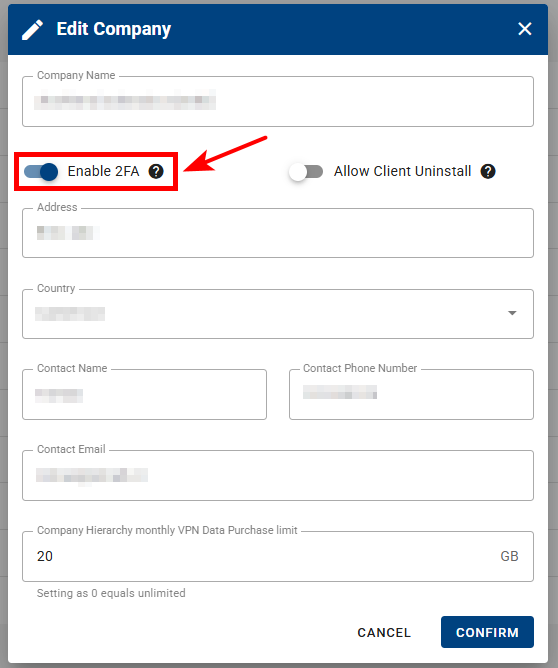

## 4. Two-Factor authentication (2-FA)

**2FA** (_Two-Factor authentication_) provides an additional level of security to protect your account.

Suppose it is enabled and already set up after a successful login. In that case, you will be asked for a one-time password to enter from your Auth App (Microsoft Authenticator, Google Authenticator, Authy, etc.)

**Authenticator Apps**

To configure 2FA, you should first download the Authenticator app to your phone. We support a wide array of Auth apps.

- [Google Authenticator](https://play.google.com/store/apps/details?id=com.google.android.apps.authenticator2&hl=en&gl=US)

- [Microsoft Authenticator](https://play.google.com/store/apps/details?id=com.azure.authenticator&hl=en&gl=US)

- [Google Authenticator (IOS)](https://apps.apple.com/us/app/google-authenticator/id388497605)

- [Microsoft Authenticator (IOS)](https://apps.apple.com/us/app/microsoft-authenticator/id983156458)

### How to enable 2-FA?

You can activate 2FA in the _Company Edit Form_.

After turning it on, you can configure a 2FA using your Auth application.

**Important Notice:** Enabling 2FA will add an extra option, “Service Account” (in the user's permissions settings), so company admins can enable/disable this feature for users in a company having 2FA enabled (this will allow users to use the scripts even if they have 2FA enabled otherwise they will not be able to).

When you enable 2FA for a company, all users will be forced to set up the 2FA after they log in. They cannot use the system until they complete the 2FA setup.

### Using 2-FA

Once you have downloaded the application, you must scan the QR code or enter the given code manually.

Type in the unique password you see in your Auth app to sign in.

:warning: **Important Notice:**

**Turning 2FA off for the company will turn it off for all users in that company.**
