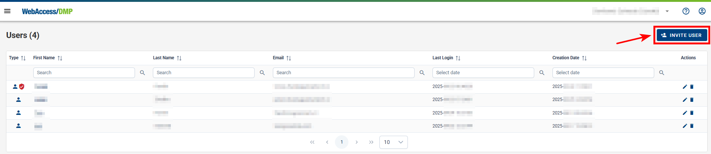

## Add Users

### Create New Users

- **Overview:**
  Creating users is the primary method to add them to your companies. When a user is invited, the process differs based on whether they are an **existing user** or a **new one**:

- **New User:**
  Will receive a registration link via email, which, upon completion of registration, will not only create their account but also add them to your company.

- **Preconditions:**

  - You must be logged into the platform.
  - You must have permissions to create users, which can be verified by editing your profile and checking for the appropriate permissions.

**Steps to Create a New User:**

- Select the Appropriate Context:

  - Navigate to Users from the Side Menu in the context of the company where you want to add the user.

  - Alternatively, select "Companies" from the Side Menu, choose your desired company, then proceed to invite a user.

- **Initiate User Invitation:**
  - Click the Invite User button located on the right top of the Users or Companies page.

.png>)

- **Fill Out the Invitation Form:**
  - Enter the prospective user's email and define specific permissions for their role.

- **Invited User Check**  
  - You can view users who have already been invited. Invited users appear in the user list in a slightly gray color. Additionally, you can resend the invitation by clicking the blue arrow button, or choose to view details or delete the invitation. 

  

- **User Email Confirmation:**
  - The invitee will receive an email with a link to confirm the invitation. They must click this link to proceed.

- **Account Registration:**
  - The link directs the invitee to the main page to complete their account setup. The email field is pre-filled from the link and cannot be changed. They must fill up the remaining login data and click the Create Account button.

- **Confirmation of Registration:**
  - After account creation, a confirmation message is displayed. The new user can now access their account either by clicking the Dashboard link or by logging in on the main page.

### Invite Existing Users

- You can invite existing or new users who just created their account to any company you have permission to. You can do it similarly, like when creating a new user.

- You can check your permissions if you edit your user. Your assigned permissions are shown as check marks.

**To invite existing users to your company:**

- **Navigate to Users:**
  Select Users from the Menu in the context of the company where you want to add the user.

- **Initiate Invitation:**
  Click on the Invite User button located at the top right of the Users page.

- **Fill Out Invitation Form:**
  Enter the user's email address and assign specific permissions to the user.

- **Send and Confirm Invitation:**
  The user will receive an email invitation. They must click the link in the email to proceed with account setup.

- **Complete Account Setup:**
  The user follows the link to the main page, fills in their login details, and clicks Create Account. The email used is pre-filled and cannot be changed.

