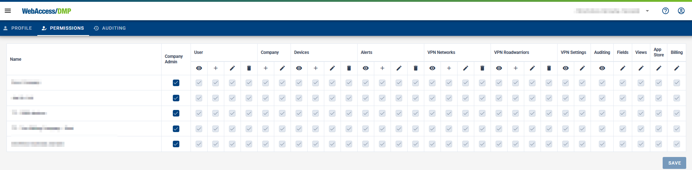

## Permissions

### Permissions Management

- User Restrictions:

  - Users cannot edit their own permissions.
  - Users cannot add themselves to any company.

- Leaving a Company:

  - A user can remove themselves from a company if:

    - The company has at least one other Company Admin.
    - The user has the "Edit Users" permission for that company.

- Profile Information Editing:
  - Users may always edit their own profile information (e.g., email, name) regardless of their permissions.

Managing Other Users:

- A user can remove another user from a company if they have "Edit Users" permission on that company.
- A user can edit another user's profile information only if they have "Edit Users" permission for at least one of the companies the user is in.

### Explanations of Individual Permissions

#### Company Admin - sets a fixed set of permissions:

- User Permissions:

  - View: Allows viewing a list of users they have access to.
  - Create: Allows the user to create new users for their company.
  - Edit: Allows the user to edit an existing user.
  - Delete: Allows the user to delete another user.

- Company Permissions:

  - Create: Allows the user to create new standalone companies.
  - Edit: Allows the user to edit an existing company.

- Devices Permissions:

  - View: Allows the user to view device details.
  - Claim & Release: Allows the user to claim a device in the system.
  - Edit: Allows the user to make changes to a device.
  - Delete: Allows the user to delete a device from the company. System-wide device deletion requires sysadmin permissions.

- Alerts, History, Rules & Endpoints Permissions:

  - View: Allows viewing a list of Alerts, History, Rules & Endpoints.
  - Create: Allows the creation of new Alerts, History, Rules & Endpoints.
  - Edit: Allows editing of existing Alerts, History, Rules & Endpoints.
  - Delete: Allows deletion of Alerts, History, Rules & Endpoints.

- Additional Permissions:
  - Auditing: View auditing details.
  - Fields: Manage fields.
  - Views: Manage views.
  - AppStore: Manage the AppStore.
  - Billing: Manage billing.
